# CRDC Portal DB Input And Architecture Plan

## Summary

포털 DB의 1차 목적은 논문 결과 표시가 아니라, **CRDC 안에서 검색 대상과 맞는 환자, 맞는 cohort/investigator group, 같은 gene/variant recurrence, public rare disease profile overlap을 빠르게 찾는 것**이다.

`cohort = investigator`로 통일한다. DB에서는 `cohort`라는 entity를 쓰고, 필요하면 `investigator_name`을 column으로 보존한다.

## Required Inputs

**MVP 필수 입력**

| Input | Purpose | Main tables built |
|---|---|---|
| CRDC sample metadata | sample identity, cohort, sex, age, proband/affected, GenDx | `sample`, `cohort`, `sample_cohort` |
| CRDC sample HPO | phenotype similarity, disease match, cohort affinity | `sample_hpo`, `sample_hpo_propagated` |
| `hpo.obo` | HPO label, parent expansion, root grouping | `hpo_term`, `hpo_ancestor`, `hpo_root_map` |
| VCF-derived sample variant table | genotype evidence, same variant/gene recurrence | `variant`, `sample_variant` |
| Orphapacket disease HPO | public disease profile matching | `disease`, `disease_hpo_weight` |
| Orphapacket disease gene | disease-gene support and GRS-ready annotation | `disease_gene_weight` |
| gene2phenotype / HPO gene annotation | known gene-phenotype support | `gene_hpo_annotation` |
| PanelApp Green-only table | curated clinical badge only | `panelapp_gene_summary`, `panelapp_gene_panel` |
| Reactome / WikiPathways GMT | functional badge only | `pathway`, `pathway_gene`, `gene_pathway_summary` |

**Optional or later inputs**

| Input | Role |
|---|---|
| OMIM gene-disease | core rare disease reference, useful but not required for MVP |
| PheRS / GRS / manuscript analyses | optional research-analysis layer, not core portal DB |
| burden/association result files | optional evidence panel for later discovery pages |
| clinical diagnosis labels | useful for GenDx/reference display, not required for similarity search |

## Normalized Tables

Keep these as source-of-truth tables.

```text
Core entities
- sample(sample_id, cohort_id, sex, age_group, affected, proband, gendx_status)
- cohort(cohort_id, investigator_name, cohort_name, cohort_type)
- gene(gene_id, gene_symbol, hgnc_id)
- variant(variant_id, chrom, pos, ref, alt, genome_build, gene_id)
- hpo_term(hpo_id, name, definition, is_obsolete)
- disease(disease_id, source, source_disease_id, disease_name)

CRDC primary evidence
- sample_hpo(sample_id, hpo_id, source, is_leaf, observed)
- sample_hpo_propagated(sample_id, hpo_id, source_hpo_id, distance)
- sample_variant(sample_id, variant_id, gene_id, genotype, dosage, consequence, af, revel, alphamissense, loftee, clinvar)
- sample_cohort(sample_id, cohort_id, is_primary)

Core reference
- hpo_ancestor(hpo_id, ancestor_hpo_id, distance)
- disease_hpo_weight(disease_id, hpo_id, frequency_category, frequency_weight, propagated)
- disease_gene_weight(disease_id, gene_id, inheritance, association_type, gene_weight)
- gene_hpo_annotation(gene_id, hpo_id, source, evidence, disease_id)

Secondary annotation
- panelapp_gene_summary(gene_id, green_panel_count, panel_names, modes_of_inheritance)
- panelapp_gene_panel(gene_id, panel_id, panel_name, confidence_label)
- pathway(pathway_id, pathway_source, pathway_name)
- pathway_gene(pathway_id, gene_id)
```

## Materialized Summary Tables

These are the 1-second portal response tables.

```text
sample_page_summary
- one row per sample
- feeds sample header and top evidence summary

sample_similar_patient_summary
- query_sample_id, match_sample_id, rank, phenotype_similarity, shared_hpo_count
- feeds "Similar samples"

sample_cohort_affinity_summary
- sample_id, home_cohort_id, best_cohort_id, home_rank, best_rank, score_delta, matched_hpo_terms
- feeds "Group affinity" and "different cohort may fit better"

sample_genotype_recurrence_summary
- sample_id, gene_id, variant_id, same_variant_carrier_count, same_gene_carrier_count, carrier_overlap_score
- feeds "Similar by genotype"

sample_disease_profile_match_summary
- sample_id, disease_id, rank, matched_hpo_count, total_disease_hpo_count, overlap_terms
- feeds "Disease profile matches"

sample_gene_variant_evidence_summary
- sample_id, gene_id, best_variant_id, phenotype_fit, internal_support, disease_link, panelapp_green_badge, pathway_badge, discovery_label
- feeds "Gene / variant evidence"

variant_carrier_profile_summary
- variant_id, carrier_count, proband_count, affected_count, cohort_distribution, top_hpo_terms
- feeds variant page exact-carrier view

gene_carrier_profile_summary
- gene_id, carrier_count, rare_variant_count, cohort_distribution, top_hpo_terms
- feeds gene-level carrier view

cohort_phenotype_signature
- cohort_id, hpo_id, hpo_frequency, hpo_weight
- feeds cohort matching and investigator-level evidence
```

## Combination Logic

**Sample search**

1. `sample` + `sample_hpo` gives the searched sample profile.
2. `sample_hpo` × `sample_hpo` gives phenotype-nearest patients.
3. `sample_hpo` × `cohort_phenotype_signature` gives whether the home cohort or another cohort fits better.
4. `sample_hpo` × `disease_hpo_weight` gives public disease profile matches.
5. `sample_variant` aggregated by same `variant_id` and same `gene_id` gives genotype recurrence.
6. `sample_variant` + `disease_gene_weight` + `gene_hpo_annotation` + recurrence summaries + PanelApp/pathway badges gives the gene/variant checklist.

**Phenotype search**

1. User HPO query is expanded through `hpo_ancestor`.
2. Query profile is matched to samples, cohorts, and disease HPO profiles.
3. Candidate genes are displayed from disease-gene reference plus CRDC carrier recurrence.
4. If the query is repeated often, cache it in `phenotype_query_result_cache`.

**Variant/gene search**

1. Exact variant uses `variant_carrier_profile_summary`.
2. Gene-level view uses `gene_carrier_profile_summary`.
3. Carrier HPO profile is compared to active HPO context when context exists.
4. PanelApp/pathway are badges only.

## Candidate Labels

Use these flags in `sample_gene_variant_evidence_summary`.

```text
has_same_variant_recurrence
has_same_gene_recurrence
has_carrier_phenotype_overlap
has_cross_cohort_affinity
has_disease_hpo_match
has_orphapacket_gene_support
has_gene2phenotype_support
has_panelapp_green_support
has_pathway_annotation
```

Recommended display labels:

```text
external_and_crdc_supported
crdc_recurrent_candidate
uncurated_recurrent_candidate
reference_supported_candidate
singleton_variant_candidate
```

`uncurated_recurrent_candidate` means:

```text
no PanelApp Green
no Orphapacket/OMIM/gene2phenotype support
but CRDC same-gene or same-variant recurrence exists
and carriers share phenotype overlap
```

This label preserves discovery candidates instead of filtering them out.

## ERD Draft

```mermaid
erDiagram
  COHORT ||--o{ SAMPLE : contains
  SAMPLE ||--o{ SAMPLE_HPO : has
  HPO_TERM ||--o{ SAMPLE_HPO : annotates
  HPO_TERM ||--o{ HPO_ANCESTOR : child
  HPO_TERM ||--o{ HPO_ANCESTOR : ancestor

  SAMPLE ||--o{ SAMPLE_VARIANT : carries
  VARIANT ||--o{ SAMPLE_VARIANT : observed_as
  GENE ||--o{ VARIANT : contains

  DISEASE ||--o{ DISEASE_HPO_WEIGHT : has_profile
  HPO_TERM ||--o{ DISEASE_HPO_WEIGHT : describes
  DISEASE ||--o{ DISEASE_GENE_WEIGHT : has_gene
  GENE ||--o{ DISEASE_GENE_WEIGHT : supports

  GENE ||--o{ GENE_HPO_ANNOTATION : has_known_phenotype
  HPO_TERM ||--o{ GENE_HPO_ANNOTATION : linked_to

  GENE ||--o{ PANELAPP_GENE_SUMMARY : has_badge
  GENE ||--o{ PATHWAY_GENE : member_of
  PATHWAY ||--o{ PATHWAY_GENE : contains

  SAMPLE ||--o{ SAMPLE_SIMILAR_PATIENT_SUMMARY : query
  SAMPLE ||--o{ SAMPLE_COHORT_AFFINITY_SUMMARY : scored_against
  COHORT ||--o{ SAMPLE_COHORT_AFFINITY_SUMMARY : candidate_group

  SAMPLE ||--o{ SAMPLE_DISEASE_PROFILE_MATCH_SUMMARY : matched_to
  DISEASE ||--o{ SAMPLE_DISEASE_PROFILE_MATCH_SUMMARY : reference_profile

  SAMPLE ||--o{ SAMPLE_GENE_VARIANT_EVIDENCE_SUMMARY : evidence_for
  GENE ||--o{ SAMPLE_GENE_VARIANT_EVIDENCE_SUMMARY : candidate_gene
  VARIANT ||--o{ SAMPLE_GENE_VARIANT_EVIDENCE_SUMMARY : best_variant

  VARIANT ||--o{ VARIANT_CARRIER_PROFILE_SUMMARY : carrier_set
  GENE ||--o{ GENE_CARRIER_PROFILE_SUMMARY : carrier_set
  COHORT ||--o{ COHORT_PHENOTYPE_SIGNATURE : signature
  HPO_TERM ||--o{ COHORT_PHENOTYPE_SIGNATURE : defines
```



## Test Plan

- For one known sample, confirm the sample page can be assembled from summary tables without joining raw VCF rows.
- Confirm self-match is excluded from `sample_similar_patient_summary`.
- Confirm home cohort and best-matching cohort can differ.
- Confirm same-variant and same-gene recurrence are separate.
- Confirm PanelApp/pathway absence does not remove CRDC recurrent candidates.
- Confirm `uncurated_recurrent_candidate` survives when CRDC recurrence and phenotype overlap exist.

## Assumptions

- `cohort` and `investigator` mean the same operational group.
- R can be used for ETL and materialized table generation.
- PostgreSQL or DuckDB can both store the design; PostgreSQL is better for production backend, DuckDB is fine for R-first prototyping.
- PheRS/GRS/manuscript outputs are optional analysis evidence and should not be required for the MVP portal DB.
