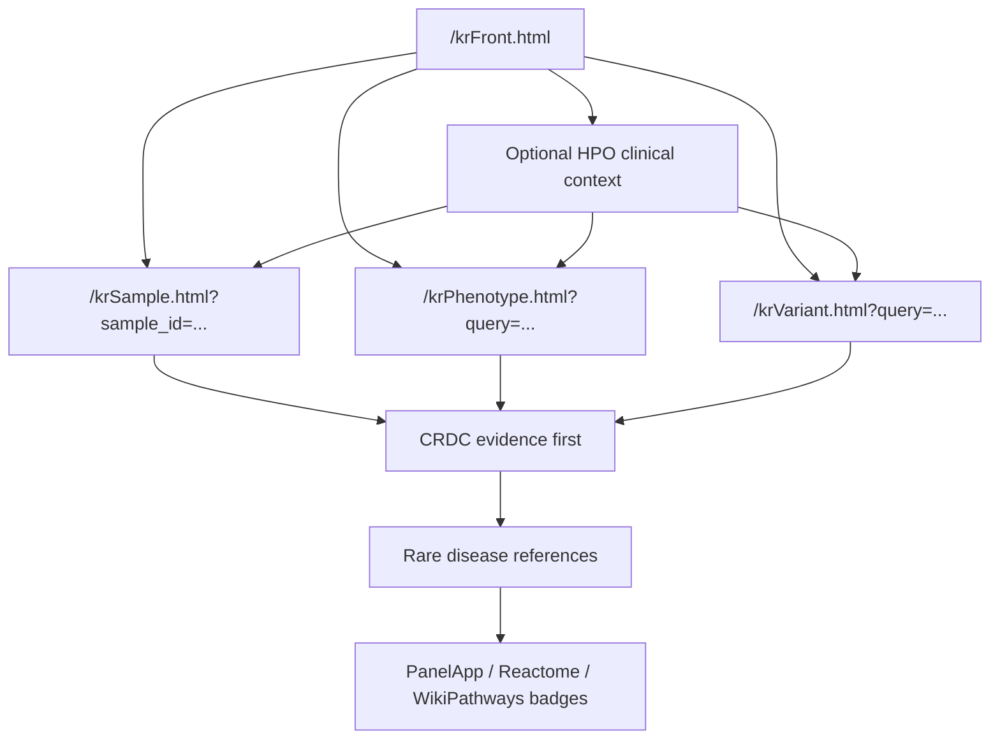

# CRDC Rare Disease Portal Architect Guide

Date: 2026-05-27  
Repository root: this `dig-dug-portal` repository

This is the current architecture guide for the clinical database browser mockup. It replaces the older workflow, status, blueprint, and API notes with one guide aligned to the four promoted pages and the `pageModel.js` refactor.

For source clinical database details, keep using `docs/DB_portal.md`. That document is the database reference and should not be treated as a UI architecture file.

---

## 1. Current Entry Points

The active rare disease browser is a Vue CLI multipage mockup with four promoted pages.

| Page | URL | Entry | UI shell | Page model |
|---|---|---|---|---|
| Front | `/krFront.html` | `src/views/KrFront/main.js` | `src/views/KrFront/Template.vue` | `src/views/KrFront/pageModel.js` |
| Sample | `/krSample.html` | `src/views/KrSample/main.js` | `src/views/KrSample/Template.vue` | `src/views/KrSample/pageModel.js` |
| Phenotype | `/krPhenotype.html` | `src/views/KrPhenotype/main.js` | `src/views/KrPhenotype/Template.vue` | `src/views/KrPhenotype/pageModel.js` |
| Variant | `/krVariant.html` | `src/views/KrVariant/main.js` | `src/views/KrVariant/Template.vue` | `src/views/KrVariant/pageModel.js` |

Normal builds should expose these four routes. Candidate and historical pages belong in archive paths and should not be linked from the main workflow.

Legacy docs that predate the `pageModel.js` split are preserved for comparison under:

```text
docs/archive/legacy_20260527/
```

---

## 2. Workflow

The portal supports three user starts from the front page:

```text
sample ID
variant or gene
HPO phenotype profile
```

All starts follow the same interpretation order:

```text
1. Inspect CRDC internal cohort evidence.
2. Review core rare disease references.
3. Treat PanelApp and pathway annotation as secondary badges.
```

Current route flow:



Routing rules from the front page:

| Search type | Target |
|---|---|
| Sample ID | `/krSample.html?sample_id=<sample_id>` |
| Phenotype profile | `/krPhenotype.html?query=<hpo_terms>` |
| Variant or gene | `/krVariant.html?query=<variant_or_gene>` |

---

## 3. Page Architecture Convention

Each promoted page should keep rendering and page logic separated.

```text
src/views/Kr*/main.js
  Vue mount and root setup only

src/views/Kr*/Template.vue
  Template markup, page state initialization, lifecycle hooks, and component wiring

src/views/Kr*/pageModel.js
  Computed properties, search/filter/sort helpers, URL builders, context comparison helpers,
  and page-specific behavior that does not need to live in markup

src/views/Kr*/mockData.js
  Fixture adapter that creates the page-shaped state consumed by Template.vue/pageModel.js

src/views/Kr*/portal*Data.generated.js
  Generated DB-derived fixture exports. Treat as generated input, not hand-authored UI logic.

src/views/Kr*/style.css
  Page-specific styling
```

`Template.vue` can still own page-local UI state such as active tabs, popover open flags, selected rows, and lifecycle listeners. Data shaping, filtering, sorting, HPO matching, route construction, and derived summary labels should move to `pageModel.js` when they grow beyond simple display binding.

---

## 4. Shared Clinical Context

Shared clinical context lives under:

```text
src/views/KrClinicalFocus/
```

Important files:

| File | Role |
|---|---|
| `ClinicalFocusBar.vue` | UI control for setting or editing context |
| `focusStore.js` | Browser-session persistence for the active context |
| `focusComparison.js` | HPO context availability and comparison helpers |
| `mockFocusData.js` | Mock context source options |
| `style.css` | Shared context control styles |

Context is an HPO phenotype profile. It can be compared to sample HPO profiles, disease HPO profiles, and carrier HPO profiles. It should not be presented as direct variant similarity.

Expected status language:

```text
No context | Set Context
Context active | Edit Context
```

Keep these concepts separate:

| Concept | Meaning |
|---|---|
| Phenotype similarity | Sample or query profile similarity to another HPO profile |
| Active context match | Overlap between active HPO context and the current sample, phenotype, disease, or carrier profile |
| Genotype recurrence | Same-variant or same-gene recurrence in CRDC |
| Reference profile overlap | HPO overlap against external disease/gene references |

---

## 5. Page Contracts

### 5.1 Front Page

Files:

```text
src/views/KrFront/main.js
src/views/KrFront/Template.vue
src/views/KrFront/pageModel.js
src/views/KrFront/style.css
```

Role:

- Search entry point for sample, phenotype, and variant/gene workflows.
- Optional HPO clinical context setup.
- Explains that CRDC internal evidence is primary.

`pageModel.js` owns:

- Search mode definitions.
- Example queries and fallback queries.
- Target route construction.
- Active context status labels.

Do not link the front page to archived candidate pages.

### 5.2 Sample Page

Files:

```text
src/views/KrSample/main.js
src/views/KrSample/Template.vue
src/views/KrSample/pageModel.js
src/views/KrSample/mockData.js
src/views/KrSample/portalSampleData.generated.js
src/views/KrSample/style.css
```

Core question:

```text
What are this sample's phenotype and genotype characteristics, and where does it lie within the CRDC cohort?
```

Expected evidence order:

1. Sample identity and metadata.
2. Sample HPO profile.
3. Similar samples by phenotype.
4. Similar or recurrent genotype evidence.
5. Disease profile reference matches.
6. Gene and variant evidence.

`pageModel.js` owns:

- Tab definitions.
- Top answer summaries.
- Display sample ID and age-band formatting.
- HPO term parsing and domain expansion helpers.
- Sample, variant, phenotype, and disease route builders.
- Popover/toggle behavior that supports evidence inspection.

Important rule:

```text
Similarity to the searched sample is not the same as match to active context.
```

### 5.3 Phenotype Page

Files:

```text
src/views/KrPhenotype/main.js
src/views/KrPhenotype/Template.vue
src/views/KrPhenotype/pageModel.js
src/views/KrPhenotype/mockData.js
src/views/KrPhenotype/portalPhenotypeData.generated.js
src/views/KrPhenotype/style.css
```

Core question:

```text
Which CRDC samples, co-observed phenotypes, disease references, genes, and variants are associated with this searched HPO profile?
```

Expected evidence order:

1. Query phenotype profile.
2. Phenotype-matched CRDC samples.
3. Co-observed CRDC phenotypes.
4. Reference-derived disease and gene candidates.
5. CRDC variant overlay from matched samples.

`pageModel.js` owns:

- Query/context overlap text.
- Matched cohort summary calculations.
- Age-bin display calculations.
- Co-observed phenotype filtering.
- Gene candidate classification helpers.
- Table sorting, row expansion, and detail selection helpers.

Important rule:

```text
Candidate variants are observed in CRDC samples after phenotype matching.
They are not inferred directly from HPO terms.
```

### 5.4 Variant Page

Files:

```text
src/views/KrVariant/main.js
src/views/KrVariant/Template.vue
src/views/KrVariant/pageModel.js
src/views/KrVariant/mockData.js
src/views/KrVariant/fixturePipeline.js
src/views/KrVariant/portalVariantData.generated.js
src/views/KrVariant/portalVariantNewData.generated.js
src/views/KrVariant/style.css
```

Core question:

```text
Who carries this variant or gene, and do carriers form a meaningful phenotype or cohort group?
```

Expected evidence order:

1. Queried variant or gene identity.
2. Exact variant carrier summary.
3. Same-gene carrier summary.
4. Carrier demographic distribution.
5. Locus and per-position carrier track.
6. Carrier HPO profile.
7. Carrier sample list.
8. Gene, disease, and secondary annotation support.

`pageModel.js` owns:

- Variant and gene summary scope switching.
- Carrier context matching.
- Carrier sample sorting/filtering.
- Demographic and density display derivations.
- HPO term normalization and formatting.
- Carrier-context draft selection behavior.

`fixturePipeline.js` owns the promoted fixture layering:

```text
base-db-fixture
  -> applies src/views/KrVariant/portalVariantData.generated.js

carrier-correction-fixture
  -> applies src/views/KrVariant/portalVariantNewData.generated.js
```

This keeps generated base fixture application and correction overrides visible to architects without hiding the order in `mockData.js`.

Important rules:

- Keep exact variant and same-gene carrier counts distinct.
- Gene-level carrier lists must deduplicate by sample ID.
- Use ClinVar or pathogenicity fields when available.
- Do not display `rare/damaging test subset` as a diagnosis.

---

## 6. Data And Fixture Backbone

The shared reference database lives at:

```text
data/reference_db/crdc_reference_db_tables.rds
```

Table-level reference files also live under:

```text
data/reference_db/
```

The Vue browser does not read RDS files directly. Current pages use generated JavaScript fixtures:

```text
src/views/KrSample/portalSampleData.generated.js
src/views/KrPhenotype/portalPhenotypeData.generated.js
src/views/KrVariant/portalVariantData.generated.js
src/views/KrVariant/portalVariantNewData.generated.js
```

Current adapter flow:

```text
data/reference_db + CRDC sample inputs
  -> local DB build/export
  -> page-shaped generated JS fixtures
  -> mockData.js adapter
  -> Template.vue + pageModel.js
```

Expected CRDC build inputs:

```text
sample_info.tsv
sample_hpo.tsv
sample_variant.tsv
```

`sample_variant.tsv` should come from normalized and annotated VCF-derived calls. If the current fixture uses a rare/damaging-enriched subset, the UI must not imply that every VCF variant is shown.

---

## 7. Backend API Replacement Direction

When replacing generated fixtures with real backend calls, preserve the same evidence separation and page-shaped contracts.

Suggested endpoint groups:

| Page | API family |
|---|---|
| Front | `GET /api/search/suggest`, `GET /api/context/reference-sources` |
| Sample | `GET /api/sample/{sample_id}/summary`, `/phenotype-profile`, `/similar-samples`, `/disease-profile-matches`, `/gene-variant-evidence` |
| Phenotype | `POST /api/phenotype/search`, `GET /api/phenotype/query/{query_id}/matched-samples`, `/co-observed-phenotypes`, `/reference-candidates` |
| Variant | `GET /api/variant/{variant_id}/summary`, `/carriers`, `GET /api/gene/{gene_symbol}/carriers`, `GET /api/carrier-set/{carrier_set_id}/phenotype-profile`, `POST /api/context/compare-carrier-profile` |

API responses should make these fields explicit when applicable:

```text
calculation method
source evidence type
matched HPO count and denominator
same-variant carrier count
same-gene carrier count
reference source
secondary annotation source
not calculated status
```

If only exact HPO overlap is available, say `exact_hpo_overlap`. Do not present it as PheRS or weighted phenotype similarity.

---

## 8. Archive And Dev-Only Pages

Promoted pages stay in:

```text
src/views/KrFront/
src/views/KrSample/
src/views/KrPhenotype/
src/views/KrVariant/
```

Archived candidate pages live under:

```text
src/views/archive/dev_only_20260527/
src/views/archive/version_01/
```

The dev-only pages are included only when:

```text
PORTAL_DEV_PAGES=true
NODE_ENV is not production
```

The default build should not emit dev-only page HTML for `_gemini`, `_new`, or `_v01` routes.

---

## 9. Design And Semantics Rules

Do not regress these rules:

- Keep CRDC internal evidence visually primary.
- Keep reference disease matches labeled as reference support, not diagnosis.
- Keep PanelApp, Reactome, and WikiPathways as secondary annotation.
- Keep phenotype similarity, active context match, genotype recurrence, and disease profile overlap separate.
- Keep `GenDx` casing exactly.
- Use blue only for clickable values or expand triggers.
- Label unavailable computed values as `not calculated`.
- Do not hide CRDC recurrent candidates because PanelApp or pathway annotation is missing.
- Do not remove the variant locus and per-position carrier track from the variant page.

---

## 10. Development Commands

Install dependencies:

```bash
npm install
```

Run development server:

```bash
./node_modules/.bin/vue-cli-service serve --mode development --port 8090 --host 0.0.0.0
```

Build default pages:

```bash
npm run build
```

Build with dev-only pages in non-production mode:

```bash
PORTAL_DEV_PAGES=true npm run build
```

Main local URLs:

```text
http://localhost:8090/krFront.html
http://localhost:8090/krSample.html
http://localhost:8090/krPhenotype.html
http://localhost:8090/krVariant.html
```

---

## 11. Review Checklist

Before accepting a UI or fixture change:

- Does the page still render through the promoted four-page workflow?
- Is UI markup mostly in `Template.vue` and derived page logic in `pageModel.js`?
- Are generated fixtures isolated from hand-authored UI logic?
- Does the variant page fixture order remain visible in `fixturePipeline.js`?
- Are exact query HPO terms separated from related or broad ontology terms?
- Are CRDC cohort signals separated from external reference annotations?
- Are same-variant and same-gene carrier scopes distinct?
- Are denominators visible for counts and overlap metrics?
- Are `not calculated` values clearly labeled?
- Are archived pages excluded from normal builds?
