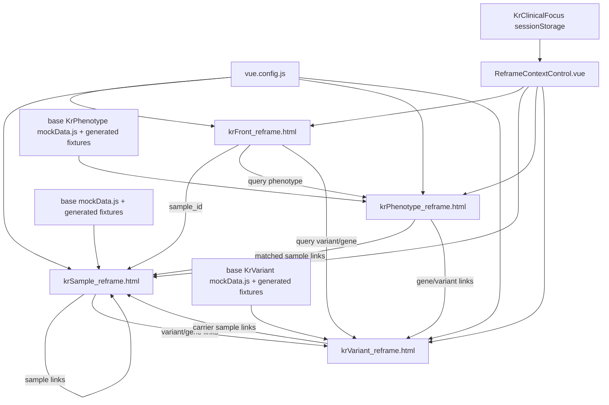

# CRDC Rare Disease Portal reframe 목업 상세 설명서

작성 기준: 현재 로컬 작업 트리의 reframe 후보 페이지

- `krFront_reframe.html`
- `krSample_reframe.html`
- `krPhenotype_reframe.html`
- `krVariant_reframe.html`

이 문서는 기본 페이지를 대체하지 않고 별도로 만든 reframe candidate layout의 구조, 데이터 연결, 페이지 간 이동, 구현 평가를 정리합니다. reframe은 기존 기본 목업과 같은 mock/test fixture를 사용하지만, 정보 계층을 더 명확하게 분리하려는 후보 버전입니다.

## 1. reframe의 목표

reframe의 목표는 사용자가 첫 화면에서 다음 질문에 더 빨리 답하도록 만드는 것입니다.

1. 무엇을 검색했는가? <!-- 굳이? 본인이 검색한것도 모를리 없잖아 -->
2. 가장 강한 CRDC internal evidence는 무엇인가?
3. 어떤 phenotype group 또는 carrier group이 관여하는가?
4. 어떤 curated rare disease reference가 support하는가?
5. 어떤 정보가 secondary annotation에 불과한가?
6. 사용자가 다음에 무엇을 inspect해야 하는가?

reframe에서는 evidence를 세 층으로 나눕니다.

| Evidence layer | 의미 |
|---|---|
| Primary CRDC internal evidence | sample HPO profile, same variant recurrence, same gene recurrence, phenotype overlap among carriers, investigator/group affinity |
| Core rare disease reference | Orphanet, HPO, OMIM |
| Secondary annotation | PanelApp, Reactome, WikiPathways. Badge로만 표시하고 filter/priority reducer로 쓰지 않습니다. |<!-- mondo도 추가했고 ddpg2도 추가했으니까 그것도 secondary로 넣되 언제든지 다시 원하면 core 레퍼런스로 이동해야해-->

## 2. 전체 구조 개괄도



## 3. 라우팅과 엔트리

`vue.config.js`에서 reframe 페이지는 기본 페이지와 별도의 multipage entry로 등록되어 있습니다.

```js
// vue.config.js
krFrontReframe: {
    entry: "src/views/KrFrontReframe/main.js",
    filename: "krFront_reframe.html",
},
krSampleReframe: {
    entry: "src/views/KrSampleReframe/main.js",
    filename: "krSample_reframe.html",
},
krVariantReframe: {
    entry: "src/views/KrVariantReframe/main.js",
    filename: "krVariant_reframe.html",
},
krPhenotypeReframe: {
    entry: "src/views/KrPhenotypeReframe/main.js",
    filename: "krPhenotype_reframe.html",
},
```

| URL | Template |
|---|---|
| `/krFront_reframe.html` | `src/views/KrFrontReframe/Template.vue` |
| `/krSample_reframe.html` | `src/views/KrSampleReframe/Template.vue` |
| `/krPhenotype_reframe.html` | `src/views/KrPhenotypeReframe/Template.vue` |
| `/krVariant_reframe.html` | `src/views/KrVariantReframe/Template.vue` |

각 reframe 페이지 상단에는 `reframe candidate layout` label이 표시됩니다.<!-- 이거 없애 불필요한 글자는 빼는게 맞아 -->

## 4. reframe 공통 context control

reframe 페이지는 모두 `src/views/KrReframeCommon/ReframeContextControl.vue`를 사용합니다.

현재 상태 표시:

| 상태 | 표시 |
|---|---|
| no context | `i No context | Set Context` |
| active context | `i Context active | Edit Context` |

핵심 구현:

```vue
<!-- src/views/KrReframeCommon/ReframeContextControl.vue -->
<span class="glens-reframe-context-status">
    {{ hasActiveContext ? "Context active" : "No context" }}
</span>
<span class="glens-reframe-divider">|</span>
<button class="glens-reframe-context-action" type="button">
    {{ hasActiveContext ? "Edit Context" : "Set Context" }}
</button>
```

각 페이지는 page-specific tooltip 문장을 props로 넘깁니다.

```vue
<reframe-context-control
    baseline-question="What are this sample's phenotype and genotype characteristics, and where does it lie within the CRDC cohort?"
    baseline-purpose="Establish the searched sample profile, then inspect disease references, similar patients, cohort groups, genes, and variants."
    active-question="How well does this sample match the active HPO context, and which patients, groups, diseases, genes, or variants support that context?"
    active-purpose="Use the active HPO context as a clinical hypothesis while keeping sample similarity and context match as separate evidence."
></reframe-context-control>
```

중요한 공통 문구:

```text
Active context is HPO phenotype-based. Variant and gene pages compare it to carrier or gene/disease phenotype profiles.
```

## 5. reframe 데이터 흐름

reframe pages는 새 DB를 쓰지 않습니다. 기본 페이지의 `createKr*State()`를 import합니다.

```js
// src/views/KrSampleReframe/Template.vue
import { createKrSampleState } from "../KrSample/mockData";

data() {
    return {
        ...createKrSampleState(),
        clinicalFocus: readClinicalFocus(),
    };
}
```

즉, reframe과 기본 페이지는 같은 generated fixture를 공유합니다.

| Reframe page | data source |
|---|---|
| `krSample_reframe.html` | `src/views/KrSample/mockData.js` + `portalSampleData.generated.js` |
| `krPhenotype_reframe.html` | `src/views/KrPhenotype/mockData.js` + `portalPhenotypeData.generated.js` |
| `krVariant_reframe.html` | `src/views/KrVariant/mockData.js` + `portalVariantData.generated.js` |
| `krFront_reframe.html` | 자체 static search mode config + shared context |

## 6. 페이지별 구조

## 6.1 `krFront_reframe.html`

### 목적

front reframe은 sample, variant/gene, phenotype search를 세 개의 별도 tool이 아니라 같은 CRDC cohort exploration workflow의 entry points로 보이게 하는 것이 목적입니다.

### 화면 구조<!--krFront_reframe.html 제거하고 krFront.html를 reframe.html들과 연결시킬꺼야. -->

| 영역 | 현재 표시 |
|---|---|
| topbar | Current workflow: Rare disease cohort portal + context control |
| candidate label | `reframe candidate layout` |
| search entry card | title, 설명, workflow band |<!-- 설명부분은 krFront.html의 설명부분대신 reframe의 설명으로 대신해해 -->
| workflow band | 1. Choose entry point, 2. Apply optional HPO context, 3. Inspect evidence layers |<!-- 이 밴드의 내용을 하나의 카드로 만들어서, 복사한 새로운 front page에 Sample ID-first workflow 의 왼편에 넣어 -->
| search modes | Search by sample, Search by variant, Search by phenotype |
| active context summary | context가 있을 때 context source, selected HPO terms, use across pages |
| entry cards | three workflow cards and example links |

검색 mode 설정:

```js
// src/views/KrFrontReframe/Template.vue
searchModes: [
    {
        key: "sample",
        label: "Search by sample",
        destination: "/krSample_reframe.html?sample_id=BCH-12-34567-01",
    },
    {
        key: "variant",
        label: "Search by variant",
        destination: "/krVariant_reframe.html?query=chr15%3A22000220%3AG%3AC",
    },
    {
        key: "phenotype",
        label: "Search by phenotype",
        destination: "/krPhenotype_reframe.html?query=cleft%20palate%2Cdevelopmental%20delay",
    },
]
```

이동 로직:

```js
openResults() {
    const value = this.query || this.activeMode.example;
    const param = this.activeSearchMode === "sample" ? "sample_id" : "query";
    window.location.assign(
        `${this.activeMode.destination.split("?")[0]}?${param}=${encodeURIComponent(value)}`
    );
}
```

### 평가

구현된 점:

- 세 검색 mode를 하나의 workflow로 묶어 설명합니다.
- reframe page끼리만 이동합니다.
- active HPO context가 있으면 front page에서 source와 HPO terms를 요약합니다.

남은 문제:

- example 값은 아직 기존 static mock 값입니다. test DB generated sample/variant와 동기화되어 있지 않습니다.
- 실제 검색/lookup은 수행하지 않고 URL 이동만 합니다.

## 6.2 `krSample_reframe.html`

### 목적

sample reframe은 sample header 뒤에 interpretation summary band를 둬서, sample을 열었을 때 즉시 "이 sample에서 중요한 phenotype/genotype/disease/group evidence가 무엇인가"를 파악하게 하는 후보 구조입니다.

### 화면 구조

| 영역 | 현재 표시 |
|---|---|
| topbar | workflow + common context control |
| searched sample header | sample ID, sex, age group, proband, affected, GenDx diagnosis status, diagnostic disease/gene/variant |
| interpretation summary band | phenotype burden, GenDx status, top disease profile match, top phenotype group, recurrent gene/variant evidence, context match |<!--이걸 searched sample header 위치에서 같이 보여줘야해 기본정보있는건 male | Age 12–17 | GenDx: Not loaded 이런식으로 공간을 줄여서 보존해-->
| Sample phenotype profile | HPO count, category bars, representative HPO terms |
| Sample genotype / GenDx profile | candidate genes, rare coding genes, GenDx status, diagnostic gene/variant |
| Disease profile matches | sample vs disease, context vs disease if active, shared evidence, reference |
| Similar patients / groups | similarity to searched sample, context match if active, phenotype group, investigator affinity |
| Gene / variant evidence | recurrence, carrier phenotype overlap, context overlap, reference support, secondary annotation |

### 핵심 코드

```js
// src/views/KrSampleReframe/Template.vue
topDiseaseProfile() {
    const disease = this.sample.diseaseMatches[0];
    return disease ? `${disease.name} · ${disease.overlap}` : "No disease profile reference";
},
topSimilarPhenotypeGroup() {
    const match = this.sample.phenotypeMatches[0];
    return match ? `${match.notes} · ${match.sharedPhenotypeCount}` : "No similar phenotype group";
},
topRecurrentEvidence() {
    const gene = this.sample.candidateGenes[0];
    return gene ? `${gene.gene} · ${gene.internalSupport}` : this.sample.topCandidate;
}
```

페이지 이동은 reframe URL을 사용합니다.

```js
// src/views/KrSampleReframe/Template.vue
sampleHref(sampleId) {
    return `/krSample_reframe.html?sample_id=${encodeURIComponent(sampleId)}`;
},
variantHref(query) {
    return `/krVariant_reframe.html?query=${encodeURIComponent(query)}`;
}
```

### 현재 데이터 연결

기본 sample fixture를 그대로 가져오기 때문에 test DB generated sample이 반영됩니다.

| UI | data |
|---|---|
| Sample ID | URL `sample_id` 또는 `sample.sampleId` |
| HPO count | `sample.overviewHpoTermCount` |
| disease profile match | `sample.diseaseMatches[0]` |
| similar group | `sample.phenotypeMatches[0]` |
| recurrent evidence | `sample.candidateGenes[0]` |

### 평가

구현된 점:

- first screen에 interpretation summary band가 추가되어 정보 계층이 기본 페이지보다 명확합니다.
- Similarity to searched sample과 Match to active context를 분리하려는 구조가 있습니다.
- secondary annotation은 badge 수준으로만 표현됩니다.

문제점:

- header에 `Diagnosed`, `Kabuki syndrome` 같은 hard-coded text가 남아 있습니다. generated sample은 `Not loaded`/ARMC9일 수 있어 불일치합니다.
- `Diagnostic gene` link href가 `KMT2D`로 hard-coded 되어 있으면서 text는 `sample.gendx.gene`을 보여주는 불일치가 있습니다.
- `displayAgeGroup()`은 `sample.ageGroup`만 사용합니다. 기본 sample page처럼 `ageBand` fallback이 없습니다.
- sample query별 dynamic lookup은 없습니다.

## 6.3 `krPhenotype_reframe.html`

### 목적

phenotype reframe은 searched phenotype HPO set과 active context HPO set을 시각적으로 분리하고, phenotype search 결과를 CRDC internal evidence, rare disease reference, candidate gene/variant evidence로 나누어 보여주는 후보 구조입니다.

### 화면 구조

| 영역 | 현재 표시 |
|---|---|
| topbar | workflow + common context control |
| Phenotype query header | searched HPO terms, active context HPO terms if active |
| Interpretation summary | searched terms, matched CRDC samples, closest phenotype group, co-occurring phenotypes, disease domains, candidate genes/variants, context overlap |
| Matched samples | sample, adjusted phenotype score, metadata summary, candidate signals, context support |
| Matched groups | phenotype-defined/investigator group bars |
| Related phenotypes | co-occurring HPO terms |
| Disease profile matches | query vs disease, context vs disease if active, linked genes, reference source |
| Candidate genes / variants | HPO gene annotation, Orphanet/OMIM support, CRDC recurrence, candidate label, secondary annotation |

### 핵심 코드

```js
// src/views/KrPhenotypeReframe/Template.vue
searchedHpoTerms() {
    return this.phenotype.queryTerms.exact
        .map((term) => `${term.label} [${term.id}]`)
        .join(" + ");
},
queryContextOverlap() {
    const queryLabels = this.phenotype.queryTerms.exact.map((term) => term.label);
    const contextLabels = (this.clinicalFocus.hpoTerms || []).map((term) => term.label);
    const shared = queryLabels.filter((label) => contextLabels.includes(label));
    return shared.length
        ? `${shared.length} / ${queryLabels.length} searched HPO terms overlap active context`
        : `0 / ${queryLabels.length} searched HPO terms overlap active context`;
}
```

candidate label logic:

```vue
<!-- src/views/KrPhenotypeReframe/Template.vue -->
<span>
    {{ gene.externalAnnotation.includes('Orphanet') || gene.externalAnnotation.includes('OMIM')
        ? 'Reference supported candidate'
        : 'Uncurated recurrent candidate' }}
</span>
```

### 현재 데이터 연결

| UI | data |
|---|---|
| query terms | `phenotype.queryTerms.exact` |
| matched CRDC samples | `phenotype.headline[0].value`, `phenotype.topSamples` |
| co-occurring phenotypes | `phenotype.coObserved` |
| disease candidates | `phenotype.diseaseCandidates` |
| gene candidates | `phenotype.geneCandidates` |
| candidate variants | `phenotype.candidateVariants` |

### 평가

구현된 점:

- searched phenotype과 active context가 분리되어 보입니다.
- candidate gene/variant evidence가 CRDC recurrence와 reference support를 분리해서 보여줍니다.
- `Uncurated recurrent candidate` label을 보존하는 방향이 들어가 있습니다.

문제점:

- `Adjusted phenotype score`라고 표시하지만 generated fixture에서는 residual/PheRS가 실제 계산되지 않아 `not calculated`가 보일 수 있습니다.
- candidate variant carrier count는 기본 phenotype page와 동일한 fixture를 쓰므로 denominator 문제가 생길 수 있습니다.
- phenotype query를 URL에서 파싱해 새로운 결과를 계산하지 않습니다.

## 6.4 `krVariant_reframe.html`

### 목적

variant reframe은 queried variant/gene의 carrier set, carrier phenotype profile, carrier group pattern, rare disease reference support를 먼저 요약하고, active context가 있으면 carrier HPO profile과 context HPO profile의 overlap을 보여주기 위한 후보 구조입니다.

### 화면 구조

| 영역 | 현재 표시 |
|---|---|
| topbar | workflow + common context control |
| queried variant/gene header | query label, gene symbol, consequence, rarity, pathogenicity score, GenDx diagnostic support |
| interpretation summary | query, query mode, pathogenicity, exact carriers, phenotype categories, disease references, cohort concentration, context match |
| scope row | exact queried variant / same gene / nearby variants 구분 |
| queried locus window | disease track, gene/base/codon track, density mini view |
| carrier count summary | all/affected/proband/diagnosed/undiagnosed/sex |
| carrier phenotype profile | HPO categories and context overlap |
| carrier group pattern | residual/investigator group pattern |
| carrier reference set | carrier sample, GenDx, phenotype match, context match, investigator |
| gene/disease/annotation support | primary CRDC, core reference, secondary annotation badges |

### 핵심 코드

```js
// src/views/KrVariantReframe/Template.vue
contextCarrierOverlap() {
    const terms = (this.clinicalFocus.hpoTerms || []).map((term) => term.label);
    const carrierTerms = this.variant.carrierPhenotypesByCategory.flatMap(
        (category) => category.terms
    );
    return carrierTerms
        .filter((term) => terms.includes(term.replace(/\s*\[HP:[0-9]+\]/, "")))
        .slice(0, 5);
},
carrierContextSummary() {
    return this.contextCarrierOverlap.length
        ? `${this.contextCarrierOverlap.length} carrier HPO terms overlap active context`
        : "No carrier HPO overlap in visible mock profile";
}
```

carrier sample link:

```js
sampleHref(sampleId) {
    return `/krSample_reframe.html?sample_id=${encodeURIComponent(sampleId)}`;
}
```

### 현재 데이터 연결

| UI | data |
|---|---|
| query label/pathogenicity | `variant.query` |
| carrier counts | `variant.summaryScopes.variant` |
| phenotype categories | `variant.carrierPhenotypesByCategory` |
| disease refs | `variant.diseaseSignals` |
| carrier samples | `variant.carrierSamples` |
| group pattern | `variant.residualGroups` |

### 평가

구현된 점:

- first screen summary band가 있어 carrier count, phenotype category, disease refs, context match를 빠르게 볼 수 있습니다.
- exact variant, same gene, nearby variants를 conceptually 분리합니다.
- active context는 carrier HPO profile과 비교하도록 코드가 작성되어 있습니다.

문제점:

- header와 support section에 UBE3A/Angelman hard-coded text가 남아 있습니다.
- generated fixture는 ARMC9/chr2인데 reframe variant header는 gene symbol `UBE3A`, consequence `missense`, AF/REVEL/AlphaMissense 값이 static입니다.
- locus view도 UBE3A codon/base text가 hard-coded입니다.
- carrier phenotype bar denominator가 `category.count / 18`로 hard-coded되어 generated carrier count 259와 맞지 않습니다.

## 7. reframe 페이지 간 이동

reframe은 내부 이동이 `_reframe.html` URL로 가도록 분리되어 있습니다.

| Source | Target | 구현 |
|---|---|---|
| Front reframe sample mode | `/krSample_reframe.html?sample_id=...` | `openResults()` |
| Front reframe variant mode | `/krVariant_reframe.html?query=...` | `openResults()` |
| Front reframe phenotype mode | `/krPhenotype_reframe.html?query=...` | `openResults()` |
| Sample reframe similar sample | `/krSample_reframe.html?sample_id=...` | `sampleHref()` |
| Sample reframe gene/variant | `/krVariant_reframe.html?query=...` | `variantHref()` |
| Phenotype reframe matched sample | `/krSample_reframe.html?sample_id=...` | `sampleHref()` |
| Phenotype reframe gene/variant | `/krVariant_reframe.html?query=...` | `variantHref()` |
| Variant reframe carrier sample | `/krSample_reframe.html?sample_id=...` | `sampleHref()` |

## 8. reframe 데이터/DB 매핑

reframe은 같은 generated fixture를 사용하므로 기본 페이지와 DB source가 동일합니다.

| Reframe section | Intended DB/source |
|---|---|
| Sample header and summary | `sample_page_summary`, `sample`, `sample_hpo`, `sample_variant` |
| Sample phenotype profile | `sample_hpo`, `hpo_term`, intended `hpo_root_map` |
| Sample disease matches | `sample_disease_profile_match_summary`, disease-HPO reference |
| Sample similar patients/groups | `sample_hpo` overlap, `sample_to_cohort_phenotype_score` |
| Sample gene/variant evidence | `sample_gene_variant_evidence_summary`, recurrence tables |
| Phenotype matched samples | query HPO overlap fixture |
| Phenotype disease/gene candidates | generated candidate summaries from matched samples/reference proxies |
| Variant carrier profile | `variant_carrier`, `gene_carrier`, carrier sample HPO aggregation |
| Variant support badges | rare disease reference + PanelApp/pathway intended annotations |

## 9. 계산/필터/선택 옵션

### Shared

- context status는 `sessionStorage`의 `krClinicalFocus.v1`을 읽습니다.
- context editor는 `ClinicalFocusBar.vue`를 사용합니다.
- context가 active이면 summary band에서 context overlap summary가 추가됩니다.

### Front reframe

- 세 search mode 중 하나를 선택하면 input placeholder와 query가 바뀝니다.
- submit 시 `_reframe.html` target으로 이동합니다.

### Sample reframe

- context active 여부에 따라 `Sample-context HPO match`, `Context vs disease`, `Match to active context`, `Carrier HPO vs context` column이 보입니다.
- 별도 runtime filtering은 거의 없습니다.

### Phenotype reframe

- active context가 있으면 searched HPO terms와 active context HPO terms가 별도 block으로 표시됩니다.
- query-context overlap은 label 문자열 기준으로 계산합니다.

### Variant reframe

- carrier-context overlap은 carrier HPO term label과 context term label을 문자열로 비교합니다.
- carrier count/phenotype category display는 fixture values와 일부 hard-coded denominator가 섞여 있습니다.

## 10. 평가: reframe 목표 vs 구현

## 10.1 목표했던 것

| 목표 | 설명 |
|---|---|
| 기본 페이지 보존 | original `kr*.html`은 유지하고 `_reframe.html` 후보 페이지 생성 |
| summary-first hierarchy | 각 페이지 first screen에 interpretation summary band 추가 |
| context control 통일 | top-right common control 사용 |
| evidence layer 구분 | CRDC internal / rare disease reference / secondary annotation 분리 |
| active context 의미 명확화 | HPO context를 sample/carrier/disease phenotype profile과 비교 |
| reframe 내부 navigation | reframe 페이지끼리 이동 |

## 10.2 실제 구현된 것

| 항목 | 상태 |
|---|---|
| 4개 reframe URL | 구현됨 |
| reframe candidate label | 구현됨 |
| common context control | 구현됨 |
| front workflow band | 구현됨 |
| sample interpretation summary band | 구현됨 |
| phenotype interpretation summary band | 구현됨 |
| variant interpretation summary band | 구현됨 |
| reframe 내부 links | 대부분 구현됨 |
| generated fixture 공유 | 구현됨 |

## 10.3 아직 구현이 불완전한 것

| 문제 | 설명 |
|---|---|
| hard-coded legacy values | sample reframe의 Kabuki/KMT2D, variant reframe의 UBE3A/Angelman/18 carriers 등 |
| dynamic query 없음 | URL query에 따라 새로운 DB row를 선택하지 않습니다. |
| frontend PheRS/GRS 없음 | reframe도 기본 페이지와 마찬가지로 runtime PheRS/GRS 계산이 없습니다. |
| context overlap 계산 단순함 | label string match 중심입니다. HPO ancestor/semantic overlap은 계산하지 않습니다. |
| generated fixture와 UI 일부 불일치 | 특히 variant reframe에서 ARMC9 generated data와 UBE3A hard-coded text가 섞입니다. |
| secondary annotation 실제 연결 | PanelApp/Reactome/WikiPathways는 badge placeholder에 가깝습니다. |

## 10.4 중복된 것

| 중복 | 설명 |
|---|---|
| 기본 페이지와 reframe 페이지 | 비교 목적상 의도된 중복입니다. |
| reframe summary band와 아래 section | 같은 top evidence가 아래 table에 다시 나옵니다. 다만 summary-first 구조상 일부 의도된 반복입니다. |
| Sample genotype / GenDx profile과 Gene / variant evidence | 둘 다 gene/variant를 보여주며, GenDx/report evidence와 recurrence evidence의 구분이 더 필요합니다. |
| Variant summary carrier counts와 carrier count card | first-screen summary와 상세 section에 반복됩니다. |

## 10.5 삭제 또는 수정이 필요한 것

| 대상 | 이유 |
|---|---|
| `krSample_reframe.html`의 hard-coded `Diagnosed`, `Kabuki syndrome`, `KMT2D` href | generated sample과 불일치합니다. |
| `krVariant_reframe.html`의 `UBE3A`, `Angelman syndrome`, `18 carriers`, static pathogenicity score | generated ARMC9/chr2 test fixture와 불일치합니다. |
| reframe front의 old examples | test DB 확인용이면 `BCH-22-44945-01`, `chr2:231222761:AT:A` 등으로 바꾸는 것이 낫습니다. |
| hard-coded carrier denominator `18` | generated carrier count와 맞지 않습니다. |
| `Adjusted phenotype score` 표현 | 실제 residual/PheRS 계산이 없으면 `HPO overlap score` 또는 `fixture score`로 표시하는 편이 안전합니다. |

## 10.6 목표와 달라진 것

| 달라진 점 | 설명 |
|---|---|
| reframe은 새 분석 대상이 아니라 같은 fixture를 다른 layout으로 보여줌 | 의도와 맞지만, 사용자가 실제 data 차이로 오해하지 않게 해야 합니다. |
| summary band가 일부 hard-coded example을 포함 | hierarchy 검토에는 도움이 되지만 DB fidelity는 떨어집니다. |
| context는 UI-level state | 실제 backend re-ranking이나 recalculation은 없습니다. |

## 10.7 요구하지 않았으나 추가된 것 또는 부가 요소

| 요소 | 평가 |
|---|---|
| Reframe common style | reframe 페이지 독립 시각 구조를 위해 추가됨 |
| ReframeContextControl component | context control 통일에는 좋지만 original page와는 별도 구현입니다. |
| summary bands | reframe hierarchy 평가를 위해 추가됨 |
| evidence layer labels | CRDC/internal/reference/secondary distinction을 화면에서 평가하기 위한 구조입니다. |

## 11. 기본 버전과 reframe 버전의 차이

| 항목 | 기본 버전 | reframe 버전 |
|---|---|---|
| 정보 구조 | 페이지별 탭/카드 중심 | first-screen summary + evidence layer 중심 |
| context control | 각 페이지에 별도 구현 | common `ReframeContextControl` |
| sample page | 상세 hub, 많은 tab | summary-first, section hierarchy 단순화 |
| phenotype page | top query + candidate block + CRDC evidence tabs | query/context HPO set 분리, evidence flow를 더 직접적으로 표현 |
| variant page | locus/carrier interaction 중심 | carrier group/phenotype/reference summary를 first screen에 올림 |
| data source | generated fixture + static mock | 같은 generated fixture + static mock |
| fidelity 문제 | phenotype/variant static 값 혼재 | hard-coded old values가 더 눈에 띄는 곳 있음 |

## 12. 결론

reframe 후보는 기본 목업보다 정보 계층은 명확합니다. 특히 각 페이지 첫 화면에 interpretation summary band를 둔 점, context control을 공통화한 점, CRDC internal evidence와 rare disease reference와 secondary annotation을 나누려는 점은 현재 portal 목표와 잘 맞습니다.

다만 reframe은 아직 "새로운 구조 후보" 수준입니다. 실제 test DB 기반으로 평가하려면 다음 정리가 필요합니다.

1. reframe front examples를 test DB 대표 sample/variant/query로 교체합니다.
2. sample reframe의 Kabuki/KMT2D hard-coded diagnosis text를 generated `sample.gendx` 기반으로 바꿉니다.
3. variant reframe의 UBE3A/Angelman/18 carrier hard-coded text를 generated ARMC9/chr2 fixture 기반으로 바꿉니다.
4. phenotype reframe에서 PheRS/adjusted score처럼 실제 계산되지 않은 표현을 fixture-compatible wording으로 바꿉니다.
5. context overlap은 HPO ID 기반으로 비교해야 하며 label string match에서 벗어나야 합니다.

현재 reframe은 production 후보라기보다, rare disease portal의 새로운 information hierarchy를 평가하기 위한 비교용 candidate layout입니다.
