# CRDC Rare Disease Portal ERD

This ERD connects the DB plan with what the portal screens need to display.

Important modeling choices:

- `cohort` is the DB entity for investigator/cohort group. Keep `investigator_name` as a column.
- Primary CRDC evidence is modeled separately from external rare disease reference evidence.
- PanelApp, Reactome, and WikiPathways are secondary annotations only. They should not remove or down-rank CRDC recurrent candidates.
- Active context is HPO phenotype-based. It can be compared to sample HPO profiles, carrier HPO profiles, or disease/gene HPO profiles, but not directly to a variant.
- The `*_SUMMARY`, `*_CACHE`, and `*_VIEW` entities below are screen-facing materialized tables or API response shapes, not normalized source-of-truth tables.

## 1. Normalized Source-Of-Truth ERD

```mermaid
erDiagram
  COHORT {
    string cohort_id PK
    string investigator_name
    string cohort_name
    string cohort_type
  }

  SAMPLE {
    string sample_id PK
    string sex
    string age_group
    boolean affected
    boolean proband
    string gendx_status
  }

  SAMPLE_COHORT {
    string sample_id FK
    string cohort_id FK
    boolean is_primary
  }

  HPO_TERM {
    string hpo_id PK
    string name
    string definition
    boolean is_obsolete
  }

  HPO_ANCESTOR {
    string hpo_id FK
    string ancestor_hpo_id FK
    int distance
  }

  HPO_ROOT_MAP {
    string hpo_id FK
    string root_hpo_id FK
    int distance
  }

  SAMPLE_HPO {
    string sample_id FK
    string hpo_id FK
    string source
    boolean is_leaf
    boolean observed
  }

  SAMPLE_HPO_PROPAGATED {
    string sample_id FK
    string hpo_id FK
    string source_hpo_id FK
    int distance
  }

  GENE {
    string gene_id PK
    string gene_symbol
    string hgnc_id
  }

  VARIANT {
    string variant_id PK
    string chrom
    int pos
    string ref
    string alt
    string genome_build
    string gene_id FK
  }

  SAMPLE_VARIANT {
    string sample_id FK
    string variant_id FK
    string gene_id FK
    string genotype
    float dosage
    string consequence
    float af
    float revel
    float alphamissense
    string loftee
    string clinvar
  }

  DISEASE {
    string disease_id PK
    string source
    string source_disease_id
    string disease_name
  }

  DISEASE_HPO_WEIGHT {
    string disease_id FK
    string hpo_id FK
    string frequency_category
    float frequency_weight
    boolean propagated
  }

  DISEASE_GENE_WEIGHT {
    string disease_id FK
    string gene_id FK
    string inheritance
    string association_type
    float gene_weight
  }

  GENE_HPO_ANNOTATION {
    string gene_id FK
    string hpo_id FK
    string source
    string evidence
    string disease_id FK
  }

  PANELAPP_GENE_SUMMARY {
    string gene_id FK
    int green_panel_count
    string panel_names
    string modes_of_inheritance
  }

  PANELAPP_GENE_PANEL {
    string gene_id FK
    string panel_id
    string panel_name
    string confidence_label
  }

  PATHWAY {
    string pathway_id PK
    string pathway_source
    string pathway_name
  }

  PATHWAY_GENE {
    string pathway_id FK
    string gene_id FK
  }

  GENE_PATHWAY_SUMMARY {
    string gene_id FK
    int reactome_pathway_count
    int wikipathways_pathway_count
    string top_pathway_names
  }

  COHORT ||--o{ SAMPLE_COHORT : groups
  SAMPLE ||--o{ SAMPLE_COHORT : belongs_to

  SAMPLE ||--o{ SAMPLE_HPO : has_observed_hpo
  HPO_TERM ||--o{ SAMPLE_HPO : annotates_sample
  SAMPLE ||--o{ SAMPLE_HPO_PROPAGATED : has_propagated_hpo
  HPO_TERM ||--o{ SAMPLE_HPO_PROPAGATED : propagated_term
  HPO_TERM ||--o{ HPO_ANCESTOR : child
  HPO_TERM ||--o{ HPO_ANCESTOR : ancestor
  HPO_TERM ||--o{ HPO_ROOT_MAP : maps_to_root

  SAMPLE ||--o{ SAMPLE_VARIANT : carries
  VARIANT ||--o{ SAMPLE_VARIANT : observed_in_sample
  GENE ||--o{ VARIANT : contains
  GENE ||--o{ SAMPLE_VARIANT : variant_gene

  DISEASE ||--o{ DISEASE_HPO_WEIGHT : has_hpo_profile
  HPO_TERM ||--o{ DISEASE_HPO_WEIGHT : disease_phenotype
  DISEASE ||--o{ DISEASE_GENE_WEIGHT : has_gene_reference
  GENE ||--o{ DISEASE_GENE_WEIGHT : disease_gene

  GENE ||--o{ GENE_HPO_ANNOTATION : has_known_hpo
  HPO_TERM ||--o{ GENE_HPO_ANNOTATION : gene_phenotype
  DISEASE ||--o{ GENE_HPO_ANNOTATION : annotation_context

  GENE ||--o{ PANELAPP_GENE_SUMMARY : has_panelapp_badge
  GENE ||--o{ PANELAPP_GENE_PANEL : appears_in_panel
  GENE ||--o{ PATHWAY_GENE : member_of
  PATHWAY ||--o{ PATHWAY_GENE : contains_gene
  GENE ||--o{ GENE_PATHWAY_SUMMARY : has_pathway_badge
```



## 2. Portal Summary And Cache ERD

These tables are designed to answer portal screens quickly. They are derived from the normalized tables above.

```mermaid
erDiagram
  SAMPLE_PAGE_SUMMARY {
    string sample_id PK
    int hpo_count
    int rare_coding_gene_count
    string gendx_status
    string top_disease_id FK
    string top_gene_id FK
    string top_variant_id FK
    string best_cohort_id FK
  }

  SAMPLE_SIMILAR_PATIENT_SUMMARY {
    string query_sample_id FK
    string match_sample_id FK
    int rank
    float phenotype_similarity
    int shared_hpo_count
    string shared_hpo_terms
  }

  SAMPLE_COHORT_AFFINITY_SUMMARY {
    string sample_id FK
    string home_cohort_id FK
    string best_cohort_id FK
    int home_rank
    int best_rank
    float score_delta
    string matched_hpo_terms
  }

  SAMPLE_GENOTYPE_RECURRENCE_SUMMARY {
    string sample_id FK
    string gene_id FK
    string variant_id FK
    int same_variant_carrier_count
    int same_gene_carrier_count
    float carrier_overlap_score
  }

  SAMPLE_DISEASE_PROFILE_MATCH_SUMMARY {
    string sample_id FK
    string disease_id FK
    int rank
    int matched_hpo_count
    int total_disease_hpo_count
    string overlap_terms
  }

  SAMPLE_GENE_VARIANT_EVIDENCE_SUMMARY {
    string sample_id FK
    string gene_id FK
    string best_variant_id FK
    string phenotype_fit
    string internal_support
    string disease_link
    boolean panelapp_green_badge
    boolean pathway_badge
    string discovery_label
  }

  VARIANT_CARRIER_PROFILE_SUMMARY {
    string variant_id FK
    int carrier_count
    int proband_count
    int affected_count
    int diagnosed_count
    string cohort_distribution
    string top_hpo_terms
  }

  GENE_CARRIER_PROFILE_SUMMARY {
    string gene_id FK
    int carrier_count
    int rare_variant_count
    int proband_count
    int affected_count
    int diagnosed_count
    string cohort_distribution
    string top_hpo_terms
  }

  CARRIER_REFERENCE_SET {
    string carrier_set_id PK
    string scope
    string variant_id FK
    string gene_id FK
    string sample_id FK
    string gendx_status
  }

  COHORT_PHENOTYPE_SIGNATURE {
    string cohort_id FK
    string hpo_id FK
    float hpo_frequency
    float hpo_weight
  }

  PHENOTYPE_QUERY {
    string phenotype_query_id PK
    string normalized_query_label
    string created_from
  }

  PHENOTYPE_QUERY_HPO {
    string phenotype_query_id FK
    string hpo_id FK
    string term_role
    float term_weight
  }

  PHENOTYPE_QUERY_RESULT_CACHE {
    string phenotype_query_id FK
    int matched_sample_count
    int eligible_sample_count
    string top_cohort_id FK
    string top_disease_id FK
    string top_gene_id FK
    string top_variant_id FK
  }

  PHENOTYPE_MATCHED_SAMPLE_SUMMARY {
    string phenotype_query_id FK
    string sample_id FK
    int rank
    float weighted_profile_score
    float burden_corrected_residual
    int matched_query_term_count
    int total_hpo_terms
    string candidate_signals
  }

  PHENOTYPE_CO_OBSERVED_HPO_SUMMARY {
    string phenotype_query_id FK
    string hpo_id FK
    string root_hpo_id FK
    int matched_sample_support
    float matched_sample_frequency
    string linked_candidate_signals
  }

  PHENOTYPE_CANDIDATE_DISEASE_SUMMARY {
    string phenotype_query_id FK
    string disease_id FK
    float profile_match_score
    int exact_query_match_count
    int related_hpo_match_count
    string linked_genes
    string source
  }

  PHENOTYPE_CANDIDATE_GENE_SUMMARY {
    string phenotype_query_id FK
    string gene_id FK
    float profile_match_score
    string external_annotation
    string cohort_carrier_evidence
    string candidate_label
  }

  PHENOTYPE_CANDIDATE_VARIANT_SUMMARY {
    string phenotype_query_id FK
    string variant_id FK
    string gene_id FK
    int carriers_among_matched_samples
    string carrier_phenotype_fit
    string annotation
  }

  CLINICAL_CONTEXT {
    string context_id PK
    string context_type
    string context_label
    string source_entity_type
    string source_entity_id
    string created_at
  }

  CLINICAL_CONTEXT_HPO {
    string context_id FK
    string hpo_id FK
    string source
    float context_weight
  }

  SAMPLE ||--|| SAMPLE_PAGE_SUMMARY : summarizes
  SAMPLE ||--o{ SAMPLE_SIMILAR_PATIENT_SUMMARY : query_sample
  SAMPLE ||--o{ SAMPLE_SIMILAR_PATIENT_SUMMARY : matched_sample
  SAMPLE ||--o{ SAMPLE_COHORT_AFFINITY_SUMMARY : scored_for_group_fit
  COHORT ||--o{ SAMPLE_COHORT_AFFINITY_SUMMARY : home_or_best_group
  SAMPLE ||--o{ SAMPLE_GENOTYPE_RECURRENCE_SUMMARY : has_recurrence
  GENE ||--o{ SAMPLE_GENOTYPE_RECURRENCE_SUMMARY : recurrent_gene
  VARIANT ||--o{ SAMPLE_GENOTYPE_RECURRENCE_SUMMARY : recurrent_variant
  SAMPLE ||--o{ SAMPLE_DISEASE_PROFILE_MATCH_SUMMARY : disease_profile_match
  DISEASE ||--o{ SAMPLE_DISEASE_PROFILE_MATCH_SUMMARY : public_profile
  SAMPLE ||--o{ SAMPLE_GENE_VARIANT_EVIDENCE_SUMMARY : gene_variant_checklist
  GENE ||--o{ SAMPLE_GENE_VARIANT_EVIDENCE_SUMMARY : candidate_gene
  VARIANT ||--o{ SAMPLE_GENE_VARIANT_EVIDENCE_SUMMARY : best_variant

  VARIANT ||--o{ VARIANT_CARRIER_PROFILE_SUMMARY : exact_variant_carriers
  GENE ||--o{ GENE_CARRIER_PROFILE_SUMMARY : same_gene_carriers
  VARIANT ||--o{ CARRIER_REFERENCE_SET : variant_scope
  GENE ||--o{ CARRIER_REFERENCE_SET : gene_scope
  SAMPLE ||--o{ CARRIER_REFERENCE_SET : carrier_sample

  COHORT ||--o{ COHORT_PHENOTYPE_SIGNATURE : phenotype_signature
  HPO_TERM ||--o{ COHORT_PHENOTYPE_SIGNATURE : signature_term

  PHENOTYPE_QUERY ||--o{ PHENOTYPE_QUERY_HPO : includes_terms
  HPO_TERM ||--o{ PHENOTYPE_QUERY_HPO : query_term
  PHENOTYPE_QUERY ||--|| PHENOTYPE_QUERY_RESULT_CACHE : cached_result
  PHENOTYPE_QUERY ||--o{ PHENOTYPE_MATCHED_SAMPLE_SUMMARY : matched_samples
  SAMPLE ||--o{ PHENOTYPE_MATCHED_SAMPLE_SUMMARY : matched_by_query
  PHENOTYPE_QUERY ||--o{ PHENOTYPE_CO_OBSERVED_HPO_SUMMARY : co_observed_terms
  HPO_TERM ||--o{ PHENOTYPE_CO_OBSERVED_HPO_SUMMARY : recurring_hpo
  PHENOTYPE_QUERY ||--o{ PHENOTYPE_CANDIDATE_DISEASE_SUMMARY : disease_candidates
  DISEASE ||--o{ PHENOTYPE_CANDIDATE_DISEASE_SUMMARY : candidate_disease
  PHENOTYPE_QUERY ||--o{ PHENOTYPE_CANDIDATE_GENE_SUMMARY : gene_candidates
  GENE ||--o{ PHENOTYPE_CANDIDATE_GENE_SUMMARY : candidate_gene
  PHENOTYPE_QUERY ||--o{ PHENOTYPE_CANDIDATE_VARIANT_SUMMARY : variant_candidates
  VARIANT ||--o{ PHENOTYPE_CANDIDATE_VARIANT_SUMMARY : candidate_variant

  CLINICAL_CONTEXT ||--o{ CLINICAL_CONTEXT_HPO : selected_hpo_terms
  HPO_TERM ||--o{ CLINICAL_CONTEXT_HPO : context_term
```



## 3. Screen-Facing ERD

This diagram shows how each current/reframe page should read from the DB and summary layer.

```mermaid
erDiagram
  FRONT_REFRAME_VIEW {
    string active_context_status
    string sample_search_entry
    string variant_search_entry
    string phenotype_search_entry
  }

  SAMPLE_REFRAME_VIEW {
    string sample_id
    string sample_header
    string interpretation_summary
    string phenotype_profile_section
    string genotype_gendx_section
    string disease_profile_match_section
    string similar_patients_groups_section
    string gene_variant_evidence_section
  }

  VARIANT_REFRAME_VIEW {
    string query_variant_or_gene
    string query_mode
    string interpretation_summary
    string locus_window_section
    string carrier_count_section
    string carrier_phenotype_profile_section
    string carrier_reference_set_section
    string carrier_group_pattern_section
    string annotation_support_section
  }

  PHENOTYPE_REFRAME_VIEW {
    string phenotype_query_id
    string searched_hpo_terms
    string active_context_hpo_terms
    string interpretation_summary
    string matched_samples_section
    string matched_groups_section
    string disease_profile_match_section
    string candidate_genes_variants_section
    string related_phenotypes_section
  }

  CLINICAL_CONTEXT ||--o{ FRONT_REFRAME_VIEW : displayed_in_global_control
  CLINICAL_CONTEXT ||--o{ SAMPLE_REFRAME_VIEW : optional_hpo_context
  CLINICAL_CONTEXT ||--o{ VARIANT_REFRAME_VIEW : optional_hpo_context
  CLINICAL_CONTEXT ||--o{ PHENOTYPE_REFRAME_VIEW : optional_hpo_context

  SAMPLE_PAGE_SUMMARY ||--|| SAMPLE_REFRAME_VIEW : feeds_header_and_summary
  SAMPLE_SIMILAR_PATIENT_SUMMARY ||--o{ SAMPLE_REFRAME_VIEW : feeds_similar_patients
  SAMPLE_COHORT_AFFINITY_SUMMARY ||--o{ SAMPLE_REFRAME_VIEW : feeds_group_affinity
  SAMPLE_DISEASE_PROFILE_MATCH_SUMMARY ||--o{ SAMPLE_REFRAME_VIEW : feeds_disease_matches
  SAMPLE_GENE_VARIANT_EVIDENCE_SUMMARY ||--o{ SAMPLE_REFRAME_VIEW : feeds_gene_variant_evidence

  VARIANT_CARRIER_PROFILE_SUMMARY ||--|| VARIANT_REFRAME_VIEW : feeds_exact_variant_carrier_view
  GENE_CARRIER_PROFILE_SUMMARY ||--o{ VARIANT_REFRAME_VIEW : feeds_gene_level_carrier_view
  CARRIER_REFERENCE_SET ||--o{ VARIANT_REFRAME_VIEW : feeds_carrier_sample_list
  COHORT_PHENOTYPE_SIGNATURE ||--o{ VARIANT_REFRAME_VIEW : feeds_carrier_group_pattern

  PHENOTYPE_QUERY_RESULT_CACHE ||--|| PHENOTYPE_REFRAME_VIEW : feeds_query_summary
  PHENOTYPE_MATCHED_SAMPLE_SUMMARY ||--o{ PHENOTYPE_REFRAME_VIEW : feeds_matched_samples
  PHENOTYPE_CO_OBSERVED_HPO_SUMMARY ||--o{ PHENOTYPE_REFRAME_VIEW : feeds_related_phenotypes
  PHENOTYPE_CANDIDATE_DISEASE_SUMMARY ||--o{ PHENOTYPE_REFRAME_VIEW : feeds_disease_candidates
  PHENOTYPE_CANDIDATE_GENE_SUMMARY ||--o{ PHENOTYPE_REFRAME_VIEW : feeds_gene_candidates
  PHENOTYPE_CANDIDATE_VARIANT_SUMMARY ||--o{ PHENOTYPE_REFRAME_VIEW : feeds_variant_candidates
```



## 4. Screen-To-Table Mapping

| Screen | UI section | Primary tables or summaries |
|---|---|---|
| `krFront_reframe.html` | Search by sample / variant / phenotype | `sample`, `variant`, `gene`, `hpo_term`, `phenotype_query` |
| `krFront_reframe.html` | Global context control | `clinical_context`, `clinical_context_hpo` |
| `krSample_reframe.html` | Sample header and interpretation summary | `sample_page_summary`, `sample`, `sample_cohort`, `sample_hpo`, `sample_variant` |
| `krSample_reframe.html` | Sample phenotype profile | `sample_hpo`, `sample_hpo_propagated`, `hpo_root_map` |
| `krSample_reframe.html` | Sample genotype / GenDx profile | `sample_variant`, `variant`, `gene`, `sample_page_summary` |
| `krSample_reframe.html` | Disease profile matches | `sample_disease_profile_match_summary`, `disease`, `disease_hpo_weight` |
| `krSample_reframe.html` | Similar patients / groups | `sample_similar_patient_summary`, `sample_cohort_affinity_summary`, `cohort_phenotype_signature` |
| `krSample_reframe.html` | Gene / variant evidence | `sample_gene_variant_evidence_summary`, `sample_genotype_recurrence_summary`, `disease_gene_weight`, `gene_hpo_annotation`, `panelapp_gene_summary`, `gene_pathway_summary` |
| `krVariant_reframe.html` | Variant/gene header and summary | `variant`, `gene`, `variant_carrier_profile_summary`, `gene_carrier_profile_summary` |
| `krVariant_reframe.html` | Locus window | `variant`, `gene`, `disease`, `sample_variant` aggregation |
| `krVariant_reframe.html` | Carrier phenotype profile | `carrier_reference_set`, `sample_hpo`, `hpo_root_map`, `variant_carrier_profile_summary`, `gene_carrier_profile_summary` |
| `krVariant_reframe.html` | Carrier reference set | `carrier_reference_set`, `sample`, `sample_cohort`, `sample_variant` |
| `krVariant_reframe.html` | Carrier group pattern | `carrier_reference_set`, `cohort`, `cohort_phenotype_signature` |
| `krVariant_reframe.html` | Gene/disease/annotation support | `disease_gene_weight`, `gene_hpo_annotation`, `panelapp_gene_summary`, `pathway_gene` |
| `krPhenotype_reframe.html` | Phenotype query header | `phenotype_query`, `phenotype_query_hpo`, `hpo_term` |
| `krPhenotype_reframe.html` | Matched samples | `phenotype_matched_sample_summary`, `sample`, `sample_cohort` |
| `krPhenotype_reframe.html` | Matched groups | `cohort_phenotype_signature`, `phenotype_matched_sample_summary` |
| `krPhenotype_reframe.html` | Disease profile matches | `phenotype_candidate_disease_summary`, `disease`, `disease_hpo_weight` |
| `krPhenotype_reframe.html` | Candidate genes / variants | `phenotype_candidate_gene_summary`, `phenotype_candidate_variant_summary`, `gene`, `variant` |
| `krPhenotype_reframe.html` | Related phenotypes | `phenotype_co_observed_hpo_summary`, `hpo_term`, `hpo_root_map` |

## 5. Read Paths By Search Mode

### Sample Search

```text
sample_id
-> sample_page_summary
-> sample_hpo / sample_hpo_propagated
-> sample_similar_patient_summary
-> sample_cohort_affinity_summary
-> sample_disease_profile_match_summary
-> sample_gene_variant_evidence_summary
```

### Variant Or Gene Search

```text
variant_id or gene_id
-> variant / gene
-> variant_carrier_profile_summary or gene_carrier_profile_summary
-> carrier_reference_set
-> carrier HPO aggregation through sample_hpo + hpo_root_map
-> disease_gene_weight / gene_hpo_annotation
-> PanelApp and pathway badges
```

### Phenotype Search

```text
entered HPO terms
-> phenotype_query + phenotype_query_hpo
-> hpo_ancestor expansion and weighting
-> phenotype_query_result_cache
-> phenotype_matched_sample_summary
-> phenotype_co_observed_hpo_summary
-> phenotype_candidate_disease_summary
-> phenotype_candidate_gene_summary
-> phenotype_candidate_variant_summary
```

### Active Context Overlay

```text
clinical_context_hpo
-> sample HPO overlap for sample pages
-> carrier HPO overlap for variant/gene pages
-> query/context HPO comparison for phenotype pages
-> disease/context HPO comparison when disease reference profiles are shown
```

## 6. Evidence Layer Rule

Use these evidence layers consistently in UI and API responses:

| Evidence layer | Tables | UI meaning |
|---|---|---|
| Primary CRDC internal evidence | `sample_hpo`, `sample_variant`, `sample_similar_patient_summary`, `variant_carrier_profile_summary`, `gene_carrier_profile_summary`, `cohort_phenotype_signature` | Recurrence, carrier groups, phenotype overlap, cohort/investigator patterns |
| Core rare disease reference | `disease`, `disease_hpo_weight`, `disease_gene_weight`, `gene_hpo_annotation` | Orphanet/HPO/OMIM disease-gene-phenotype support |
| Secondary annotation | `panelapp_gene_summary`, `panelapp_gene_panel`, `pathway`, `pathway_gene` | Badges only; not a filter |
