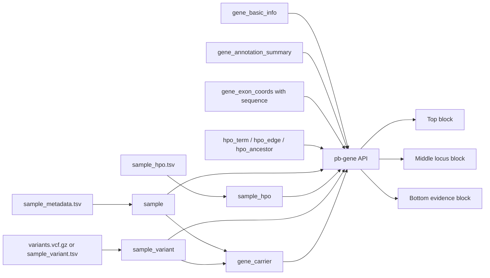

# pb_Gene Engineer Implementation Guide

- Date: 2026-06-24
- Repository: `dig-dug-portal`
- Author: Kyuryung Kim
- Draft prepared with assistance from codex

This guide explains how to implement the `pb_Gene.html` page from input data to API response to UI blocks.

The page answers one request:

```text
Given a gene symbol, show the cohort evidence for that gene.
```

Recommended endpoint:

```text
GET /api/pb-gene?gene={HGNC_SYMBOL}
```

---

## 1. Data Flow



The frontend should receive a page-shaped JSON response. It should not join raw VCF, HPO, and sample tables in the browser.

The reference tables needed by this page already live under `data/reference_db/`
in this repository. Production work should use those files or the equivalent
server-side reference database. Do not ask the browser or the frontend engineer
to download HGNC, NCBI, DDG2P, PanelApp, HPO, pathway, Ensembl, FASTA/GTF, or
coordinate resources at runtime.

---

## 2. Input Files

### 2.1 Sample Metadata

Expected file shape:

```text
sample_metadata.tsv
```

| Column | Required | Used for | Notes |
|---|---:|---|---|
| `sample_id` | yes | Join key across all cohort tables | |
| `stable_sample_id` | preferred | Display-safe sample ID if different from `sample_id` | Currently Inactive |
| `gender` | preferred | Sex summary and carrier sample table | |
| `affected_flag` | yes | Affected count | |
| `proband_flag` | yes | Proband count | |
| `diagnosed_flag` | preferred | GenDx diagnosed count | Metadata source of truth |
| `age_for_portal` | preferred | Carrier sample table age display | |
| `age_at_analysis` | accepted | Fallback display age if `age_for_portal` is missing | |
| `age_at_enrollment` | accepted | Carrier demographics / source age if present | |
| `age_band` | accepted | Age grouping if already binned | |
| `cohort_id` == `investigator` | yes | Investigator distribution | |

`diagnosed_flag` is the source of truth for the top `GenDx diagnosed` metric.
It is a sample-level metadata flag. It does not identify which gene or variant
caused the diagnosis.

### 2.2 GenDx Diagnosis Detail

Expected file shape:

```text
data/reference_db/crdc_diagnosed_20240716.tsv
```

| Column | Required | Used for |
|---|---:|---|
| `sample_id` | yes | Join to carrier sample rows |
| `gene_symbol` | yes | Diagnosis detail display |
| `diagnosed_interpretation` | yes | Diagnosis interpretation display |
| `role` | optional | Audit context only |
| `cdna` | optional | Future detailed diagnosis display |
| `protein` | optional | Future detailed diagnosis display |
| `transcript_nm` | optional | Future detailed diagnosis display |

Current `pb_Gene` carrier rows use only `sample_id`, `gene_symbol`, and
`diagnosed_interpretation`. The display label is:

```text
{gene_symbol}({diagnosed_interpretation})
```

Example:

```text
TTC7A(VUS)
```

If one sample has multiple diagnosis-detail rows, deduplicate identical
`gene_symbol(interpretation)` labels and join distinct labels with `; `.

Do not filter diagnosis detail by the searched gene. A sample can be a carrier
in the searched gene while its GenDx diagnosis is in another gene. Carrier status
means "has an observed qualifying variant in the searched gene"; diagnosis detail
means "sample-level GenDx record."

Top metric source:

- `crdcEvidence.genDxDiagnosed` must count carrier samples where
  `sample.diagnosed_flag` is true.
- It must not be recomputed from `crdc_diagnosed_20240716.tsv`.
- The TSV is detail text for the carrier sample table and a consistency check
  against metadata.

Carrier table display rules:

| Metadata `diagnosed_flag` | TSV detail exists | Display | Hover / title |
|---|---:|---|---|
| yes | yes | `ABC(PATH)` | Detail came from `crdc_diagnosed_20240716.tsv` |
| yes | no | `Yes*` | Metadata says diagnosed, but no matching TSV detail row exists |
| no | yes | `ABC(PATH)*` | TSV detail exists, but metadata is not diagnosed |
| no | no | `-` | No GenDx diagnosis detail |

The `*` is a data consistency flag. It should not change the top metric.

### 2.3 Sample HPO Terms

Expected file shape:

```text
sample_hpo.tsv
```

| Column | Required | Used for |
|---|---:|---|
| `sample_id` | yes | Join to carriers |
| `hpo_id` | yes | Phenotype category summaries |


Each row should be one sample-term observation.

### 2.4 Variant Calls

Preferred input:

```text
variants.vcf.gz
variants.vcf.gz.tbi
```

The API build step should normalize VCF records into `sample_variant`. In the
current CRDC VCF, variant-level fields come from the VCF core columns and
`INFO`, sample-level carrier fields come from `FORMAT`, and gene/annotation
fields come from the VEP `CSQ` annotation.

Required/preferred/optional below describes build strictness, not UI use.
`preferred` and `optional` fields are still used by the mockup when present;
they are marked this way only because the page can return an explicit
unavailable value if that annotation is missing.

| Normalized column | Required | Used for |
|---|---:|---|
| `sample_id` | yes | Join to sample and HPO tables |
| `variant_id` | yes | Display row key, link target, selected variant |
| `chrom`, `pos`, `ref`, `alt` | yes | Locus markers and density |
| `gene_symbol` | yes | Gene search filter |
| `genotype` | preferred | Carrier sample table |
| `consequence` | preferred | Variant evidence row |
| `hgvs_p` | preferred | Protein consequence display |
| `crdc_vcf_af` | preferred | Internal CRDC allele frequency from VCF `INFO/AF` |
| `crdc_carrier_frequency` | build script/API | Carrier count over cohort VCF sample count for UI display |
| `gnomad_exome_af` | optional | External AF |
| `lof_class` | optional | LOFTEE display |
| `alphamissense_score` | optional | Variant score display |
| `revel_score` | optional | Variant score display |
| `clinvar_clnsig` | optional | Classification display |

Recommended source mapping from the current VEP-annotated VCF:

| Normalized field | VCF source |
|---|---|
| `chrom` | `#CHROM` |
| `pos` | `POS` |
| `ref` | `REF` |
| `alt` | `ALT` |
| `variant_id` | derived from `#CHROM:POS:REF:ALT` unless a stable ID is supplied |
| `crdc_vcf_af` | `INFO/AF` for the CRDC cohort-level allele frequency |
| `cohort_AC`, `cohort_AN` | `INFO/AC`, `INFO/AN` if retained for QA or recalculation |
| `crdc_carrier_count` | count distinct carrier samples with non-reference `FORMAT/GT` |
| `crdc_carrier_frequency` | `crdc_carrier_count / VCF sample count`; this is the current `variantRows[].crdcAF` display value |
| `genotype` | per-sample `FORMAT/GT` |
| `genotype_quality` | per-sample `FORMAT/GQ`; optional backend QA field, not currently required by the browser |
| `depth` | per-sample `FORMAT/DP`; optional backend QA field, not currently required by the browser |
| `allele_depth` | per-sample `FORMAT/AD`; optional backend QA field, not currently required by the browser |
| `gene_symbol` | `CSQ/SYMBOL` |
| `ensembl_gene_id` | `CSQ/Gene` |
| `consequence` | `CSQ/Consequence` |
| `impact` | `CSQ/IMPACT` |
| `hgvsc` | `CSQ/HGVSc` |
| `hgvs_p` | `CSQ/HGVSp` |
| `transcript_id` | `CSQ/Feature` |
| `exon` | `CSQ/EXON` |
| `existing_variation` | `CSQ/Existing_variation` |
| `gnomad_exome_af` | `CSQ/gnomADe_AF` |
| `lof_class` | `CSQ/LoF` |
| `lof_filter`, `lof_flags`, `lof_info` | `CSQ/LoF_filter`, `CSQ/LoF_flags`, `CSQ/LoF_info` |
| `alphamissense_class` | `CSQ/am_class` |
| `alphamissense_score` | `CSQ/am_pathogenicity` |
| `revel_score` | `CSQ/REVEL` |
| `clinvar` | `CSQ/ClinVar` |
| `clinvar_clnsig` | `CSQ/ClinVar_CLNSIG` |

Use `CSQ/gnomADe_AF` for the displayed external gnomAD exome AF. Do not use
VCF `INFO/AF` for gnomAD; `INFO/AF` is the CRDC/internal cohort allele
frequency in this VCF.


### 2.5 Reference Inputs

| Table | Used for |
|---|---|
| `gene_basic_info` | HGNC approved name, HGNC cytogenetic location, NCBI Gene summary |
| `gene_annotation_summary` | DDG2P, PanelApp, Reactome/WikiPathways rows |
| `gene_exon_coords` | Gene locus range, exon model, base-level reference sequence |
| `hpo_term`, `hpo_edge`, `hpo_ancestor` | HPO labels and root-category grouping |

Prepared reference resources:

These resources exist in the local/server-side data area used to build the
current fixture and production API payloads. Large or sensitive raw/cache files
do not need to be committed to the shared UI branch; the backend should read
them from the server-side reference database or data area.

| Resource | Current file |
|---|---|
| HGNC + NCBI gene basics | `data/reference_db/gene_basic_info.tsv`, `.rds` |
| HGNC source cache | `data/reference_db/hgnc_complete_set.txt` |
| DDG2P | `data/reference_db/ddg2p_*` |
| PanelApp | `data/reference_db/panelapp_*` |
| Reactome / WikiPathways | `data/reference_db/pathway*`, `gene_pathway_summary.*` |
| Collapsed gene annotation | `data/reference_db/gene_annotation_summary.tsv`, `.rds` |
| HPO graph | `data/reference_db/hpo_term.*`, `hpo_edge.*`, `hpo_ancestor.*` |
| Gene exon coordinates and sequence | `data/reference_db/gene_exon_coords.tsv` |
| Ensembl GTF cache | `data/reference_db/_ensembl.gtf.gz` |
| GenDx diagnosis detail | `data/reference_db/crdc_diagnosed_20240716.tsv` |

These files are reference inputs. They are not browser assets. The backend/API
should load them server-side and return only the fields needed for the current
gene page. Refreshing external sources is a separate data-build task, not a
frontend task.

Sequencing target BED/capture files, if needed for production WES QC or coverage
logic, should also be treated as server-side reference inputs. They should not
be requested by or bundled into `pb_Gene.html`.

---

## 3. Normalized Tables

The backend can build these tables from the input files.

| Table | Minimum key | Purpose |
|---|---|---|
| `sample` | `sample_id` | Sample-level metadata |
| `sample_hpo` | `sample_id`, `hpo_id` | Sample phenotype terms |
| `sample_variant` | `sample_id`, `variant_id`, `gene_symbol` | Variant calls and annotations |
| `gene_carrier` | `sample_id`, `gene_symbol` | Samples carrying qualifying variants in a gene |
| `sample_gendx_diagnosis` | `sample_id` | Optional normalized view of `crdc_diagnosed_20240716.tsv` |
| `gene_basic_info` | `gene_symbol` | HGNC/NCBI gene name, summary, cytogenetic location |
| `gene_annotation_summary` | `gene_symbol` | Collapsed gene reference annotation |
| `gene_exon_coords` | `gene_symbol`, `start`, `end` | Locus drawing and base sequence |

`gene_carrier` can be derived from `sample_variant` by selecting samples with
qualifying variants in each gene. `sample_gendx_diagnosis` can be derived from
`crdc_diagnosed_20240716.tsv`; it should not drive carrier membership.

---

## 4. API Response Shape

Endpoint:

```text
GET /api/pb-gene?gene=SLC6A7
```

Top-level response:

```json
{
  "geneInfo": {},
  "crdcEvidence": {},
  "genomeWindow": {},
  "variantRows": [],
  "geneCarrierDemographics": {},
  "geneLevelPhenotypeCategories": [],
  "geneLevelCoCarrierGenes": []
}
```

Required behavior:

- Return one response per searched gene.
- Shared fallback mock data uses `SLC6A7`. A private local generated fixture may
  use `PGD`; production endpoint should use the requested HGNC symbol.
- Use exact HGNC gene symbols unless alias resolution is explicitly added.
- Return `404` or a typed empty state when the gene has no cohort carrier evidence.
- Return explicit unavailable values such as `null`, `"-"`, or empty arrays when annotation is missing.
- Do not calculate match scores unless a phenotype or outcome context is provided.

---

## 5. Top Block

### **Goal:**

Identify the searched gene and summarize the strongest gene-level cohort evidence.

| UI element | API field | Source columns |
|---|---|---|
| Gene symbol | `geneInfo.symbol` | query gene / `gene_symbol` |
| HGNC gene name | `geneInfo.fullName` | `gene_basic_info.gene_name` |
| NCBI short description | `geneInfo.description` | `gene_basic_info.gene_description` |
| Gene location + build | `geneInfo.location`, `geneInfo.build` | min exon `start`, max exon `end`, fixed assembly label |
| Cytogenetic location | `geneInfo.cytogeneticLocation` | `gene_basic_info.cytogenetic_location` from HGNC `location` |
| OMIM / Ensembl | `geneInfo.omim`, `geneInfo.ensemblId` | reference annotation / exon table |
| DDG2P row | `geneInfo.referenceAnnotation.ddg2p` | `gene_annotation_summary` |
| PanelApp row | `geneInfo.referenceAnnotation.panelapp` | `gene_annotation_summary` |
| Pathway row | `geneInfo.referenceAnnotation.pathways` | Reactome/WikiPathways summary |
| Carriers | `crdcEvidence.currentGeneCarrierTotal` | count distinct `gene_carrier.sample_id` |
| Affected | `crdcEvidence.affected` | carrier samples where `affected_flag` is true |
| Probands | `crdcEvidence.probands` | carrier samples where `proband_flag` is true |
| GenDx diagnosed | `crdcEvidence.genDxDiagnosed` | carrier samples where `diagnosed_flag` is true |
| Variants in this gene | `crdcEvidence.variantCount` | count distinct `sample_variant.variant_id` for gene |
| Carrier phenotype profile | `geneLevelPhenotypeCategories` | HPO terms among gene carriers |
| Most severe observed variant | derived from `variantRows` | highest annotation-only variant severity score |
| Mean carrier burden | `crdcEvidence.meanCarrierBurden` or equivalent | mean of per-carrier max gene burden score |

Gene identity display:

- Show the gene symbol as the main title.
- Do not show separate chromosome/build chips next to the symbol.
- Show `HGNC:` before `geneInfo.fullName`.
- Show `NCBI:` before `geneInfo.description`.
- Show `geneInfo.location geneInfo.build` on the gene identity block.
- Show locus title as:

```text
{symbol} gene locus ({build}) {location} ({cytogeneticLocation}; {span_kb} kb)
```

Example:

```text
PGD gene locus (GRCh38) chr1:10,399,064-10,420,511 (1p36.22; 21.4 kb)
```

Gene basic info source policy:

- `geneInfo.fullName` must come from HGNC approved name.
- `geneInfo.cytogeneticLocation` must come from HGNC `location`.
- `geneInfo.description` must come from NCBI Gene ESummary summary, trimmed to one or two deterministic sentences.
- Do not use OMIM prose for the basic description. OMIM can be used as an ID/link if present.

Scoring semantics:

- `variant_severity_score` is annotation-only and must not be multiplied by genotype.
- Variant severity score priority:
  1. `LoFTEE/LoF == HC` -> `1`
  2. else `AlphaMissense`
  3. else `REVEL`
  4. else unavailable / `0` only if a numeric fallback is required
- ClinVar should be displayed as classification context only. Do not include ClinVar in `variant_severity_score`.
- Sample-level gene burden score can use `variant_severity_score * genotype_dosage`.
- `GT 0/1` or `1/0` dosage is `1`; `1/1` dosage is `2`.
- Gene-level burden for one sample is the max burden score across that sample's variants in the searched gene.
- Overall/mean carrier burden on this page should be the mean of the sample-level gene burden among carriers, not the mean across the entire cohort.
- Match score is different from burden score and should stay `no context` until a real phenotype or outcome context is supplied.

UI behavior:

- Pathway `more` should expand within the row.
- HPO category labels should be readable even when long.
- Mean carrier burden can be shown because it is computed from carrier genotypes and variant severity scores.
- Match score should show `no context` until a real phenotype or outcome context exists.

HPO profile calculation:

- Exclude broad ontology anchors `HP:0000001` and `HP:0000118` from evidence
  counts and displayed HPO category profiles.
- Gene-level carrier phenotype profile denominator is the number of current gene
  carriers.
- Variant-level carrier phenotype profile denominator is the number of carriers
  of the selected variant, not the number of gene carriers.
- If a carrier set has no non-broad HPO terms after exclusion, return an empty
  category array and let the UI show an empty state. Do not return rows with
  `null` category, `null` percent, or `null` term count.

---

## 6. Middle Locus Block

### **Goal:**

Show where observed variants sit across the gene and let the user zoom into base-level detail.

| UI element | API field | Source columns |
|---|---|---|
| Locus title | `geneInfo.symbol`, `geneInfo.build`, `geneInfo.location`, `geneInfo.cytogeneticLocation` | `gene_basic_info`, `gene_exon_coords` |
| Exon track | `genomeWindow.exons[]` | `gene_exon_coords.start`, `end`, `sequence`, `exon_number` |
| Variant markers | `genomeWindow.markers[]` | `sample_variant.pos`, `variant_id` |
| Carrier density | `genomeWindow.densityAll` | per-position distinct carrier count |
| Proband density | `genomeWindow.densityProband` | per-position distinct proband carrier count |
| Axis ticks | `genomeWindow.axisTicks` | gene range |
| Base-level sequence | `genomeWindow.exons[].sequence` | reference sequence column |

Derived values:

- Whole-gene density groups positions into display bins.
- Base-level view uses genomic coordinate alignment: one base equals one genomic position.
- Variant marker collision should be handled visually when variants are close together.

UI behavior:

- Filter controls should affect displayed carrier density and summary counts.
- Zoom levels should move from whole gene to narrower windows, ending at base-level view.
- Drag pan is a display behavior; API does not need to know current pan state.

---

## 7. Bottom Evidence Block

Goal:

Show gene-level carrier evidence by default and switch to variant-level evidence when a variant row is selected.

| UI element | API field | Source columns |
|---|---|---|
| Mode header | `geneInfo.symbol`, selected variant ID | page state |
| Gene carrier summary | `geneLevelPhenotypeCategories`, `geneLevelCoCarrierGenes`, `geneCarrierDemographics` | carriers of searched gene |
| Variant evidence rows | `variantRows[]` | `sample_variant` grouped by `variant_id` |
| CRDC AF | `variantRows[].crdcAF` | variant carrier count / cohort VCF sample count |
| Classification | `variantRows[].clinvar` | `clinvar_clnsig` |
| Consequence | `variantRows[].consequence`, `csq_detail` | VEP consequence / HGVSp |
| Variant score | `variantRows[].variantSeverityScore` or equivalent | LoFTEE HC, else AlphaMissense, else REVEL |
| Match score | explicit unavailable value | requires phenotype or outcome context |
| Expanded carrier samples | `variantRows[].carrierSamples[]` | joined sample + variant + HPO counts |

Carrier sample row fields:

| Field | Source |
|---|---|
| `id` | `sample_id` or `stable_sample_id` |
| `age` | `sample.age_for_portal`; fallback to `age_at_analysis`; `-` if missing |
| `sex` | `gender` |
| `gt` | `genotype` |
| `hpo` | count of non-broad HPO terms for sample |
| `genes` | count of genes with observed variants in sample |
| `group` | `cohort_id` or investigator |
| `proband` | `proband_flag`; may remain in payload for filters/summary but is not the displayed table column |
| `affected` | `affected_flag` |
| `diagnosed` | `diagnosed_flag` |
| `gendx` | display label derived from `diagnosed_flag` + `crdc_diagnosed_20240716.tsv` |
| `gendxNote` | hover text explaining source or conflict |
| `gendxConflict` | boolean; true when metadata and TSV detail disagree |

Displayed carrier sample columns:

```text
Sample | Age | Sex | GT | HPO | Co-genes | Investigator | Affected | GenDx
```

`Proband` is still useful for top metrics, filters, or demographic summaries,
but the expanded carrier sample table should show `Affected` instead of
`Proband`.

GenDx display construction:

```pseudo
detail = diagnosis_tsv[sample_id]

if diagnosed_flag == true and detail exists:
    gendx = distinct "{gene_symbol}({diagnosed_interpretation})" labels joined by "; "
    gendxConflict = false
elif diagnosed_flag == true and no detail:
    gendx = "Yes*"
    gendxConflict = true
    gendxNote = "Sample metadata diagnosed_flag is Yes, but no matching diagnosis detail row exists."
elif diagnosed_flag != true and detail exists:
    gendx = detail + "*"
    gendxConflict = true
    gendxNote = "Diagnosis detail exists, but sample metadata diagnosed_flag is not Yes."
else:
    gendx = "-"
    gendxConflict = false
```

The hover text should identify the conflict reason. Do not hide the row or
change top metrics because of a conflict.

UI behavior:

- Default mode is Gene.
- Clicking a variant row switches the summary to Variant mode and expands that row.
- Selected variant row should be visually obvious.
- If CRDC AF or gnomAD AF is `>= 0.10`, mark the variant with `*` and show a high-AF review warning. This is a rare-disease cohort review flag, not an automatic exclusion rule.
- Expanded samples should be limited or paginated for large cohorts.
- Gene-level co-carrier profile should not be hidden only because selected variant rows lack co-carrier summaries.
- If a selected variant carrier has no non-broad HPO terms, show an explicit empty state such as `No HPO category data`. Do not render a blank pseudo-row.

---

## 8. Error And Empty States

| Case | API behavior | UI behavior |
|---|---|---|
| Unknown gene symbol | `404` with message | Show search error |
| Known gene, no carriers | typed empty response or `404` | Show no carrier evidence state |
| Missing DDG2P/PanelApp/pathway | empty annotation object | Display `No entry`, `No green panels`, or `No annotation` |
| Missing variant scores | `null` or `"-"` | Display `-` |
| No phenotype context | `matchScore: null` with reason | Display `no context` |
| Missing reference sequence | empty `sequence` | Hide base letters or show unavailable state |
| High AF variant | warning metadata | Show `*` and high-AF review note |

---

## 9. Acceptance Checks

For a valid gene with cohort evidence:

- Top metrics match distinct carrier sample counts.
- HGNC approved name, NCBI description, and HGNC cytogenetic location come from `gene_basic_info`.
- Gene locus range changes when searching a different gene.
- Exon model uses the searched gene, not the previous gene.
- Variant rows only include variants in the searched gene.
- CRDC AF uses the internal cohort denominator.
- External gnomAD AF uses `CSQ/gnomADe_AF`, not VCF `INFO/AF`.
- Variant severity score follows `LoFTEE HC -> AlphaMissense -> REVEL` and does not use ClinVar or GT.
- Mean carrier burden uses carrier-only sample-level max burden scores.
- Gene-level phenotype profile summarizes all current gene carriers.
- Variant-level phenotype profile summarizes only carriers of the selected variant.
- Variant-level phenotype profile percentages use the selected variant carrier count as denominator.
- A selected variant whose carriers have only broad HPO anchors returns an empty phenotype category array and shows a readable empty state.
- Carrier sample table displays `Affected` and `GenDx`, not `Proband`, as the final two columns.
- Carrier sample `Age` uses `age_for_portal` first, with `age_at_analysis` only as fallback.
- Top `GenDx diagnosed` metric counts `sample.diagnosed_flag`, not diagnosis TSV detail rows.
- Carrier sample `GenDx` detail comes from `crdc_diagnosed_20240716.tsv` by `sample_id`.
- GenDx metadata/detail mismatches display `*` with hover explanation but do not change top metrics.
- Match score is not shown as a real calculated value unless a context is provided.
- Variants with CRDC or gnomAD AF `>= 0.10` show a high-AF review flag.

For implementation testing, use at least two genes with different chromosome
locations and carrier counts. Current useful non-HLA examples include:

| Gene | Notes |
|---|---|
| `PGD` | Useful private generated fixture example; `chr1`, 8 carriers, 3 variants |
| `SLC6A7` | `chr5`, higher carrier count, multiple variants |
| `ARMC9` | `chr2`, high carrier count, multiple variants |
| `DNAH14` | Carrier count <= 50 and variant count >= 3 |
| `DARS1` | Carrier count <= 50 and variant count >= 3 |
| `SI` | Carrier count <= 50 and variant count >= 3 |
| `IQCM` | Carrier count <= 50 and variant count >= 3 |
