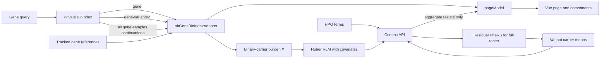
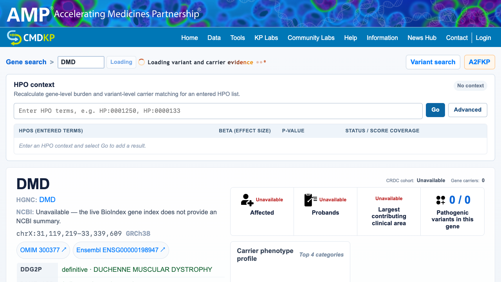

# pb_Gene Production Integration Handoff

Date: 2026-07-30

Reference page: `/pb_Gene.html?query=DMD`

Reference branch: `kyuryung/mockup-branch`

When the local mockup server is running, inspect:
<http://127.0.0.1:8090/pb_Gene.html?query=DMD>

Reference baseline: `b4343c07`

This is the short implementation entry point for moving the tested `pb_Gene`
mockup into the production portal. The goal is to preserve the current page
behavior while replacing development-only connections with approved production
services.

The current UI revision and this handoff are recorded together in the latest
local commit after the baseline above. The branch is not pushed automatically;
verify `git log` and share the required commits explicitly.

## What the production page must preserve [Updated 2026-08-24]

| Area | Required behavior | Source of truth |
|---|---|---|
| Gene identity | Link the existing `HGNC: gene name` text to the official HGNC symbol report; show OMIM and Ensembl IDs as external links | `GeneIdentityPanel.vue` and HGNC-derived fallback IDs |
| External portal | Show a subtle orange **A2FKP** link to `https://a2f.hugeamp.org/` in a new tab | `Template.vue` |
| Gene loading | Show an orange spinner, three activity dots, and a left-to-right orange text sweep while complete continuations load; respect reduced-motion settings | `Template.vue` and `style.css` |
| Top score | **Extended Pathogenic Score** uses LoFTEE HC, then AlphaMissense, then REVEL | `extendedVariantScoreValue()` |
| Variant-table score | **Pathogenic Score** is the variant-level LoFTEE HC or AlphaMissense score shown for the observed variant; REVEL is not included in this table score | `variantScoreValue()` |
| REVEL-only rows | Preserve the existing missing/evidence state and explanation for variants with only REVEL evidence | `hasRevelOnlyScore()` and `sortedVariantRows()` |
| ClinVar emphasis | Mark Pathogenic with a restrained red badge and Likely pathogenic with orange in both the collapsed classification and expanded evidence | `pathogenicityClass()` |
| Evidence count | Show variants with any LoFTEE, AlphaMissense, or REVEL value over all observed variants, for example `20 / 870` | `pathogenicEvidenceVariantCount` |
| Match Score | Mean residual PheRS across all unique carriers of that variant | Context API `variant_match_scores` |
| Row interaction | Clicking a variant row expands it and changes the carrier statistics; clicking again closes it | Existing `toggleVariant()` flow |
| Phenotype profile | Keep the current panel because it switches from all gene carriers to the selected variant carriers | Existing active carrier-set state |
| Table layout | Optimize for desktop/laptop; use horizontal overflow rather than a separate mobile card UI | `style.css` |

The upper-right Extended Pathogenic Score and the table Pathogenic Score are
display values. The single-gene burden test is a separate analysis: its current
input uses pathogenic score multiplied by genotype dosage, with multiple variants
summed within each sample. The page displays the returned burden-test result and
does not recalculate it.

## Runtime flow



`gene` is allowed to render first. The adapter then completes
`gene-variants2` and every `gene-samples` continuation in the background. Final
carrier counts, variant counts, Match Scores, and burden values must never use
only the first BioIndex page.

The loading motion is CSS-only. It adds no API call, image, webfont, GSAP, or
Motion dependency. The text uses the local `Trebuchet MS` stack at `0.9rem`
with `0.04em` tracking; spinner and dots are 1.25 times the first draft size,
and their animation speed is 60% of that draft. Under
`prefers-reduced-motion: reduce`, all loading transforms stop.

### Reference loading state



The screenshot captures the transient state after the gene identity is
available and while variant and carrier continuations are still loading.

## Current live-data gaps

The live private `gene` index returns coordinates and a symbol but does not
currently return an NCBI summary. DMD does have an NCBI summary in
`data/reference_db/gene_basic_info.tsv`; production should join that reference
server-side or extend the BioIndex gene record. Do not bundle the approximately
11 MB reference TSV into the browser. Until the backend supplies the field, the
UI states that the live gene index does not provide an NCBI summary.

In an inspected 1,000-row DMD `gene-samples` response, genotype was populated
but age, sex, co-genes, investigator, affected, proband, and GenDx fields were
not. The frontend must not fabricate them. Production should join approved
sample metadata by sample ID; until then, keep explicit unavailable values.
If the table is revised later, show `Sample`, `GT`, `Affected`, and `Proband`
first, move secondary metadata into details, and hide only columns proven empty
for the complete response.

## Files to port

| File | Responsibility |
|---|---|
| `vue.config.js` | Builds `pb_Gene.html`; development proxies only |
| `src/views/PbGene/main.js` | Vue page entry |
| `src/views/PbGene/Template.vue` | Page composition and variant interaction |
| `src/views/PbGene/GeneIdentityPanel.vue` | HGNC/OMIM/Ensembl links, gene identity, and reference annotations |
| `src/views/PbGene/HpoContextPanel.vue` | HPO input, Advanced controls, and aggregate result rows |
| `src/views/PbGene/pageModel.js` | UI state, score separation, Context API request, and response merge |
| `src/views/PbGene/pbGeneBioIndexAdapter.js` | BioIndex queries, deduplication, progressive state, and five-gene tab cache |
| `src/views/PbGene/style.css` | Page tokens, accessible loading motion, desktop table overflow, and evidence states |
| `src/views/PbGene/geneIdReference.generated.js` | Generated gene-level Ensembl and OMIM lookup |
| `scripts/context_api_fast.py` | Reference Match Score and context-result integration |
| `scripts/pb_gene_context_api_server.py` | Local reference HTTP service, not the production deployment |

Regenerate the gene ID module with
`node scripts/build_pb_gene_id_reference.js`. Do not edit the generated module
by hand. Its inputs are `data/reference_db/gene.tsv` and
`data/reference_db/hgnc_complete_set.txt`.

## Context API contract [Updated 2026-08-24]

The browser sends one request when the user selects **Go**:

```http
POST /phenotype-analyzer-api/analyze
Content-Type: application/json
```

```json
{
  "terms": "HP:0001250,HP:0000133",
  "gene": "DMD",
  "advanced": {
    "significance_metric": "p_value",
    "significance_threshold": 0.05,
    "min_carriers": 10
  }
}
```

The response must contain `variant_match_scores`, `gene_burden`, and
`analysis_sample_count`. It must not return sample IDs, patient HPO terms,
genotypes, or patient-level residual PheRS values.

The calculations are:

```text
MatchScore_v = mean(residual PheRS_i for every unique carrier i of variant v)

Gene burden test result = separately calculated analysis output
```

Only finite ages from 0 through 99 are retained. Every other age is Unknown,
median-imputed over the fixed analysis roster, and marked with
`age_missing=1`. Only Female and Male are retained; every other sex value is
Unknown. Female is the sex reference, with Male and Unknown indicators. No
sample is excluded solely because age or sex is Unknown. PC1-PC10 must be
finite and aligned one-to-one by sample ID.

Portal v1 uses the tested MASS `summary.rlm(method="XtX")`-style standard
error with a clearly labeled two-sided normal-approximation P-value.

The page currently also shows a temporary link to
`http://100.80.30.199/phenotypeResult.html`. That link is not the Context API.
Keep it only while it remains a useful approved residual-PheRS reference.

## Production wiring

1. Expose the `pbGene` page entry in the production Vue build.
2. Point the private BioIndex client at the production private endpoint.
3. Replace the development proxy with an authenticated backend route for
   `POST /phenotype-analyzer-api/analyze`.
4. Keep all patient-level joins and calculations on the backend.
5. Preserve explicit unavailable states when BioIndex lacks affected, proband,
   cohort, demographic, or phenotype fields.
6. Preserve the progressive gene-summary render, but calculate final carrier
   metrics from complete continuations. Display the separately calculated
   single-gene burden result supplied by the approved analysis output.

Development uses:

```bash
BIOINDEX_HOST_PRIVATE=http://100.80.30.199:5000 \
PHENOTYPE_ANALYZER_HOST_PRIVATE=http://127.0.0.1:8092 \
NODE_OPTIONS=--openssl-legacy-provider \
./node_modules/.bin/vue-cli-service serve --port 8090 --host 127.0.0.1
```

Production should not expose these private hosts to the browser. Use same-origin
authenticated routes or the portal's established private-service pattern.

## Acceptance check

For `DMD`, verify the following in the integrated page:

- The existing HGNC name text opens the HGNC symbol report; OMIM and Ensembl
  links also work.
- **A2FKP** opens `https://a2f.hugeamp.org/` in a new tab and uses a subtle
  orange treatment.
- During a gene search, the orange spinner, dots, and text sweep remain visible
  while page progress changes; reduced-motion mode stops the animation.
- Missing live NCBI summary data is described as a source-field limitation,
  not as proof that NCBI has no gene information.
- The top card says **Extended Pathogenic Score**.
- The metric says **Pathogenic variants in this gene** and displays
  `evidence-bearing variants / all observed variants`.
- The variant table says **Pathogenic Score**.
- Pathogenic Score values preserve the documented missing/evidence states.
- ClinVar Pathogenic uses restrained red emphasis and Likely pathogenic uses
  orange without coloring the entire row.
- A variant row opens and closes without changing the established carrier
  selection behavior.
- The Match Score help marker explains the unique-carrier residual-PheRS mean.
- HPO submission returns an aggregate result row and fills per-variant Match
  Scores without exposing patient-level values.
- The HPO result table includes a Note column. The separately calculated
  single-gene burden result is displayed with its analysis status and threshold.
- Repeated searches for a recently loaded gene reuse the tab-local cache.
- A narrow laptop viewport scrolls the variant table horizontally without
  collapsing columns.

Run:

```bash
PYTHONDONTWRITEBYTECODE=1 python3 -m unittest \
  scripts.test_rphers_fast \
  scripts.test_context_api_fast \
  scripts.test_pb_gene_context_validation \
  scripts.test_pb_gene_context_ui
npm run build
```

The final local verification passed 45 Python/UI tests and the Vue development
build. The existing `tabix-reader` default-export warning is unrelated to
`pb_Gene`; it matters only if the LocusZoom `TabixUrlSource` adapter is used.

## Copy-paste request for an implementation agent

> Integrate the tested `pb_Gene` implementation from the latest local
> `kyuryung/mockup-branch` commit into the production portal. Preserve the score,
> sorting, carrier-selection, progressive-loading, privacy, and API contracts
> in `docs/pb_gene_production_integration_handoff.md`. Adapt only routing,
> authentication, and service configuration to the production architecture.
> Do not replace complete BioIndex continuations with first-page results, do not
> use Extended Pathogenic Score as gene burden X, and do not send patient-level
> residuals or genotypes to the browser. Run the documented tests and build,
> then report any production-specific deviations before merging.

For calculation details, read `docs/pb_gene_context_api_guide.md`. For unresolved
method and privacy approvals, read
`docs/pb_gene_context_api_review_checklist.md`. The longer historical mapping
remains in `docs/pb_gene_live_handoff.md`.
