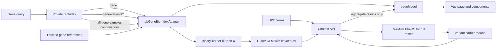

# pb_Gene Production Integration Handoff

Date: 2026-07-30

Reference page: `/pb_Gene.html?query=DMD`

Reference branch: `kyuryung/mockup-branch`

Reference commit: `46ea6338`

This is the short implementation entry point for moving the tested `pb_Gene`
mockup into the production portal. The goal is to preserve the current page
behavior while replacing development-only connections with approved production
services.

The reference branch is three commits ahead of
`origin/kyuryung/mockup-branch` at the time of writing:
`23f25c29`, `dd61816f`, and `46ea6338`. They must be pushed or otherwise shared
before another checkout can cherry-pick them.

## What the production page must preserve

| Area | Required behavior | Source of truth |
|---|---|---|
| Gene identity | Show gene-level OMIM and Ensembl IDs as external links | BioIndex fields with HGNC-derived fallback IDs |
| Top score | **Extended Pathogenic Score** uses LoFTEE HC, then AlphaMissense, then REVEL | `extendedVariantScoreValue()` |
| Variant-table score | **Burden Pathogenic Score** uses only LoFTEE HC, then AlphaMissense | `variantScoreValue()` |
| REVEL-only rows | Display red `—*`; sort after numeric burden scores and before complete missing values | `hasRevelOnlyScore()` and `sortedVariantRows()` |
| Evidence count | Show variants with any LoFTEE, AlphaMissense, or REVEL value over all observed variants, for example `20 / 870` | `pathogenicEvidenceVariantCount` |
| Match Score | Mean residual PheRS across all unique carriers of that variant | Context API `variant_match_scores` |
| Row interaction | Clicking a variant row expands it and changes the carrier statistics; clicking again closes it | Existing `toggleVariant()` flow |
| Phenotype profile | Keep the current panel because it switches from all gene carriers to the selected variant carriers | Existing active carrier-set state |
| Table layout | Optimize for desktop/laptop; use horizontal overflow rather than a separate mobile card UI | `style.css` |

The two pathogenic scores are intentionally different. Do not reuse the
Extended score as the burden input because it can contain a REVEL fallback.

## Runtime flow



`gene` is allowed to render first. The adapter then completes
`gene-variants2` and every `gene-samples` continuation in the background. Final
carrier counts, variant counts, Match Scores, and burden values must never use
only the first BioIndex page.

## Files to port

| File | Responsibility |
|---|---|
| `vue.config.js` | Builds `pb_Gene.html`; development proxies only |
| `src/views/PbGene/main.js` | Vue page entry |
| `src/views/PbGene/Template.vue` | Page composition and variant interaction |
| `src/views/PbGene/GeneIdentityPanel.vue` | Gene identity, OMIM/Ensembl, and reference annotations |
| `src/views/PbGene/HpoContextPanel.vue` | HPO input, Advanced controls, and aggregate result rows |
| `src/views/PbGene/pageModel.js` | UI state, score separation, Context API request, and response merge |
| `src/views/PbGene/pbGeneBioIndexAdapter.js` | BioIndex queries, deduplication, progressive state, and five-gene tab cache |
| `src/views/PbGene/style.css` | Page tokens, desktop table overflow, and score states |
| `src/views/PbGene/geneIdReference.generated.js` | Generated gene-level Ensembl and OMIM lookup |
| `scripts/context_api_fast.py` | Reference Match Score and burden model |
| `scripts/pb_gene_context_api_server.py` | Local reference HTTP service, not the production deployment |

Regenerate the gene ID module with
`node scripts/build_pb_gene_id_reference.js`. Do not edit the generated module
by hand. Its inputs are `data/reference_db/gene.tsv` and
`data/reference_db/hgnc_complete_set.txt`.

## Context API contract

The browser sends one request when the user selects **Go**:

```http
POST /phenotype-analyzer-api/analyze
Content-Type: application/json
```

```json
{
  "terms": "HP:0001250,HP:0000133",
  "gene": "DMD",
  "advanced": {
    "significance_metric": "p_value",
    "significance_threshold": 0.05,
    "min_carriers": 5
  }
}
```

The response must contain `variant_match_scores`, `gene_burden`, and
`analysis_sample_count`. It must not return sample IDs, patient HPO terms,
genotypes, or patient-level residual PheRS values.

The calculations are:

```text
MatchScore_v = mean(residual PheRS_i for every unique carrier i of variant v)

X_i = sum(I(sample i carries variant v) * BurdenPathogenicScore_v)

rlm(residual PheRS ~ X + age + age_missing + sex_male + sex_unknown + PC1-PC10)
```

Age is median-imputed over the fixed analysis roster. `age_missing` records
whether age was absent before imputation. Female is the sex reference, with
Male and Unknown indicators. PC1-PC10 must be finite and aligned one-to-one by
sample ID.

The page currently also shows a temporary link to
`http://100.80.30.199/phenotypeResult.html`. That link is not the Context API.
Keep it only while it remains a useful approved residual-PheRS reference.

## Production wiring

1. Expose the `pbGene` page entry in the production Vue build.
2. Point the private BioIndex client at the production private endpoint.
3. Replace the development proxy with an authenticated backend route for
   `POST /phenotype-analyzer-api/analyze`.
4. Keep all patient-level joins and calculations on the backend.
5. Preserve explicit unavailable states when BioIndex lacks affected, proband,
   cohort, demographic, or phenotype fields.
6. Preserve the progressive gene-summary render, but calculate final metrics
   from complete continuations.

Development uses:

```bash
BIOINDEX_HOST_PRIVATE=http://100.80.30.199:5000 \
PHENOTYPE_ANALYZER_HOST_PRIVATE=http://127.0.0.1:8092 \
NODE_OPTIONS=--openssl-legacy-provider \
./node_modules/.bin/vue-cli-service serve --port 8090 --host 127.0.0.1
```

Production should not expose these private hosts to the browser. Use same-origin
authenticated routes or the portal's established private-service pattern.

## Acceptance check

For `DMD`, verify the following in the integrated page:

- Gene identity shows working OMIM and Ensembl links.
- The top card says **Extended Pathogenic Score**.
- The metric says **Pathogenic variants in this gene** and displays
  `evidence-bearing variants / all observed variants`.
- The variant table says **Burden Pathogenic Score**.
- Numeric burden scores sort first, red REVEL-only `—*` rows sort next, and
  complete missing `—` rows sort last.
- A variant row opens and closes without changing the established carrier
  selection behavior.
- The Match Score help marker explains the unique-carrier residual-PheRS mean.
- HPO submission returns an aggregate result row and fills per-variant Match
  Scores without exposing patient-level values.
- Repeated searches for a recently loaded gene reuse the tab-local cache.
- A narrow laptop viewport scrolls the variant table horizontally without
  collapsing columns.

Run:

```bash
PYTHONDONTWRITEBYTECODE=1 python3 -m unittest \
  scripts.test_rphers_fast \
  scripts.test_context_api_fast \
  scripts.test_pb_gene_context_validation \
  scripts.test_pb_gene_context_ui
npm run build
```

The current reference state passes 44 Python/UI tests and the Vue development
build. The existing `tabix-reader` default-export warning is unrelated to
`pb_Gene`; it matters only if the LocusZoom `TabixUrlSource` adapter is used.

## Copy-paste request for an implementation agent

> Integrate the tested `pb_Gene` implementation from commits `23f25c29`,
> `dd61816f`, and `46ea6338` into the production portal. Preserve the score,
> sorting, carrier-selection, progressive-loading, privacy, and API contracts
> in `docs/pb_gene_production_integration_handoff.md`. Adapt only routing,
> authentication, and service configuration to the production architecture.
> Do not replace complete BioIndex continuations with first-page results, do not
> use Extended Pathogenic Score as gene burden X, and do not send patient-level
> residuals or genotypes to the browser. Run the documented tests and build,
> then report any production-specific deviations before merging.

For calculation details, read `docs/pb_gene_context_api_guide.md`. For unresolved
method and privacy approvals, read
`docs/pb_gene_context_api_review_checklist.md`. The longer historical mapping
remains in `docs/pb_gene_live_handoff.md`.
