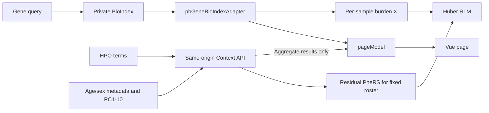

# pb_Gene Production Integration Handoff

Updated: 2026-07-30  
Target branch: `kyuryung/bch-prototype`  
Push status: local commits only; do not assume they are on the remote branch

This is the starting document for an engineer or AI agent integrating the
tested `pb_Gene` page into the production BCH portal.

## Start With the Mockup

Run the BCH prototype and compare the production implementation directly
against:

<http://127.0.0.1:8095/pb_Gene.html?query=DMD>

The mockup is the visual and interaction reference. It also demonstrates the
large-gene loading state, complete BioIndex continuation handling, score
labels, sorting, row expansion, and explicit unavailable states. Do not
reconstruct the behavior from screenshots alone when the local page is
available.

The loading screenshot is retained as a secondary reference:


## What Is Ready

| Area | Required production behavior |
|---|---|
| Gene loading | Render gene identity first, then show the orange spinner, dots, and text sweep while all variant and carrier continuations load |
| Gene links | Existing HGNC text, OMIM ID, and Ensembl ID open their external records |
| External portal | `A2FKP` opens <https://a2f.hugeamp.org/> |
| Extended Pathogenic Score | Display score priority is LoFTEE HC, AlphaMissense, then REVEL |
| Burden Pathogenic Score | Model/table score uses LoFTEE HC, then AlphaMissense; REVEL is excluded |
| REVEL-only row | Red `—*`, sorted after numeric scores and before fully missing rows |
| Evidence count | Variants with any LoFTEE, AlphaMissense, or REVEL value divided by all observed variants |
| ClinVar | Restrained red Pathogenic and orange Likely pathogenic badges; never color the whole row |
| Variant row | Opens/closes evidence and switches carrier statistics without replacing the phenotype profile component |
| Classification | Long values wrap inside the table cell |
| Match Score | Mean residual PheRS across every unique carrier of that variant |

For DMD, the tested full-continuation result showed 6,132 unique carriers,
20/870 variants with pathogenicity evidence, and 870 total variants. These
counts are validation references, not hard-coded values.

## Runtime Boundary



The browser must never receive patient-level residual PheRS, HPO profiles, or
the complete covariate matrix. Production needs an authenticated same-origin
route:

```http
POST /phenotype-analyzer-api/analyze
```

The local Vue proxy and `scripts/pb_gene_context_api_server.py` are reference
implementations, not a production deployment.

## Files the Engineer Must Read

| Path | Responsibility |
|---|---|
| `src/views/PbGene/Template.vue` | Page composition, table, row interaction |
| `src/views/PbGene/GeneIdentityPanel.vue` | Gene identifiers and external links |
| `src/views/PbGene/HpoContextPanel.vue` | HPO form and minimum-carrier control |
| `src/views/PbGene/pageModel.js` | State, sorting, Context API request/merge |
| `src/views/PbGene/pbGeneBioIndexAdapter.js` | BioIndex mapping, deduplication, continuations, cache |
| `src/views/PbGene/style.css` | Tokens, loading motion, table wrapping |
| `scripts/context_api_fast.py` | Match Score and Huber RLM reference calculations |
| `scripts/pb_gene_context_validation.py` | Cohort alignment and covariate encoding |
| `docs/pb_gene_context_api_guide.md` | Exact calculation and data contract |
| `docs/pb_gene_context_api_review_checklist.md` | Remaining production approvals |

## Production Wiring

1. Expose the `pbGene` page entry in the production Vue build.
2. Use the production private BioIndex client and follow every
   `/api/bio/cont` continuation before final counts or burden calculations.
3. Deploy the Context API behind the portal's authenticated same-origin route.
4. Source age and sex from approved sample metadata.
5. Compute PC1-PC10 once from the approved cohort PCA workflow and align the
   saved results one-to-one by `sample_id`.
6. Keep missing metadata explicit; do not fabricate values in the browser.
7. Return aggregate model and per-variant Match Score results only.

## Current Statistical Defaults

- Minimum positive-burden carrier count: **10**, enforced by UI and reference API.
- Age: only finite values from 0 through 99 are valid. Everything else is
  Unknown, median-imputed, and marked with `age_missing=1`.
- Sex: only Female and Male are retained. Every other value is Unknown.
- No sample is excluded solely because age or sex is Unknown.
- Female is the model reference; `sex_male` and `sex_unknown` are indicators.
- RLM inference recommendation for portal v1: retain the tested MASS
  `summary.rlm(method="XtX")`-style standard error and label the two-sided
  normal P-value as an approximation. See the API guide for rationale.

## Staging Acceptance

- Compare DMD against the local mockup at the URL above.
- Verify large-gene counts use every continuation page.
- Verify the default and minimum allowed carrier threshold are both 10.
- Submit a valid HPO context and confirm the response includes the exact model
  formula, sample count, score versions, and structured status.
- Verify an age of 100, a negative/non-numeric age, and any non-Male/Female sex
  remain in the cohort but are encoded as Unknown.
- Verify no patient-level values appear in the browser response or logs.
- Run the documented Python tests and `npm run build`.

## Copy-Paste Request for the Production AI Agent

> Integrate the current `kyuryung/bch-prototype` pb_Gene implementation into
> the production portal. First inspect the running mockup at
> `http://127.0.0.1:8095/pb_Gene.html?query=DMD`, then read
> `docs/pb_gene_production_integration_handoff.md`,
> `docs/pb_gene_context_api_guide.md`, and
> `docs/pb_gene_context_api_review_checklist.md`. Preserve complete BioIndex
> continuations, Extended/Burden score separation, carrier deduplication,
> minimum 10 positive-burden carriers, age/sex Unknown encoding, aggregate-only
> Context API responses, and existing row interactions. Adapt routing,
> authentication, and service configuration only where required by production.
> Report any deviation before merging.
