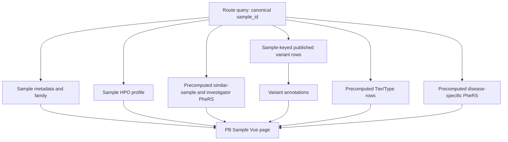

# PB Sample Engineering Integration Handoff

Updated: 2026-08-21

Target branch: `kyuryung/bch-prototype`

Prototype integration commit: `07024747`

Page: `/pb_sample.html`

Audience: frontend, backend, data, and platform engineers and their coding agents

## 1. Read this first

The PB Sample page is implemented as an approved interactive prototype, but
most Sample data sources are not connected. The next implementation must keep
the approved UI behavior and replace fixture sections only when their approved
production payloads exist.

Two inputs are mandatory:

1. A **sample-keyed API/BioIndex** for Sample `All` variants.
2. A **separately precomputed and versioned Tier/Type result** supplied by the
   approved classification workflow.

Do not attempt either task by filtering the Gene page in the browser.

### Non-negotiable boundaries

- `patient_id` and `sample_id` mean the same identifier for this page. Use one
  canonical `sample_id` in published payloads and joins.
- `All` is a sample-level variant set. A gene-keyed result is not Sample `All`.
- `gene-variants-crdc?q={gene}` is an annotation/format reference. It is not a
  sample-variant discovery API.
- Tier and Type are not present in the currently verified BioIndex sources.
  The user will provide a precomputed classifier result.
- The frontend must not infer Tier or Type from ClinVar, gene identity,
  LoFTEE, AlphaMissense, REVEL, or Gene-page filters.
- Live mode must never fall back to fixture values.
- Missing production data renders as `Unavailable`, `—`, or an explicit
  unconnected state. Missing is not zero.

## 2. Current checkout and review URLs

Start the BCH prototype from its own checkout:

```bash
cd /Users/kyuryung/Documents/github_dir/dig-dug-portal-bch-prototype
BIOINDEX_HOST_PRIVATE=http://100.80.30.199:5000 \
NODE_OPTIONS=--openssl-legacy-provider \
./node_modules/.bin/vue-cli-service serve --port 8095 --host 127.0.0.1
```

Approved visual and interaction fixture:

<http://127.0.0.1:8095/pb_sample.html?query=BCH-00-00000-01&fixture=1>

Live-mode route:

<http://127.0.0.1:8095/pb_sample.html?query=BCH-23-61402-01>

`fixture=1` is an explicit design-review switch. It is not a production
fallback. Without it, the page queries live sources and shows unavailable
states for unconnected sections.

`npm run watch` is not the browser dev server and does not provide the private
BioIndex proxy.

## 3. Existing implementation map

| File | Responsibility |
|---|---|
| `vue.config.js` | Registers the `pbSample` page entry and `pb_sample.html` |
| `src/views/PbSample/main.js` | Vue entry point |
| `src/views/PbSample/Template.vue` | Page state, layout, interactions, routing |
| `src/views/PbSample/style.css` | Sample-specific layout and responsive styles |
| `src/views/PbSample/pbSampleBioIndexAdapter.js` | Current private `patient` query boundary |
| `src/views/PbSample/sampleRecord.js` | Canonical ID and empty/live record normalization |
| `src/views/PbSample/mockData.js` | Explicit fixture-only values |
| `src/views/PbSample/familyModel.js` | Family ID and relationship ordering |
| `src/views/PbSample/tableSort.js` | Shared table sorting behavior |
| `src/views/PbSample/variantEvidence.js` | Pathogenic Score display calculation |
| `src/views/PbFront/searchModel.js` | BCH/CRDC sample search routing |

Cross-page Sample links already use:

```text
/pb_sample.html?query={sample_id}
```

They do not attach a gene to the Sample URL.

## 4. Current source audit

The following was verified against the private BioIndex host on 2026-08-21:

| Index | Query key | Built | Relevance to Sample |
|---|---|---:|---|
| `patient` | `patient_id` | No | Intended sample metadata source, currently unusable |
| `gene-samples` | `gene_symbol` | Yes | Gene-first carrier rows; cannot discover all variants from a sample ID |
| `gene-variants-crdc` | `gene` | Yes | Gene-first annotation and sample-list rows; format reference only |
| `variant-sample` | `variant_ID` | Yes | Variant-first sample lookup; cannot discover variants from a sample ID |
| `variant-sample-unique` | `variant_ID` | Yes | Variant-first sample lookup; cannot discover variants from a sample ID |
| `variants-annotation` | `varID` | Yes | Variant-first annotation; requires a known variant ID |

The `patient` query currently returns:

```json
{ "detail": "Index \"patient\" is not built" }
```

There is no verified built index whose query key is `sample_id` and whose rows
are that sample's variants. This is the blocker for live Sample `All`.

## 5. Target data flow



The browser may join normalized response objects for presentation. The browser
does not run HPO ontology expansion, PheRS residualization, percentile
calculation, investigator aggregation, Tier assignment, or Type assignment.

## 6. Required source contracts

Endpoint and index names below are proposed unless explicitly identified as
existing. An engineer may change a proposed route name, but not its query key,
row grain, semantics, provenance, or privacy boundary.

### SAMPLE-01: sample metadata and family

Status: required. The advertised private `patient` index is not built.

Minimum logical payload:

```json
{
  "sample_id": "BCH-22-12345-01",
  "affected": true,
  "sex": "Female",
  "age_at_enrollment": 11,
  "investigator": "Investigator A",
  "family_id": "BCH-22-12345",
  "family_members": [
    { "sample_id": "BCH-22-12345-01", "role": "case" },
    { "sample_id": "BCH-22-12345-02", "role": "twin" },
    { "sample_id": "BCH-22-12345-11", "role": "mother" }
  ],
  "data_version": "required"
}
```

Rules:

- The canonical response key is `sample_id`; accept `patient_id` as an input
  alias only at the boundary.
- Do not display diagnosed/undiagnosed status without an approved source.
- Do not restore Proband or rare-coding-carrier-gene count.
- Use the approved family table/field as the source of truth. The shared ID
  prefix before the final member suffix is a validation check, not the only
  family assignment method.
- Relationship display order is `case`, `twin`, `sibling`, then `mother` and
  `father` at equal priority.
- No approved family rows means `No family data available for this sample.`

Validation required before publication:

- source row count and distinct canonical sample count;
- duplicate `sample_id` rows;
- invalid/unknown role values;
- family members whose family ID conflicts with the approved family field;
- missing or unauthorized investigator labels;
- data version and generation timestamp.

### PHENO-01: sample HPO profile and direct-child grouping

Status: required; not connected.

Minimum logical payload:

```json
{
  "sample_id": "BCH-22-12345-01",
  "hpo_terms": [
    { "hpo_id": "HP:0000252", "label": "Microcephaly" }
  ],
  "ontology_version": "required",
  "data_version": "required"
}
```

Dominant HPO group rule:

1. Deduplicate the sample's HPO IDs.
2. Map every term to the direct child or children of
   `Phenotypic abnormality [HP:0000118]` using the declared HPO version.
3. Count distinct assigned sample terms per direct-child group.
4. Sort by count descending.
5. Preserve all tied maximum groups. Do not choose one arbitrarily.

The preferred implementation publishes the grouped result with its HPO
version. Do not fetch a changing ontology in the browser and recompute a
release-dependent hierarchy there.

### PHERS-01: similar phenotype profiles

Status: required; precomputed by the approved PheRS workflow.

The queried sample's complete HPO set is the reference. The current analysis
contract uses `wp = HPO information content` and binary `fi = 0/1`. Eligibility,
residualization, exclusions, and rank direction are owned by the scoring
pipeline and must be versioned in the result.

Minimum logical payload:

```json
{
  "sample_id": "BCH-22-12345-01",
  "reference_hpo_count": 131,
  "eligible_sample_count": 12475,
  "similar_samples": [
    {
      "rank": 1,
      "sample_id": "BCH-20-00001-01",
      "residual_phers": 2.14,
      "matched_hpo_count": 84,
      "investigator": "Investigator B",
      "age_at_enrollment": 9,
      "sex": "Female"
    }
  ],
  "investigator_summaries": [
    {
      "rank": 1,
      "investigator": "Investigator B",
      "median_residual_phers": 1.42,
      "q1": 0.88,
      "q3": 1.91,
      "eligible_n": 96,
      "is_current_sample_group": false
    }
  ],
  "scoring_version": "required",
  "data_version": "required"
}
```

Rules:

- Exclude the queried sample and its known family from similar-sample rows.
- Publish the approved rank. Vue must not rerank by matched-HPO count.
- Publish at least the top 50 sample rows. The page shows 5 initially and adds
  5 at a time.
- Investigator summaries use all eligible samples, not the displayed top 50.
- Publish median, Q1, Q3, and eligible n. The page displays median and IQR.
- Sample rows keep age and sex in separate columns. Age is numeric.
- Every column in both tables remains sortable in the browser.

Validation required before publication:

- reference sample and HPO count;
- eligible denominator and exclusion counts;
- scoring direction used for rank 1;
- current sample/family exclusion audit;
- duplicate candidate sample IDs;
- investigator group n versus the eligible source rows;
- scoring, ontology, covariate, and data versions.

### SAMPLE-VARIANTS-01: mandatory sample-keyed `All`

Status: required; no verified built index satisfies this contract.

The implementation may create a private BioIndex named
`sample-variants-crdc`, but the name is proposed. Its required contract is:

```text
query key: sample_id
row grain: one sample × canonical variant
optional expanded grain: one sample × canonical variant × transcript
```

Example request if published through BioIndex:

```http
GET /api/bio/query/sample-variants-crdc?q=BCH-22-12345-01
x-bioindex-access-token: <session cookie value>
```

Minimum row:

```json
{
  "sample_id": "BCH-22-12345-01",
  "variant_id": "chr6:79518824:A:T",
  "genome_build": "GRCh38",
  "gene_symbol": "LCA5",
  "transcript_id": "NM_181714.4",
  "gt": "1/1",
  "consequence": "stop_gained",
  "crdc_carrier_frequency": 0.0001,
  "gnomad_af": null,
  "loftee": "HC",
  "alphamissense": null,
  "revel": null,
  "clinvar_classification": "Pathogenic",
  "published_variant_scope": "required",
  "data_version": "required"
}
```

Required semantics:

- `All` means every variant for the sample within the documented published
  portal call/QC scope. It must not mean Tier/Type findings only.
- The publisher documents genome build, PASS/QC rules, call-quality filters,
  variant normalization, transcript selection, and release version.
- GT comes from the sample-specific call row.
- The query returns only the requested sample's rows.
- The frontend follows every continuation before displaying a final total, or
  consumes explicit server-side pagination with a stable total and sort key.
- Canonical variants are deduplicated. If multiple transcript rows are
  returned, the publisher supplies a deterministic display transcript rule.
- Gene-page annotation fields may be joined during publication by canonical
  variant ID. The browser must not discover sample variants by scanning genes.
- A field absent from the approved source is null. Do not derive it from a
  different score or display zero.

`gene-variants-crdc` may guide field naming and normalization because it is an
existing Gene/Variant annotation source. It does not replace this sample-keyed
contract.

Validation required before publication:

- input sample count, distinct sample count, and duplicate keys;
- published variant row count per sample distribution;
- canonical variant normalization failures;
- missing gene/transcript/GT/consequence counts;
- invalid or unexpected genotype values;
- sample IDs unmatched to SAMPLE-01;
- genome build, QC scope, input versions, build time, and artifact hash.

### TIER-TYPE-01: precomputed Tier and Type artifact

Status: required; not present in the currently verified APIs. The user will
supply the classifier result separately.

Tier/Type must be calculated before portal ingestion. Treat the classifier
result like a versioned data product, not a frontend rule.

Required preparation sequence:

1. Receive the approved classifier output and its input/version metadata.
2. Validate row count, unique keys, allowed Tier/Type values, missing IDs, and
   duplicates.
3. Normalize `patient_id`/`sample_id` to canonical `sample_id` and normalize
   variant IDs to the same GRCh38 representation as SAMPLE-VARIANTS-01.
4. Materialize a private sample-keyed table or BioIndex.
5. Join it to Sample `All` by `sample_id + variant_id`.
6. Retain `disease_id`; one variant can have multiple disease rows.
7. Publish classifier version, source data version, and calculation timestamp.

Minimum row grain:

```text
sample_id × variant_id × disease_id
```

Minimum logical row:

```json
{
  "sample_id": "BCH-22-12345-01",
  "variant_id": "chr6:79518824:A:T",
  "gene_symbol": "LCA5",
  "disease_id": "ORPHA:364055",
  "tier": "Tier 1",
  "type": "Type 1",
  "type_group": "1-2",
  "scope_result": "MATCH",
  "scope_basis": "approved classifier output",
  "clinvar_review_stars": 3,
  "classifier_version": "required",
  "input_data_version": "required",
  "calculated_at": "required"
}
```

Display grouping:

- Types 1–2: ClinVar RCV pathogenic/likely pathogenic evidence.
- Types 3–4: qualifying known-gene evidence without the Types 1–2 ClinVar
  basis.
- Types 5–6: high-impact unknown-gene discovery evidence.

These descriptions are UI group labels, not executable classification rules.
Exact Tier and Type values come only from the supplied artifact. Tier records
variant evidence; Type adds cohort/discovery context. They remain separate
fields.

Do not:

- infer Type 1–2 from a ClinVar string in Vue;
- infer Type 3–4 from a known-gene lookup in Vue;
- infer Type 5–6 from a high pathogenicity score in Vue;
- claim Gene-page filters reproduce the classifier result;
- silently drop disease rows when one variant maps to multiple diseases;
- read a developer's local analysis directory from the web application.

Validation required before publication:

- exact classifier input and output versions;
- allowed Tier and Type values and cross-tabulation;
- unique `sample_id + variant_id + disease_id` key audit;
- duplicate and missing disease IDs;
- unmatched rows against SAMPLE-VARIANTS-01;
- row counts before and after normalization/join;
- classifier provenance and artifact hash.

### DISEASE-PHERS-01: disease-specific PheRS for Type findings

Status: required; precomputed and joined at sample-disease grain.

One variant may map to multiple diseases. Do not publish one variant-level
PheRS value. Reuse one sample-disease result wherever multiple variants point
to the same disease.

Minimum row grain:

```text
sample_id × disease_id
```

Minimum logical row:

```json
{
  "sample_id": "BCH-22-12345-01",
  "disease_id": "ORPHA:364055",
  "matched_hpo_count": 24,
  "disease_hpo_count": 64,
  "phenotype_coverage": 37.5,
  "residual_phers": 2.14,
  "eligible_sample_count": 12480,
  "sample_percentile": 90,
  "investigator": "Investigator A",
  "investigator_mean_percentile": 92,
  "investigator_eligible_n": 216,
  "leave_one_out": true,
  "scoring_version": "required",
  "data_version": "required"
}
```

Rules:

- The percentile reference set is all PheRS-eligible samples scored for the
  same disease.
- The investigator comparison excludes the queried sample.
- Publish matched and total disease HPO counts; Vue does not recompute them.
- The page shows sample percentile, investigator mean percentile, and their
  percentile-point difference in one row.
- Below the investigator value is green; above is red.
- The investigator marker is a vertical line. Do not use a diamond.

### VARIANT-PHERS-01: Mean carrier residual PheRS in `All`

Status: required if the `Mean carrier residual PheRS` column remains enabled.

For each sample reference profile and variant:

1. Use the queried sample's HPO set as the PheRS reference.
2. Score all PheRS-eligible samples with the approved pipeline.
3. Select unique carriers of the variant.
4. Average their residual PheRS values.
5. Publish the unique carrier denominator and scored-carrier denominator.

Minimum logical fields attached to the variant row:

```json
{
  "mean_carrier_residual_phers": 1.23,
  "carrier_count": 80,
  "scored_carrier_count": 80,
  "status": "ok",
  "scoring_version": "required"
}
```

Do not display a mean when coverage is partial unless the UI and payload
explicitly describe that partial denominator. This value replaces the old
generic `Match Score (Context-based)` label on Sample because the context is
always the queried sample's HPO profile.

## 7. UI behavior that must be preserved

### Sample summary

- Show affected, sex, age at enrollment, investigator, total HPO count, and
  dominant direct-child HPO group.
- Show family ID and related samples when available.
- Do not show Proband, diagnosis status, or rare-coding-carrier-gene count.

### Phenotype tab

- Keep Phenotype and Genotype as separate top-level tabs.
- On wide screens, use 4.5:5.5 for phenotype composition versus similar
  profiles. Stack the panels on narrow screens.
- Each direct-child HPO group is a native disclosure row.
- The row shows group name and `group HPO count / total sample HPO count`.
- Opened groups show 5 terms first, then Show more/Show fewer.
- Similar phenotype profiles open on Investigator, then Samples.
- Both tables sort by every displayed column.
- Both tables show 5 rows initially and add 5 rows at a time.
- Samples display only the approved top 50.

### Genotype `All`

- Group sample variants by gene before rendering variant rows.
- The gene row shows gene symbol, display transcript, variant count, and Gene
  page navigation.
- Expanded rows follow the PB Gene variant-evidence visual language.
- Replace carrier count with this sample's GT.
- Keep Variant page navigation next to the canonical variant ID.
- Keep columns: Variant, GT, CRDC carrier frequency,
  classification/consequence, Pathogenic Score, and Mean carrier residual
  PheRS.
- Avoid nested tables and horizontal-scroll-dependent interaction when a
  simpler row layout is possible.

Pathogenic Score display order:

1. LoFTEE HC displays `1.00`.
2. Otherwise numeric AlphaMissense is used.
3. REVEL-only displays `—*` and is excluded from the score.
4. No supported value displays `—`.

### Tier/Type findings

- Filters are All, Types 1–2, Types 3–4, and Types 5–6.
- Clicking the active filter again closes the result.
- Show Tier and ClinVar review evidence when supplied.
- Render disease/PheRS rows per disease, not one aggregate per variant.
- Tooltip controls must work on hover and keyboard focus.

## 8. Frontend implementation sequence

An implementation agent should work in this order:

1. Verify branch, clean worktree, and commit `07024747` ancestry.
2. Inventory the deployed private indexes and capture their actual schemas.
3. Do not change the UI while required sample-keyed sources are absent.
4. Connect SAMPLE-01 and verify missing/family states.
5. Connect PHENO-01 and PHERS-01; verify counts, exclusions, sorting, and
   5-row increments.
6. Connect SAMPLE-VARIANTS-01; remove fixture use only from live `All` state.
7. Connect the supplied TIER-TYPE-01 artifact without implementing classifier
   logic in Vue.
8. Join DISEASE-PHERS-01 and VARIANT-PHERS-01.
9. Verify every PB route, desktop/narrow layout, keyboard behavior, loading,
   error, empty, and partial-data state.
10. Commit only files required for Sample integration and its tests/docs.

### Recommended adapter boundary

Keep API-specific field aliases and normalization in a Sample adapter/model,
not in the template. Reuse the existing private BioIndex helper:

```js
query(index, q, options, true)
```

The fourth `true` preserves the private-query path and token behavior. Follow
all continuation tokens before deriving totals.

## 9. Stop conditions for an AI implementation agent

Stop and report the exact blocker instead of inventing a workaround when:

- no sample-keyed variant API exists;
- the proposed sample-keyed endpoint schema differs from this grain;
- Tier/Type output or its version/provenance is not supplied;
- `patient_id` and `sample_id` cannot be deterministically normalized;
- genome build or canonical variant representation is unclear;
- multiple transcript rows lack a deterministic display rule;
- PheRS eligibility, residual direction, or investigator exclusion is unclear;
- a response would expose unauthorized patient-level data;
- a production route would require fixture fallback.

Do not scan all genes, scrape another page, fabricate fixture rows, or silently
choose a classifier rule to keep working.

## 10. Authentication and deployment

- Private BioIndex requests require the existing authenticated private-query
  path.
- Continuation tokens are opaque. Do not decode, persist, or log them.
- Do not expose the private BioIndex upstream directly to an unauthenticated
  browser.
- Local `/__bioindex_private__` behavior comes from the Vue development proxy.
  It does not exist in a static production build.
- Production must provide an authenticated same-origin reverse proxy or an
  approved equivalent configured by the platform engineer.

## 11. Acceptance checklist

### Backend and data

- [ ] Sample metadata/family is queryable by canonical `sample_id`.
- [ ] A sample-keyed variant source returns the complete documented published
      variant scope without a gene query.
- [ ] Genome build, QC/filter scope, transcript rule, release version, and
      artifact hash are recorded.
- [ ] HPO grouping and PheRS outputs record ontology/scoring/data versions.
- [ ] Current sample and family exclusions are audited.
- [ ] Tier/Type is precomputed, validated, versioned, and sample-keyed before
      frontend integration.
- [ ] Tier/Type retains sample-variant-disease grain.
- [ ] Sample-disease PheRS is reused consistently across variants.
- [ ] Duplicate keys, unmatched IDs, missing joins, and row-count changes are
      reported before release.

### Frontend

- [ ] Live mode never imports fixture values after loading or API failure.
- [ ] Sample URLs contain only the canonical sample query, not a forced gene.
- [ ] `All` never shows a gene-scoped or Tier/Type-only subset.
- [ ] Final counts come from complete continuations or explicit pagination.
- [ ] Missing optional values display as unavailable, not zero.
- [ ] Tabs, disclosures, sorting, filters, tooltips, links, and show-more
      controls match the approved fixture.
- [ ] Desktop and narrow-screen layouts are verified.
- [ ] Keyboard focus and disclosure state are verified.

### Required checks

```bash
node src/views/PbSample/sampleRecord.test.js
node src/views/PbSample/familyModel.test.js
node src/views/PbSample/variantEvidence.test.js
node src/views/PbSample/tableSort.test.js
node src/views/PbFront/searchModel.test.js
git diff --check
npm run build
```

The existing `tabix-reader` default-export warning is unrelated to PB Sample.

## 12. Definition of done

PB Sample is production-connected only when all of the following are true:

1. A sample ID loads authorized metadata, family, HPO, and phenotype-summary
   data without fixture fallback.
2. `All` loads the documented complete published variant scope through a
   sample-keyed source.
3. Tier/Type rows come from the separately precomputed, validated, versioned
   classifier artifact.
4. Disease-specific and carrier-mean PheRS values include their denominators
   and versions.
5. Every unavailable value remains distinguishable from zero and from an empty
   biological result.
6. Unit checks, build, browser interaction, responsive layout, and authenticated
   deployment checks pass.

Until items 2 and 3 are satisfied, do not describe Sample Genotype `All` or
Tier/Type as production-connected.
