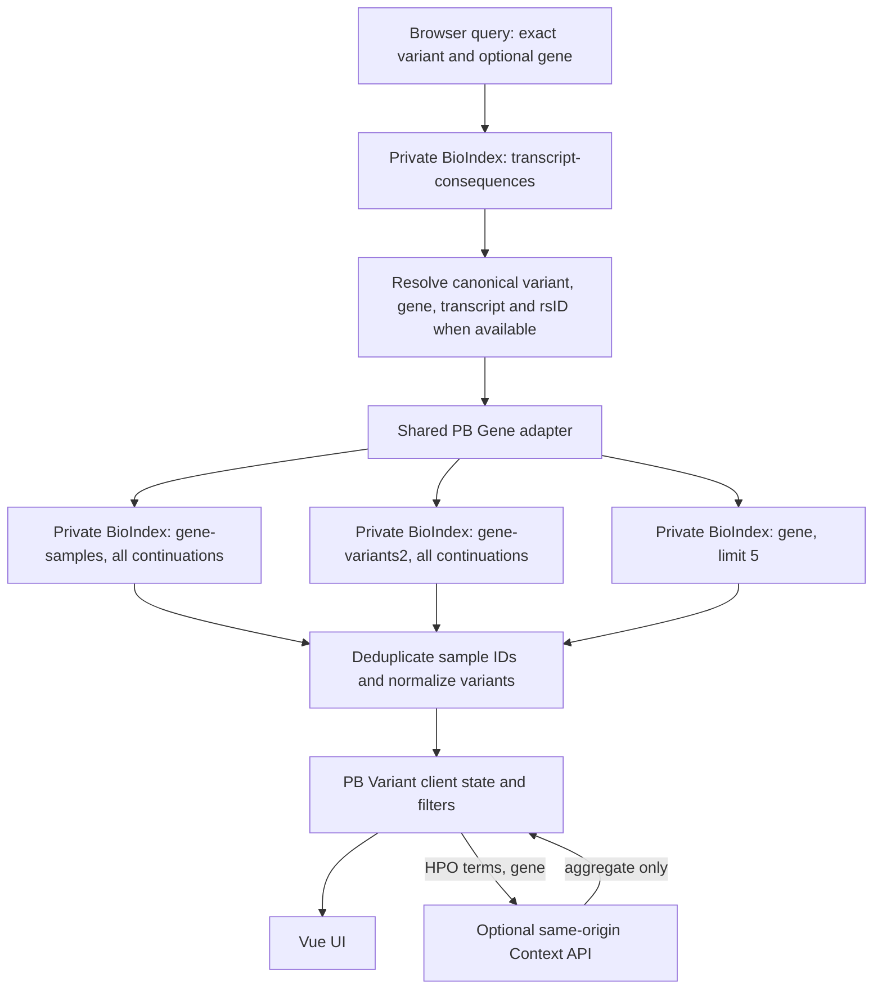

# PB Variant Engineering Integration Handoff

Updated: 2026-08-01
Target branch: `kyuryung/bch-prototype`
Pages: `/pb_variant.html`, `/pb_Gene.html`
Audience: frontend, backend, data, and platform engineers connecting the approved PB Variant implementation to a browser-accessible BCH environment

## Decision And Scope

`pb_variant` is an additional multi-page Vue entry. It does not replace `pb_Gene`, `krVariant`, or their routes. The existing PB Gene implementation and its later approved UI changes remain in place.

The current page is the approved frontend implementation, including its interaction and client-side aggregation rules. Production integration should adapt hosting, authentication, and data-service configuration without redesigning the page or substituting fixture values.

No shared `bch-aggregator` branch, shared BioIndex helper, or backend service was changed by this migration.

### Plain-language terms used here

| Term | Meaning |
|---|---|
| Exact variant | One specific chromosome, position, reference allele, and alternate allele. |
| Canonical variant ID | The standard GRCh38 text ID used by this page, such as `chr1:167845562:CT:C`. |
| Carrier | One distinct person/sample with the exact variant. Repeated source rows still count as one carrier. |
| Continuation | A token that points to the next BioIndex result page. All pages must be loaded before final counts are shown. |
| Aggregate | A summary count or score that does not return person-level source rows. |
| Denominator | The full group used under a count or percentage, such as all selected carriers. |

## Five-Minute Local Start

From the `kyuryung/bch-prototype` checkout:

```bash
BIOINDEX_HOST_PRIVATE=http://100.80.30.199:5000 \
NODE_OPTIONS=--openssl-legacy-provider \
./node_modules/.bin/vue-cli-service serve --port 8095 --host 127.0.0.1
```

Open:

- PB Gene: <http://127.0.0.1:8095/pb_Gene.html?query=SLC6A7>
- PB Variant: <http://127.0.0.1:8095/pb_variant.html?query=chr5%3A150205284%3AA%3AT&gene=SLC6A7>

Validated alternate PB Variant examples:

- <http://127.0.0.1:8095/pb_variant.html?query=chr1%3A167845562%3ACT%3AC&gene=ADCY10>
- <http://127.0.0.1:8095/pb_variant.html?query=chr1%3A167809958%3AC%3AA&gene=ADCY10>

The private BioIndex host must be reachable from the machine running the Vue dev server. A successful Vue compile does not prove that the private host or optional Context API is reachable.

`npm run watch` only builds assets in watch mode. It is not the browser dev server and does not provide the BioIndex proxy.

## Runtime Configuration

| Setting | Local development behavior | Production requirement |
|---|---|---|
| `BIOINDEX_HOST_PRIVATE` | Enables the Vue dev-server proxy from `/__bioindex_private__` to the private BioIndex host. | Build/deploy configuration must identify the private upstream without exposing it to an unauthenticated browser. |
| `BIOINDEX_HOST_PRIVATE_BROWSER` | Optional compile-time browser base override. With `BIOINDEX_HOST_PRIVATE` and no override, it becomes `/__bioindex_private__`. | Prefer a same-origin authenticated reverse-proxy path. If the path remains `/__bioindex_private__`, the deployed web server must route it; Vue `devServer.proxy` does not exist after deployment. |
| `PHENOTYPE_ANALYZER_HOST_PRIVATE` | Proxy target for `/phenotype-analyzer-api`; defaults to `http://127.0.0.1:8092`. | Route `/phenotype-analyzer-api` to the authenticated aggregate-only Context API. Do not expose patient-level residuals or covariates. |
| `NODE_OPTIONS=--openssl-legacy-provider` | Needed by this Vue 2/Webpack toolchain on the currently used modern Node runtime. | Build-pipeline concern only; it is not a browser runtime setting. |

The compile replaces `SERVER_IP_PRIVATE` in `src/utils/bioIndexUtils.js`. Do not replace the BCH `vue.config.js` with the mockup configuration. Preserve its page entries, proxy rules, cache key, private-query contract, and existing environment behavior.

## Browser Route Contract

### PB Variant

```text
/pb_variant.html?query={variant}&gene={HGNC_SYMBOL}
```

- `query` accepts an exact `chr:pos:ref:alt` identifier.
- `gene` is recommended. When a direct variant maps to multiple genes, the
  browser presents the returned genes and requires an explicit selection
  before loading carrier evidence; the selected gene is then written to the
  URL. A mapping with no gene remains an error.
- When `gene` is omitted, the page queries `transcript-consequences`, proceeds
  immediately for one gene, pauses for explicit selection for multiple genes,
  and reports an error when no gene is mapped.
- rsID input is accepted only when the current generated GRCh38 reference resolves it. General rsID resolution is not connected yet.
- Successful searches update `query` and `gene` with `history.pushState`; the page does not navigate away.

### PB Gene

```text
/pb_Gene.html?query={HGNC_SYMBOL}
```

PB Gene keeps its existing page entry. A variant row expands in place, while the explicit `Variant ↗` action opens PB Variant.

File-name case matters: `pb_Gene.html` uses an uppercase `G`; `pb_variant.html` is lowercase.

## Implemented Request And State Flow



Actual sequence:

1. `src/views/PbVariant/pageModel.js` validates and normalizes the browser query.
2. It calls private `transcript-consequences` by canonical GRCh38 variant ID without the `chr` prefix.
3. It calls `fetchPbGeneBioIndexState(gene)` from the existing PB Gene adapter.
4. The adapter queries `gene-samples` and `gene-variants2` without a row limit and queries `gene` with `limit=5`.
5. `src/utils/bioIndexUtils.js` follows every `/api/bio/cont` token using the same private-query flag.
6. Variant rows are built from observed `gene-samples.variant_id`; carrier counts are distinct `sample_id` counts.
7. PB Variant selects the exact row, attaches same-gene co-variants, and builds filterable client state.
8. The optional Context API is called only when the user submits valid HPO terms.

Every private BioIndex query must retain the fourth `true` argument:

```js
query(index, q, options, true)
```

The shared helper obtains the `session` cookie and sends it as `x-bioindex-access-token`. Private queries also call the existing `/api/bio/log/{index}` path. Do not add a second token store in PB Variant.

## Existing BioIndex Contract

### Requests

```http
GET /api/bio/query/transcript-consequences?q=1%3A167845562%3ACT%3AC
GET /api/bio/query/gene-samples?q=ADCY10
GET /api/bio/query/gene-variants2?q=ADCY10
GET /api/bio/query/gene?q=ADCY10&limit=5
x-bioindex-access-token: <session cookie value>
```

Continuation:

```http
GET /api/bio/cont?token=<opaque token>
x-bioindex-access-token: <session cookie value>
```

The token is opaque. It must not be decoded, persisted in the page, copied into logs, or sent to another service.

### Response envelope

```json
{
  "data": [],
  "count": 0,
  "restricted": 0,
  "continuation": null,
  "profile": {},
  "progress": {}
}
```

Final counts must be calculated from the fully accumulated `data`, not from `count`, `/api/bio/count`, a first response page, or the number of rendered rows.

## Connected Field Matrix

Status meanings:

- **Connected**: the current page has a live or versioned reference source and a defined mapping.
- **Conditional**: the mapping exists, but the current payload may omit the field.
- **Not connected**: the UI exists but no approved source is wired.
- **Proposed**: a contract is documented below but no deployed endpoint is assumed.

| Page value | Current source | Transformation / rule | Status and UI behavior |
|---|---|---|---|
| Canonical variant ID | `gene-samples.variant_id` | Normalize `chr`, commas, case, and exact alleles; match the requested GRCh38 variant. | Connected |
| Gene mapping | `transcript-consequences` | Use provided `gene` or require exactly one normalized transcript gene. | Connected |
| Transcript identity | `transcript-consequences` plus PB Gene MANE/RefSeq reference | Prefer MANE transcript, then `pick=1`, protein-coding, then first matching row. | Conditional; missing fields show `Unavailable` |
| rsID | Generated PB Variant GRCh38 reference, then transcript dbSNP field | Local exact mapping first; transcript row second. | Partially connected; unsupported rsID receives a validation error |
| Gene identity and locus | `gene` plus PB Gene generated identifiers/exons | Reuse `pbGeneBioIndexAdapter` and PB Gene reference modules. | Connected / conditional by field |
| Exact-variant carriers | Complete `gene-samples` output | Exact normalized variant match; deduplicate by `sample_id`. | Connected |
| Gene carrier count | Complete `gene-samples` output | Distinct `sample_id` across the gene. | Connected |
| Observed variant count | Complete `gene-samples` output | Distinct normalized observed variant IDs. | Connected |
| Consequence, HGVSp, classification, ClinVar | First matching carrier row; `gene-variants2` rows are collected as annotation support | Normalize configured aliases; transcript rows supply HGVSc/HGVSp identity when available. | Conditional |
| CRDC AF and cohort denominator | Optional fields in `gene-samples` / `gene-variants2` | AF is displayed only if supplied. Denominator uses an explicit cohort-count field only. | Conditional; never derive denominator from carrier count |
| gnomAD AF and link | Optional BioIndex annotation plus canonical variant ID | Display source AF if present; derive external gnomAD URL from the ID. | Conditional |
| LoFTEE, AlphaMissense, REVEL | Optional BioIndex annotation fields | Display independently; do not infer a value from another score. | Conditional |
| Carrier GT | Matching `gene-samples` row | Read `GT`, `gt`, or `genotype`. | Conditional |
| Same-gene co-variants | Complete gene-level carrier/variant state | Intersect distinct carrier sets; exclude the target variant; recompute counts for the selected carrier subset. | Connected, frontend-derived |
| Mean carrier GRS | Same-gene carrier/variant state | Per carrier, sum LoFTEE HC as `1`; otherwise numeric AlphaMissense; exclude REVEL-only and unscored variants. Show a mean only when every selected carrier has at least one scored variant. | Connected, frontend-derived |
| Mean residual PheRS / Match Score | `POST /phenotype-analyzer-api/analyze` | Exact-variant mean across unique carriers; require `status=ok` and `carrier_count=scored_carrier_count`. | Conditional on Context API; filtered subsets remain `Unavailable` until backend recomputation exists |
| Age, sex, affected, proband, cohort/investigator | Optional carrier row aliases | Normalize only values actually supplied by the authorized source. | Not connected for currently verified payloads; filter disabled and cells show `Unavailable` |
| Carrier HPO categories/terms | Optional carrier row phenotype fields | Normalize observed categories and terms; all carrier aggregates use the same selected denominator. | Not connected for currently verified payloads |
| GenDx | Optional carrier row diagnosis fields | Display authorized label only. | Not connected for currently verified payloads |
| Different-gene co-carriers | Optional `gene-samples.co_carrier_genes` | Preferred unfiltered path: read the approved, deduplicated other-gene list already attached to each private carrier row. Use AGG-01 only for filtered recalculation or when sample-level cross-gene delivery is not approved. | Frontend ready; current verified payload does not supply the field, so display `Not calculated`, never `0` |

`Unavailable` means that the current connected payload does not supply an approved value. It is not a claim that the underlying CRDC, reference, or clinical source lacks the value.

`Not calculated` means that the required calculation path is not connected. A numeric zero is valid only after a connected source completed the calculation with a defined denominator.

## UI And Interaction Contract

| State or interaction | Required behavior |
|---|---|
| Initial search | Read `query` and optional `gene` from the URL and load automatically when `query` exists. |
| Loading | Keep the approved progress copy as transcript, carrier, and continuation work advances. Do not replace the page with a new design. |
| Invalid query | Explain whether the exact variant format is invalid, rsID is unresolved, gene mapping is ambiguous, or the variant is not returned in the selected gene. |
| Missing optional field | Render `Unavailable`; disable an empty facet rather than inventing options. |
| Carrier filters | Facets combine with AND; multiple values within a facet use OR. Every phenotype, carrier, and same-gene co-occurrence summary uses the same selected carrier set. |
| Carrier table | Show 3 rows initially and add 3 at a time; filtering resets to the first 3. |
| Same-gene table | Show 10 rows initially and add 10 at a time. |
| HPO Context | Validate `HP:ddddddd`; post on demand; keep negative Match Scores; reject partial coverage. |
| Filtered Match Score | Do not reuse the all-carrier score after the carrier selection changes. Show `Unavailable` until a filtered aggregate endpoint exists. |
| Different-gene result | Calculate from `co_carrier_genes` when the approved field is present. Show `Not calculated` when it is missing/null. Use AGG-01 only when server-side filtered recalculation is required. |
| PB Gene navigation | Preserve in-place row expansion; use only the explicit `Variant ↗` action for PB Variant navigation. |
| Motion/accessibility | Keep visible focus, `aria-live` status, disclosure state, and `prefers-reduced-motion` behavior. Motion communicates loading or expansion only. |

## Existing Context API Contract

Status: implemented in the frontend; production service and approved inputs still require deployment/owner confirmation.

```http
POST /phenotype-analyzer-api/analyze
Content-Type: application/json
```

```json
{
  "terms": "HP:0001250,HP:0000133",
  "gene": "ADCY10",
  "advanced": {
    "significance_metric": "p_value",
    "significance_threshold": 0.05,
    "min_carriers": 10
  }
}
```

PB Variant reads either `payload.genes[gene]` or the payload itself, then requires:

```json
{
  "variant_match_scores": {
    "1:167845562:CT:C": {
      "match_score": -0.25,
      "carrier_count": 3,
      "scored_carrier_count": 3,
      "status": "ok"
    }
  }
}
```

The response must not include sample IDs, per-patient HPO profiles, residual PheRS values, genotypes, or covariate rows. See `docs/pb_gene_context_api_guide.md` for the full statistical contract.

## Contracts Required Before Remaining UI Can Be Connected

Every contract in this section is separate from the current BioIndex integration. Endpoint names marked **Proposed** are reviewable requests, not deployed routes.

### REF-01 — Versioned reference DB bundle

Status: partly connected through generated PB Gene/PB Variant assets.

Preferred delivery is a versioned server-built or build-time bundle, not browser web lookups:

```json
{
  "reference_version": "required",
  "genome_build": "GRCh38",
  "gene": {
    "symbol": "ADCY10",
    "ensembl_gene_id": "optional",
    "omim_id": "optional",
    "refseq_transcript": "optional",
    "mane_select": "optional"
  },
  "annotations": {
    "ddg2p": [],
    "panelapp": [],
    "pathways": []
  },
  "exons": []
}
```

Required provenance: upstream database names and versions, build date, genome build, generating script, and artifact hash. A missing reference row must remain distinguishable from an unbuilt or stale bundle.

### SAMPLE-01 — Authorized sample/cohort table

Status: required; not connected.

Logical table contract, independent of the browser endpoint:

| Field | Requirement |
|---|---|
| `sample_id` | Canonical join key; unique in the sample table. |
| `age_at_enrollment` or approved age band | Definition, units, allowed range, missing-value policy, and data version required. |
| `sex` | Controlled values and Unknown policy required. |
| `affected`, `proband` | Explicit booleans or controlled labels; source definition required. |
| `investigator` / `cohort` | Approved display label and grouping definition required. |
| `gendx_status`, `gendx_display` | Authorized display fields only; no unrestricted clinical text. |
| `eligible_for_portal` | Cohort inclusion flag used for the denominator. |
| `data_version` | Required for every materialized release. |

Join validation must report source row count, distinct sample count, duplicate keys, unmatched carrier IDs, and the cohort eligibility denominator. The frontend must not guess join policy.

### COHORT-01 — Cohort denominator aggregate

Status: required when BioIndex does not supply an explicit denominator.

**Proposed endpoint**:

```http
GET /api/cohorts/crdc/summary?genome_build=GRCh38
```

```json
{
  "cohort": "CRDC",
  "genome_build": "GRCh38",
  "eligible_distinct_sample_count": 0,
  "eligibility_definition": "required",
  "data_version": "required",
  "calculated_at": "required"
}
```

The denominator is a distinct eligible-sample count. It must not be inferred from exact-variant carriers, gene carriers, response rows, or the number of visible table rows.

### DIRECT-01 — General variant identifier resolver

Status: required for rsIDs outside the small generated reference.

**Proposed endpoint**:

```http
GET /api/reference/variants/resolve?query=rs1558177664&assembly=GRCh38
```

```json
{
  "query": "rs1558177664",
  "assembly": "GRCh38",
  "matches": [
    {
      "variant_id": "chr1:167845562:CT:C",
      "rsid": "rs1558177664",
      "genes": ["ADCY10"]
    }
  ],
  "source": "required",
  "source_version": "required"
}
```

Return multiple mappings explicitly. The browser must not silently select an
allele, assembly, or gene when the result is ambiguous. PB Variant renders the
candidate genes as controls; selecting one reloads the variant with the chosen
carrier context and adds `gene` to the URL.

### DIRECT-02 — Authorized exact-variant carrier details

Status: required for sample metadata, HPO, GenDx, and their filters.

**Proposed endpoint**:

```http
POST /api/variants/carrier-details
Content-Type: application/json
```

```json
{
  "variant_id": "chr1:167845562:CT:C",
  "gene_symbol": "ADCY10",
  "genome_build": "GRCh38",
  "fields": [
    "age_at_enrollment",
    "sex",
    "affected",
    "proband",
    "investigator",
    "hpo_categories",
    "gendx_display"
  ],
  "limit": 100,
  "continuation": null
}
```

```json
{
  "carrier_count": 3,
  "rows": [
    {
      "sample_id": "authorized-internal-id",
      "age_at_enrollment": null,
      "sex": null,
      "affected": null,
      "proband": null,
      "investigator": null,
      "hpo_categories": [],
      "gendx_display": null
    }
  ],
  "continuation": null,
  "field_authorization": {
    "returned": [],
    "withheld": []
  },
  "data_version": "required"
}
```

This route is private and record-level. Authentication, authorization, small-cell policy, allowed display fields, audit logging, page size, and continuation behavior require data/privacy owner approval. Do not return unrestricted diagnosis text or patient-level residual PheRS.

### BIO-EXT-01 — Preferred `gene-samples.co_carrier_genes` extension

Status: preferred first request; frontend ready; current verified payload does not supply the field.

No new endpoint is required for the current unfiltered PB Variant view. Add one optional field to each existing private `gene-samples` record:

```json
{
  "gene_symbol": "ADCY10",
  "sample_id": "S1",
  "variant_id": "1:167809958:C:A",
  "co_carrier_genes": ["MECP2", "SCN1A"]
}
```

The list must contain distinct other gene symbols observed for the same sample in the same approved production variant universe used to build `gene-samples`. Exclude the row's own `gene_symbol`.

- `[]` means the approved source was evaluated and no other qualifying gene was found.
- Missing or `null` means the source was not connected or evaluated; the UI displays `Not calculated`.
- Keep the field on the existing private authenticated BioIndex path.
- Preserve the `gene_symbol` query schema, required JSONL ordering, and full continuation behavior; rebuild the index after the S3 records change.
- If sample-level cross-gene lists are not approved, do not add this field and use AGG-01 instead.

The full owner questions, data-build rule, privacy boundary, and acceptance checklist are in `Projects/dig-dug-portal/PB Variant Small API Request Cards 2026-07-31.md`.

### AGG-01 — Filtered different-gene co-carrier aggregate

Status: conditional fallback; required only for filtered recalculation or aggregate-only delivery.

**Proposed endpoint**:

```http
POST /api/carrier-set/co-carrier-genes
Content-Type: application/json
```

```json
{
  "query": {
    "type": "variant",
    "variant_id": "chr1:167809958:C:A",
    "gene_symbol": "ADCY10",
    "genome_build": "GRCh38"
  },
  "filters": {
    "affected": [],
    "proband": [],
    "sex": [],
    "age_at_enrollment": [],
    "investigator": [],
    "phenotype": []
  },
  "limit": 10,
  "offset": 0
}
```

```json
{
  "query": {
    "variant_id": "chr1:167809958:C:A",
    "gene_symbol": "ADCY10",
    "genome_build": "GRCh38"
  },
  "carrier_set": {
    "total_carrier_count": 125,
    "selected_carrier_count": 125
  },
  "co_carrier_genes": {
    "total_available": 0,
    "limit": 10,
    "offset": 0,
    "rows": []
  },
  "data_version": "required",
  "calculation_version": "co-carrier-gene-v1"
}
```

The empty `rows` example defines the envelope; it does not assert that this variant has zero different-gene co-carriers. The server must count distinct samples, exclude the query gene, apply all filters to the same carrier set, and return aggregate rows only.

### AGG-02 — Filtered exact-variant Match Score

Status: optional extension; not connected.

If the product requires Match Score after metadata or phenotype filtering, extend the Context API with an approved server-side filter contract. The response must return the selected carrier denominator and complete scored coverage. The browser must not receive carrier residuals or calculate a partial mean.

## Backend Error Contract

New Direct or aggregate APIs should distinguish these states:

| HTTP/status | Meaning | Frontend behavior |
|---|---|---|
| `400` | Invalid variant, gene, build, HPO, or request shape | Show the specific validation message. |
| `401` / `403` | Missing session or insufficient authorization | Use the portal's existing authentication flow; do not expose upstream details. |
| `404` | Query entity is absent from the approved source | Show not found for that source/version. |
| `422` | Valid request shape but unsupported field/filter combination | Keep affected feature unavailable and identify the unsupported input. |
| `503` | Upstream source or aggregate service unavailable | Show temporarily unavailable; do not convert to zero or an empty biological result. |
| `200` with empty rows | Calculation completed and found no rows | Render a true empty result using the returned denominator and provenance. |

Every aggregate response should include `data_version`, `calculation_version`, and denominator definitions. Never include access tokens, continuation tokens, raw HPO profiles, or patient-level model inputs in normal logs.

## Source Ownership Matrix

| Concern | Owner |
|---|---|
| Vue page entry, browser query parsing, rendering, loading/error states, filter state | Frontend |
| Shared private BioIndex request helper, session-cookie header, continuation traversal | Existing portal/BioIndex integration |
| BioIndex indexes, schemas, freshness, upstream row eligibility | BioIndex/data platform |
| Sample/cohort table definitions and authorized display fields | CRDC data owner |
| Reference DB releases and generated artifact provenance | Reference data owner |
| Context API calculation, complete coverage, covariate privacy | Phenotype/statistical backend owners |
| `gene-samples.co_carrier_genes` source, rebuild, and field approval | BioIndex/data/privacy owners |
| Filtered different-gene aggregate, denominator, filtering, suppression | Backend/data/privacy owners |
| Same-origin reverse proxy and service authentication | Platform/production portal owner |

## Files To Read Before Integration

| Path | Responsibility |
|---|---|
| `vue.config.js` | MPA entry, private BioIndex browser base, dev proxies, compile-time replacement |
| `src/views/PbVariant/main.js` | Vue page mount |
| `src/views/PbVariant/Template.vue` | Approved page structure and interactions |
| `src/views/PbVariant/pageModel.js` | Query flow, client state, filters, Context API call |
| `src/views/PbVariant/carrierStatistics.js` | Carrier normalization, deduplication, GRS, phenotype and co-occurrence calculations |
| `src/views/PbVariant/variantIdentifiers.js` | Exact ID, rsID, transcript, and gnomAD-link rules |
| `src/views/PbVariant/style.css` | PB Gene-aligned visual and interaction states |
| `src/views/PbGene/pbGeneBioIndexAdapter.js` | Reused gene/carrier loading and mapping |
| `src/utils/bioIndexUtils.js` | Existing private request, session header, logging, and continuation logic |
| `docs/bch_pb_variant_tier1_acceptance_note_20260801.md` | Connected/unconnected decision and validation evidence |
| `docs/pb_gene_context_api_guide.md` | Match Score and gene Context calculation contract |
| `docs/pb_gene_context_api_review_checklist.md` | Remaining production approvals |

## Verification And Acceptance

Run:

```bash
node scripts/test_pb_variant_carrier_statistics.js
node scripts/test_pb_variant_identifiers.js
git diff --check
npm run build
```

When the private BioIndex is reachable, run the read-only live check:

```bash
BIOINDEX_HOST_PRIVATE=http://100.80.30.199:5000 \
node scripts/test_pb_variant_live_api.js ADCY10 chr1:167845562:CT:C
```

Browser acceptance:

- exact variant without a gene resolves only when transcript mapping is unambiguous;
- full continuation counts match distinct carrier and variant counts;
- 3-carrier and large-carrier pages both render correctly;
- carrier table expands 3 rows at a time and same-gene co-variants expand 10 rows at a time;
- filters update every frontend-derived section against the same carrier denominator;
- missing metadata/HPO/GenDx remains `Unavailable` and its facet is disabled;
- different-gene co-carriers is calculated when approved `gene-samples.co_carrier_genes` data is present; otherwise it remains `Not calculated`; use AGG-01 only for filtered recalculation or aggregate-only delivery;
- Context API results display only for exact-variant complete coverage;
- PB Gene remains available and the explicit variant action opens PB Variant;
- no fixture values, tokens, patient-level HPO profiles, residuals, or covariate rows appear in browser responses or logs.

## Known Verification Boundary On 2026-08-01

The implementation and documented build/browser checks passed during Tier 1 acceptance. During this documentation pass, the already-running Vue server remained available on port 8095, but the configured private BioIndex host was not reachable from the workstation. Therefore this pass verified the code paths, contracts, prior acceptance evidence, and local compile state; it did not claim a new live-source snapshot or schema confirmation.

## Copy-Paste Production Task

> Integrate the existing `kyuryung/bch-prototype` PB Variant page into the BCH browser environment without replacing PB Gene or the BCH `vue.config.js`. Start with `docs/pb_variant_engineering_integration_handoff.md` and `docs/bch_pb_variant_tier1_acceptance_note_20260801.md`. Preserve the existing private BioIndex helper and its fourth `query_private=true` argument, follow all continuations, count distinct sample IDs, and keep missing source fields as `Unavailable` or `Not calculated`. Configure a same-origin authenticated route for private BioIndex and, separately, for the Context API. Request optional `gene-samples.co_carrier_genes` first for the unfiltered different-gene view; use AGG-01 only for filtered recalculation or aggregate-only delivery. Treat REF-01, SAMPLE-01, COHORT-01, DIRECT-01/02, BIO-EXT-01, and AGG-01/02 as distinct source/backend contracts; do not synthesize their data. Run the documented unit, build, live, and browser checks before merge, and report any contract deviation.
