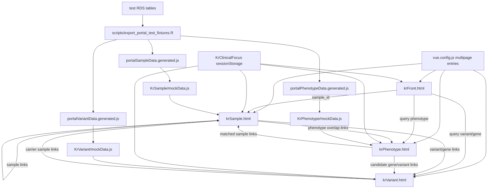

# CRDC Rare Disease Portal 기본 목업 상세 설명서

작성 기준: 현재 로컬 작업 트리의 기본 페이지

- `krFront.html`
- `krSample.html`
- `krPhenotype.html`
- `krVariant.html`

이 문서는 현재 기본 목업이 어떤 목표로 만들어졌고, 실제 코드에서 어떻게 동작하며, 어떤 데이터가 어떤 화면에 연결되어 있는지 정리한 보고서입니다. production backend 명세가 아니라 현재 Vue 목업과 test DB fixture 연결 상태를 기준으로 합니다.

## 1. 전체 목표와 핵심 개념

현재 포털의 핵심 목표는 rare disease cohort 안에서 검색 대상이 되는 sample, phenotype profile, variant/gene을 CRDC 내부 evidence와 rare disease reference evidence에 비추어 해석하는 것입니다.

프로젝트 상태 문서의 핵심 문장은 다음입니다.

```text
clinical context x search subject -> interpreted cohort evidence
```

의미는 다음과 같습니다.

| 개념 | 현재 구현 의미 |
|---|---|
| Clinical context | 선택적 배경 HPO profile입니다. Orphanet/OMIM/sample/manual/investigator context 등으로부터 HPO term set을 구성합니다. |
| Search subject | 현재 사용자가 직접 보고 싶은 대상입니다. sample ID, phenotype profile, variant/gene 중 하나입니다. |
| Interpreted cohort evidence | CRDC 내부 sample/HPO/variant recurrence, disease-HPO reference, gene/variant evidence를 검색 대상과 context에 맞춰 보여주는 UI입니다. |

중요한 설계 원칙은 active context가 genotype similarity가 아니라 HPO phenotype-based context라는 점입니다. variant/gene page에서도 context는 variant 자체와 직접 비교되는 것이 아니라 carrier HPO profile 또는 disease/gene phenotype profile과 비교되어야 합니다.

## 2. 전체 구조 개괄도



## 3. 라우팅과 엔트리 포인트

멀티 페이지 라우팅은 `vue.config.js`에서 관리됩니다.

```js
// vue.config.js
krFront: {
    entry: "src/views/KrFront/main.js",
    filename: "krFront.html",
},
krPhenotype: {
    entry: "src/views/KrPhenotype/main.js",
    filename: "krPhenotype.html",
},
krVariant: {
    entry: "src/views/KrVariant/main_V3.js",
    filename: "krVariant.html",
},
krSample: {
    entry: "src/views/KrSample/main.js",
    filename: "krSample.html",
},
```

현재 기본 URL은 다음과 같습니다.

| URL | Vue entry | Template |
|---|---|---|
| `/krFront.html` | `src/views/KrFront/main.js` | `src/views/KrFront/Template.vue` |
| `/krSample.html` | `src/views/KrSample/main.js` | `src/views/KrSample/Template.vue` |
| `/krPhenotype.html` | `src/views/KrPhenotype/main.js` | `src/views/KrPhenotype/Template.vue` |
| `/krVariant.html` | `src/views/KrVariant/main_V3.js` | `src/views/KrVariant/Template_V3.vue` |

## 4. Clinical context 구현

공통 context 상태는 `sessionStorage` 기반입니다. backend DB에 저장되지 않고 브라우저 세션 안에서만 유지됩니다.

```js
// src/views/KrClinicalFocus/focusStore.js
const FOCUS_STORAGE_KEY = "krClinicalFocus.v1";
const FOCUS_EVENT = "kr-clinical-focus-change";

export function readClinicalFocus() {
    const raw = window.sessionStorage.getItem(FOCUS_STORAGE_KEY);
    return raw ? JSON.parse(raw) : null;
}

export function writeClinicalFocus(focus) {
    window.sessionStorage.setItem(
        FOCUS_STORAGE_KEY,
        JSON.stringify({
            ...focus,
            updatedAt: new Date().toISOString(),
        }),
    );
    window.dispatchEvent(new CustomEvent(FOCUS_EVENT, { detail: readClinicalFocus() }));
}
```

context가 있는지 여부는 HPO term 배열이 있는지로 판단합니다.

```js
// src/views/KrClinicalFocus/focusComparison.js
export function hasClinicalFocus(focus) {
    return !!(focus && Array.isArray(focus.hpoTerms) && focus.hpoTerms.length);
}
```

현재 context UI가 의미하는 것은 다음과 같습니다.

| 상태 | 표시 |
|---|---|
| context 없음 | `No context` 또는 `No context set` |
| context 있음 | `Context active` 또는 active context label |
| 편집 | `ClinicalFocusBar.vue`를 popover/panel로 열어서 context를 설정 |

context는 모든 기본 결과 페이지에서 top-right control로 유지됩니다. 단, front page는 오른쪽 `Our purpose` 카드 안에 context 설정 UI를 함께 보여줍니다.

## 5. test DB fixture 연결 구조

현재 Vue 목업은 RDS를 직접 읽지 않습니다. test DB에서 필요한 값을 JS fixture로 export한 뒤 기존 `mockData.js`에서 import하여 state 일부를 override합니다.

### 5.1 입력 DB

테스트 DB:

```text
/Users/kyuryung/Documents/Playground/crdc_portal_db/portal_db_test_20260522_163649/crdc_portal_test_db_tables.rds
```

기존 reference DB:

```text
/Users/kyuryung/Documents/Playground/crdc_portal_db/reference_db/crdc_reference_db_tables.rds
```

reference DB는 건드리지 않습니다.

### 5.2 Export script

```r
# scripts/export_portal_test_fixtures.R
portal_rds <- "/Users/kyuryung/Documents/Playground/crdc_portal_db/portal_db_test_20260522_163649/crdc_portal_test_db_tables.rds"
repo_dir <- "/Users/kyuryung/Documents/github_dir/dig-dug-portal"

out_sample_js <- file.path(repo_dir, "src/views/KrSample/portalSampleData.generated.js")
out_variant_js <- file.path(repo_dir, "src/views/KrVariant/portalVariantData.generated.js")
out_phenotype_js <- file.path(repo_dir, "src/views/KrPhenotype/portalPhenotypeData.generated.js")

db <- readRDS(portal_rds)

sample_page <- as.data.table(db$sample_page_summary)
sample_hpo <- as.data.table(db$sample_hpo)
sample_variant <- as.data.table(db$sample_variant)
same_variant_recurrence <- as.data.table(db$same_variant_recurrence)
sample_gene_summary <- as.data.table(db$sample_gene_variant_evidence_summary)
```

export script는 다음 generated fixture를 만듭니다.

| Generated file | 연결 페이지 |
|---|---|
| `src/views/KrSample/portalSampleData.generated.js` | `krSample.html` |
| `src/views/KrPhenotype/portalPhenotypeData.generated.js` | `krPhenotype.html` |
| `src/views/KrVariant/portalVariantData.generated.js` | `krVariant.html` |

### 5.3 mockData override 방식

기존 큰 mock fixture를 버리지 않고 generated fixture가 있을 때만 override합니다.

```js
// src/views/KrSample/mockData.js
import { applyPortalSampleData } from "./portalSampleData.generated";

export function createKrSampleState() {
    const state = {
        // 기존 static mock state
    };
    return applyPortalSampleData(state);
}
```

generated fixture의 구조는 다음과 같습니다.

```js
// src/views/KrSample/portalSampleData.generated.js
const portalSampleState = {
  "referenceSampleId": "BCH-19-86295-01",
  "selectedInvestigatorGroup": "janet_chou",
  "sample": {
    "sampleId": "BCH-22-44945-01",
    "sex": "male",
    "ageGroup": "12-17",
    "investigator": "janet_chou",
    "hpoTotal": 107,
    "rareCodingGenes": 17,
    "topCandidate": "ARMC9 chr2:231222761:AT:A"
  }
};

export function applyPortalSampleData(state) {
    return {
        ...state,
        ...portalSampleState,
        sample: {
            ...state.sample,
            ...portalSampleState.sample,
        },
    };
}
```

현재 test fixture는 production API가 아니라 한 번 export된 static JS입니다. 따라서 URL query가 바뀌어도 DB를 다시 조회하지 않습니다.

## 6. 기본 페이지별 상세 구조

## 6.1 `krFront.html`

### 목적

front page는 sample, phenotype, variant/gene workflow로 들어가는 검색 entry point입니다. 동시에 clinical context를 설정할 수 있게 하여, 같은 검색 대상이라도 context가 있으면 해석 레이어가 달라진다는 메시지를 전달합니다.

### 주요 파일

| 파일 | 역할 |
|---|---|
| `src/views/KrFront/Template.vue` | front page 전체 markup과 검색 라우팅 |
| `src/views/KrClinicalFocus/ClinicalFocusBar.vue` | context 설정 UI |
| `src/views/KrClinicalFocus/focusStore.js` | context sessionStorage |

### 화면 구조

| 영역 | 현재 보이는 내용 | 데이터 출처 |
|---|---|---|
| Hero left | `Clinical context-guided rare disease cohort search` 설명 | static text |
| Search subject | Sample ID / Phenotype / Variant-gene select, input, examples | `fixtures` object |
| Right `Our purpose` card | context 설명, context status, `Set context` control | `readClinicalFocus()` |
| Workflow cards | Sample ID-first, Phenotype-first, Variant-first workflow | static `workflows` |
| Workflow summary modal | `/images/context_summary_20260519.png` | public image |

### 검색 이동 로직

```js
// src/views/KrFront/Template.vue
fixtures: {
    variant: { destination: "/krVariant.html", fallback: "chr15:22,000,220 G>C" },
    phenotype: { destination: "/krPhenotype.html", fallback: "cleft palate [HP:0000175]" },
    cohort: {
        destination: "/krSample.html",
        queryParam: "sample_id",
        fallback: "BCH-12-34567-01",
    },
}

openResults() {
    const value = this.query || this.activeFixture.fallback;
    const param = this.activeFixture.queryParam || "query";
    window.location.assign(
        `${this.activeFixture.destination}?${param}=${encodeURIComponent(value)}`
    );
}
```

### 현재 한계

- front page의 example/fallback은 아직 기존 static 값입니다. generated test DB의 sample `BCH-22-44945-01`, variant `chr2:231222761:AT:A`와 자동 동기화되어 있지 않습니다.
- 실제 검색 API가 아니라 단순 URL 이동입니다.
- phenotype query parsing, sample lookup, variant lookup은 front page에서 수행하지 않습니다.

## 6.2 `krSample.html`

### 목적

sample page는 현재 기본 목업에서 가장 중요한 interpretation hub입니다. 하나의 sample ID를 중심으로 phenotype profile, GenDx/variant evidence, disease profile reference, similar samples, genotype recurrence, investigator/group affinity를 보여줍니다.

### 주요 파일

| 파일 | 역할 |
|---|---|
| `src/views/KrSample/Template.vue` | sample page UI |
| `src/views/KrSample/mockData.js` | 기존 static sample fixture + generated data import |
| `src/views/KrSample/portalSampleData.generated.js` | test DB 기반 generated fixture |
| `src/views/KrSample/style.css` | sample page style |

### Header / top summary

현재 header는 다음을 보여줍니다.

| 항목 | 현재 구현 |
|---|---|
| Workflow | `Sample search` |
| Context control | `ⓘ`, `Context active/No context`, `Edit Context`, options |
| Sample ID | `displaySampleId` |
| Compact metadata | sex, age, GenDx short status, HPO count, rare coding genes |
| Top answers | Closest phenotype match, Group affinity, Disease profile reference |

관련 코드:

```js
// src/views/KrSample/Template.vue
topAnswers() {
    const metricByLabel = (needle) =>
        this.sample.positionMetrics.find((metric) =>
            metric.label.toLowerCase().includes(needle)
        );
    const closest = metricByLabel("closest");
    const group = metricByLabel("investigator");
    const disease = metricByLabel("disease profile");
    return [
        { label: "Closest phenotype match", value: closest ? closest.value : "-" },
        { label: "Group affinity", value: group ? group.value : "-" },
        { label: "Disease profile reference", value: disease ? disease.value : "-" },
    ];
}
```

test DB fixture가 적용되면 예시는 다음과 같이 바뀝니다.

| 항목 | generated 예시 |
|---|---|
| sampleId | `BCH-22-44945-01` |
| sex | `male` |
| ageGroup | `12-17` |
| investigator | `janet_chou` |
| HPO count | `107` |
| top candidate | `ARMC9 chr2:231222761:AT:A` |
| disease profile reference | `Chronic mucocutaneous candidiasis` |

### Main tab 구조

```js
// src/views/KrSample/Template.vue
tabs() {
    return [
        { id: "overview", label: "Overview" },
        { id: "phenotype", label: "Similar samples" },
        { id: "genotype", label: "Similar by genotype" },
        { id: "disease", label: "Disease profile matches" },
        { id: "genes", label: "Gene / variant evidence" },
    ];
}
```

### Overview tab

| 섹션 | 현재 보이는 것 | 데이터 |
|---|---|---|
| Position metrics | Closest phenotype neighbor, investigator context, public disease profile reference | `sample.positionMetrics` |
| Investigator phenotype-signature affinity | top investigator/cohort group ranks and z-score-like values | `sample.groupAffinityTop`, `groupAffinityOther` |
| Right Sample overview card | internal tab: `Sample overview`, `Phenotype profile` | `overviewItems`, `sample.phenotypeDomains` |
| Sample overview table | Proband, Affected, Sex, Age group, Investigator, HPO count, dominant HPO group, rare coding genes | `sample` object |
| Context comparison | context가 있을 때만 context HPO count/overlap 표시 | `sample.contextComparison` |
| GenDx panel | status, gene, variant, pathogenicity | `sample.gendx` |
| Phenotype profile | HPO group composition, full HPO term list | `sample.phenotypeDomains`, `sample.fullHpoTerms` |

계산/표시 로직:

- `displayAgeGroup()`은 `sample.ageGroup || sample.ageBand || sample.age` 순서로 값을 가져와 `-`를 `–`로 바꿉니다.
- phenotype domain bar는 `domain.count / sample.hpoTotal` 비율로 표시됩니다.
- HPO term list는 `+N more`로 접었다 펼 수 있습니다.

### Similar samples tab

이 탭은 검색한 sample과 phenotype profile이 비슷한 다른 CRDC samples를 보여줍니다.

| Column | 의미 |
|---|---|
| Sample | matched sample ID, sample page로 이동 |
| Similarity rank | phenotype similarity rank |
| Shared phenotype counts | shared HPO count, 클릭 시 shared HPO term popover |
| Shared genes | shared gene list, 길면 popover |
| Investigator | matched sample investigator/cohort |
| Sex | matched sample sex |
| Age band | matched sample age band |
| Note | row-level evidence 설명 |

관련 코드:

```vue
<!-- src/views/KrSample/Template.vue -->
<button
    class="glens-table-link glens-table-link-button"
    type="button"
    @click="toggleSharedPhenotypes(row.sampleId)"
>
    {{ row.sharedPhenotypeCount }}
</button>
<div v-if="activeSharedPhenotypeSampleId === row.sampleId" class="glens-shared-hpo-popover">
    <strong>Shared HPO terms: {{ row.sharedPhenotypeCount }}</strong>
    <ul>
        <li v-for="term in visibleSharedHpoTerms(row)" :key="term">{{ term }}</li>
    </ul>
</div>
```

test DB fixture에서는 `sample_hpo` self join 형태로 shared HPO count를 만들고, `sample_variant`에서 shared genes를 가져옵니다.

### Similar by genotype tab

이 탭은 phenotype similarity가 아니라 genotype recurrence 관점입니다.

| 섹션 | 현재 보이는 것 |
|---|---|
| Reference variant for searched sample | sample의 기준 variant/gene |
| Genotype groups | same variant, same gene 등 group별 table |
| Table columns | Sample, Genetic similarity, Shared gene, Variant evidence, Phenotype overlap, Key HPO terms |

export script는 같은 variant recurrence와 같은 gene recurrence를 분리합니다.

```r
# scripts/export_portal_test_fixtures.R
gene_rows[has_same_variant_recurrence == TRUE, sort_score := sort_score + 4]
gene_rows[has_same_gene_recurrence == TRUE, sort_score := sort_score + 3]
gene_rows[has_carrier_phenotype_overlap == TRUE, sort_score := sort_score + 3]
```

현재 qualitative strength label은 제거 방향으로 정리되었고, phenotype overlap은 count 기반으로 보여주는 방향입니다.

### Disease profile matches tab

이 탭은 diagnosis가 아니라 public disease-HPO profile reference match입니다.

| Column | 의미 |
|---|---|
| Disease profile | public disease profile |
| Source | Orphanet/Orphapacket 등 |
| Matched HPO terms | sample과 disease profile 사이 matched terms count |
| Total disease HPO terms | disease profile 전체 HPO term 수 |
| Overlap | matched / total |
| Notes | weighted profile score 등 짧은 설명 |

관련 wording:

```text
Disease profile matches compare this sample's HPO profile against public disease phenotype annotations. They are reference matches for review, not final clinical conclusions.
```

### Gene / variant evidence tab

이 탭은 narrative interpretation이 아니라 gene-level checklist입니다.

| Checklist field | 현재 의미 |
|---|---|
| Gene | candidate gene, variant page link |
| Best variant | 실제 variant ID + consequence + rarity text |
| Disease link | public disease/gene reference |
| Phenotype fit | carrier/disease HPO overlap popover 가능 |
| Internal support | same-gene carriers, same-variant carriers |
| GenDx | supporting evidence 또는 not available |
| Priority reason | candidate label |

variant table은 실제 variant 값만 clickable blue로 유지하도록 정리되어 있습니다.

### Sample page의 현재 DB 연결

| UI | test DB table/source |
|---|---|
| header metadata | `sample_page_summary`, `sample` |
| HPO count/full HPO | `sample_hpo`, `hpo_term` |
| phenotype neighbors | `sample_hpo` overlap aggregation |
| disease profile reference | `sample_disease_profile_match_summary` |
| gene/variant evidence | `sample_gene_variant_evidence_summary`, `sample_variant`, `same_variant_recurrence`, `same_gene_recurrence` |
| group affinity | `sample_to_cohort_phenotype_score` |

### Sample page의 주요 한계

- `displaySampleId`는 URL query를 읽지만 generated fixture는 한 sample object만 override합니다. 따라서 `/krSample.html?sample_id=다른ID`로 이동하면 header ID는 바뀌어도 실제 상세 데이터는 같은 fixture일 수 있습니다.
- GenDx 관련 값은 test export에서 제한적입니다. 현재 generated fixture에는 `Not loaded`, `Not diagnosed in sample metadata`가 표시될 수 있습니다.
- phenotype domain aggregation은 현재 export script에서 실제 HPO root category aggregation이 아니라 상위 HPO label 몇 개를 단순 domain처럼 쓰는 부분이 있습니다.
- PheRS/GRS는 frontend에서 계산하지 않습니다.

## 6.3 `krPhenotype.html`

### 목적

phenotype page는 입력 phenotype profile을 기준으로 CRDC matched samples, disease/gene candidates, cohort variant overlay, co-observed phenotype structure, investigator-level evidence를 보여주는 페이지입니다.

### 주요 파일

| 파일 | 역할 |
|---|---|
| `src/views/KrPhenotype/Template.vue` | phenotype page UI |
| `src/views/KrPhenotype/mockData.js` | static phenotype fixture + generated import |
| `src/views/KrPhenotype/portalPhenotypeData.generated.js` | test DB generated fixture |

### Top Query phenotype profile section

| 영역 | 현재 표시 |
|---|---|
| Query phenotype profile | exact query HPO terms |
| Phenotype-similar samples | 현재 template에 `132 / 904`가 직접 표시됨 |
| Semantically similar phenotypes | disclosure 형태 |
| Cohort summary | sex/proband/age distribution |
| Annotation-burden check | headline summary |
| Dominant phenotype structure | headline summary |
| Candidate gene evidence | gene + `[External]`, `[CRDC]`, `[External | CRDC]` source label |

중요한 문제는 generated phenotype fixture에는 `20 / 350`이 들어 있지만, top section 일부는 여전히 `132 / 904`로 hard-coded 되어 있다는 점입니다.

generated fixture 예시:

```js
// src/views/KrPhenotype/portalPhenotypeData.generated.js
"headline": [
  {
    "label": "Phenotype-similar samples",
    "value": "20 / 350",
    "detail": "HPO overlap search in test DB"
  },
  {
    "label": "Annotation-burden check",
    "value": "Not calculated in fixture",
    "detail": "Would require backend/runtime residual scoring"
  }
]
```

### Phenotype-derived candidates block

이 블록은 input HPO profile에서 disease/gene candidate를 만들고 CRDC cohort evidence를 overlay한다는 논리를 보여줍니다.

현재 설명:

```text
Input HPO profile → weighted PheRS/profile matching → ranked disease and gene candidates → CRDC cohort evidence overlay.
```

tabs:

| Tab | 내용 |
|---|---|
| Disease candidates | disease candidate, PheRS/profile match, external annotation, CRDC cohort evidence, why matched |
| Gene candidates | gene, PheRS/profile match, external annotation, CRDC cohort evidence, why matched |
| Cohort variant overlay | prioritized genes 안에서 CRDC cohort variants를 보여줌 |

현재 구현은 PheRS라는 UI 개념을 보여주지만 실제 runtime PheRS 계산은 없습니다. generated fixture에서도 다음처럼 명시합니다.

```js
"subtext": "2 test DB HPO query terms; runtime PheRS/GRS is not implemented in frontend"
```

### CRDC cohort evidence block

현재 tabs:

| Tab | 내용 |
|---|---|
| Matched samples | ranked matched sample table, selected matched sample, selected sample phenotype profile, annotation-burden QC plot |
| Co-observed phenotypes | matched sample set 안에서 반복되는 additional HPO terms |
| Investigator-level evidence | investigator group plot, detail table, scatter plot |

Matched samples table:

| Column | 의미 |
|---|---|
| Rank | matched sample rank |
| Sample | clickable selected sample |
| Investigator | cohort/investigator |
| Query terms matched | original query terms matched |
| Total HPO terms | selected sample HPO term count |
| Similarity | raw score |
| Residual | annotation burden corrected residual, fixture에서는 not calculated 가능 |
| Candidate signals | candidate genes |

selected sample panel은 row 클릭 시 `activeOutlierSample`이 바뀌면서 업데이트됩니다.

```js
// src/views/KrPhenotype/Template.vue
selectSample(sampleId) {
    this.activeOutlierSample = sampleId;
    this.diagnosisOpen = false;
    this.activeSampleProfileCategory = "Abnormality of the nervous system";
}
```

### Phenotype page의 현재 DB 연결

| UI | test DB table/source |
|---|---|
| query HPO terms | selected sample의 HPO 2개를 export script에서 query로 선택 |
| matched samples | `sample_hpo` overlap 기반 |
| candidate genes | phenotype-matched samples 안의 `sample_variant` gene aggregation |
| candidate variants | matched sample set 안의 prioritized genes variants |
| co-observed phenotypes | matched samples의 HPO aggregation |
| residual/QC | 현재 generated fixture에서는 계산하지 않음 |

### Phenotype page의 주요 한계

- top cohort summary가 generated fixture와 완전히 동기화되지 않았습니다. `132 / 904` static text가 남아 있습니다.
- PheRS/profile matching은 UI hierarchy로 표현되어 있지만 frontend 계산은 단순 HPO overlap fixture입니다.
- annotation-burden residual은 generated fixture에서 `not calculated`입니다.
- `candidateVariants.carriers`가 실제 "matched samples among denominator"로 정확히 계산된 것이 아니라 global carrier count가 섞일 수 있습니다. 예를 들어 `259 / 20 matched samples`처럼 denominator보다 numerator가 큰 이상한 값이 생길 수 있습니다.
- selected sample phenotype profile은 fallback mock data가 섞일 수 있습니다.

## 6.4 `krVariant.html`

### 목적

variant page는 queried variant 또는 gene의 carrier set, carrier HPO profile, disease/gene/locus evidence, context position in CRDC를 보여주는 페이지입니다.

### 주요 파일

| 파일 | 역할 |
|---|---|
| `src/views/KrVariant/Template_V3.vue` | variant page UI |
| `src/views/KrVariant/mockData.js` | static variant fixture + generated import |
| `src/views/KrVariant/portalVariantData.generated.js` | test DB generated fixture |

### Header

| 항목 | 현재 표시 |
|---|---|
| query label | `variant.query.label` |
| cytoband | 현재 template에 `15q11.3` hard-coded |
| pathogenicity badge | `variant.query.pathogenicity` |
| window/build | `variant.query.window`, `variant.query.build` |
| carrier subline | 현재 `18 queried-variant carriers · 12 probands · 17 affected` hard-coded |
| Demographic Summary | variant/gene level toggle, age bars, sex/proband counts |

generated fixture 예시:

```js
// src/views/KrVariant/portalVariantData.generated.js
"query": {
  "label": "chr2:231222761:AT:A",
  "pathogenicity": "rare/damaging test subset",
  "window": "ARMC9 Variant",
  "build": "test DB"
},
"summaryScopes": {
  "variant": {
    "all": 259,
    "proband": 122,
    "female": 137,
    "male": 113
  }
}
```

따라서 현재 header 안에는 generated DB 값과 오래된 UBE3A/15q/18 carrier static text가 섞이는 문제가 있습니다.

### Queried variant window

| 구성 | 현재 역할 |
|---|---|
| Disease track checkbox | disease/locus signals 표시 여부 |
| Gene track checkbox | exon/base/codon track 표시 여부 |
| coordinate axis | static axis ticks |
| focus band/line | queried position alignment |
| disease signal track | `variant.diseaseSignals` |
| exon/codon/base track | mostly static UBE3A-oriented markup |
| marker track | `variant.markers` |
| per-position carrier count | `variant.densitySeries` 기반 density plot |
| filters | All/Affected/Proband, investigator, age |

filter 로직은 backend filter가 아니라 frontend synthetic scaling입니다.

```js
// src/views/KrVariant/Template_V3.vue
activeDensityGroup() {
    const baseGroup = this.variant.densitySeries[this.activeInvestigator];
    const ageScale = {
        "all-ages": 1,
        "0-1": 0.18,
        "2-4": 0.28,
        "5-12": 0.46,
        "13-18": 0.58,
        adult: 0.38,
    }[this.activeCarrierAge] || 1;
    // investigatorScale과 ageScale로 density count를 조정
}
```

### Queried variant evidence / Gene locus context

오른쪽 panel은 다음을 보여줍니다.

| Panel | 데이터 |
|---|---|
| Queried variant evidence | `variant.variantEvidence` |
| Gene / locus context | `variant.geneContext` |
| Disease signals | `variant.relatedDiseases` |

generated fixture에서는 ARMC9 reference support, carriers, AF, LoFTEE 등이 들어옵니다.

### Carrier phenotype profile block

이 블록은 variant page의 핵심입니다.

구성:

| 영역 | 내용 |
|---|---|
| Variant level / Gene level toggle | exact queried variant carriers 또는 same-gene carrier set |
| Set as context | 선택한 carrier samples 또는 phenotype items를 context 후보로 보냄 |
| Edit context panel | 선택 항목 review/remove/add/clear/confirm |
| left carrier tabs | carrier samples, carrier HPO profile, Context position in CRDC |
| right Phenotype Summary | HPO category와 detail terms, investigator filter |

선택 workflow:

```text
carrier sample checkbox 또는 phenotype row/term checkbox
-> Edit context panel 자동/수동 열림
-> selected item review/remove/add/clear
-> Confirm context
-> writeClinicalFocus()
-> context active
```

핵심 코드:

```js
// src/views/KrVariant/Template_V3.vue
confirmCarrierContextDraft() {
    const type = this.carrierContextDraftType;
    const items = [...this.carrierContextDraftItems];
    const hpoTerms = type === "phenotypes"
        ? this.hpoTermsFromPhenotypeRows(items)
        : this.hpoTermsFromCarrierProfile();
    writeClinicalFocus({
        source: type === "samples" ? "carrier-sample-selection" : "carrier-phenotype-selection",
        label,
        sourceQuery: items.join(", "),
        hpoTerms,
    });
    this.activeCarrierDetail = "residual";
}
```

mixed context type은 막혀 있습니다.

```js
// src/views/KrVariant/Template_V3.vue
toggleCarrierSampleContext(sampleId) {
    if (this.carrierContextSelectionType === "phenotypes") return;
    // sample context 선택
}

toggleCarrierPhenotypeContext(label) {
    if (this.carrierContextSelectionType === "samples") return;
    // phenotype context 선택
}
```

### Context position in CRDC

context가 없으면 guide message를 보여줍니다.

```text
No active context. Carrier samples and carrier HPO profile are shown as cohort-wide summaries only. Set a clinical context to score this carrier profile against a disease, sample, investigator cohort, or HPO profile.
```

context가 있으면 carrier HPO profile을 active context와 비교하는 mock summary를 보여줍니다.

| Field | 의미 |
|---|---|
| Active context | 현재 HPO context label |
| Carrier reference | exact variant carriers 또는 gene carriers |
| Match to context | context HPO term overlap |
| Position vs CRDC | CRDC background 대비 rank/percentile |

### Variant page의 현재 DB 연결

| UI | test DB table/source |
|---|---|
| query variant/gene | `sample_variant`, generated top variant |
| carrier count | `variant_carrier`, `gene_carrier` |
| carrier sample list | `variant_carrier`, `sample` |
| carrier phenotype categories | carrier samples의 `sample_hpo` aggregation |
| disease/gene reference | `disease_gene_weight`, generated Orpha IDs |
| same-gene recurrence | `gene_carrier` |

### Variant page의 주요 한계

- template 내부에 old UBE3A/15q11.3/18 carrier text가 많이 남아 있습니다. generated fixture가 ARMC9/259 carriers를 넣어도 일부 화면은 옛값을 계속 보여줄 수 있습니다.
- locus window coordinate text도 `chr15:22,000,195-22,000,245`로 남아 있어 generated `chr2` query와 불일치합니다.
- density filter는 실제 DB query가 아니라 synthetic scaling입니다.
- `carrierReference()` computed는 hard-coded variant/gene count와 UBE3A label을 사용합니다.
- context setting은 sessionStorage mock입니다. downstream backend re-analysis는 없습니다.

## 7. 페이지 간 이동 구현

기본 페이지는 Vue Router를 쓰지 않고 multipage HTML 간 `href` 또는 `window.location.assign`으로 이동합니다.

| Source | Target | 구현 |
|---|---|---|
| Front search sample | `/krSample.html?sample_id=...` | `openResults()` |
| Front search phenotype | `/krPhenotype.html?query=...` | `openResults()` |
| Front search variant/gene | `/krVariant.html?query=...` | `openResults()` |
| Sample similar row | `/krSample.html?sample_id=...` | `sampleHref()` |
| Sample gene/variant | `/krVariant.html?query=...` | `variantHref()` |
| Phenotype matched sample | `/krSample.html?sample_id=...` | `sampleHref()` |
| Phenotype candidate gene/variant | `/krVariant.html?query=...` | `variantHref()` |
| Variant carrier sample | `krSample.html?sample_id=...` | `sampleHref()` |

예:

```js
// src/views/KrSample/Template.vue
sampleHref(sampleId) {
    return `/krSample.html?sample_id=${encodeURIComponent(sampleId)}`;
},
variantHref(variantId) {
    return `/krVariant.html?query=${encodeURIComponent(variantId)}`;
}
```

주의할 점은 현재 이동은 navigation일 뿐이고, target page가 URL query에 맞춰 DB/API를 새로 조회하지 않는다는 것입니다. generated fixture는 한 번 import된 static object입니다.

## 8. 데이터 테이블과 화면 매핑

현재 test DB와 목업 연결 기준입니다.

| DB table / fixture source | 화면 위치 | 현재 사용 방식 |
|---|---|---|
| `sample` | sample metadata, carrier sample metadata | sex, age, proband, affected |
| `sample_page_summary` | sample header/top summary | HPO count, rare coding genes, top evidence |
| `sample_hpo` | sample phenotype profile, similar samples, phenotype search, carrier HPO profile | HPO overlap/count aggregation |
| `hpo_term` | HPO label lookup | `label [HP:id]` 문자열 생성 |
| `sample_variant` | sample genotype, candidate genes, variant page query | rare/damaging test subset |
| `same_variant_recurrence` | genotype recurrence, gene/variant evidence | same variant carrier count |
| `same_gene_recurrence` | genotype recurrence, gene evidence | same gene carrier count |
| `variant_carrier` | variant carrier reference set | carrier samples |
| `gene_carrier` | gene-level carrier set | carrier samples |
| `carrier_context_fit_summary` | intended context/carrier fit | 현재 기본 UI에는 제한적으로만 반영 |
| `sample_gene_variant_evidence_summary` | sample gene/variant evidence | candidate genes, labels, internal support |
| `sample_disease_profile_match_summary` | sample disease profile matches | disease profile reference table |
| `sample_to_cohort_phenotype_score` | investigator/group affinity | group rank/z-like score |

## 9. 화면 표시 전 계산/필터/선택 옵션

### 9.1 R export 단계 계산

| 계산 | 위치 | 의미 |
|---|---|---|
| preferred sample 선택 | `pick_sample()` | `external_and_crdc_supported`, `uncurated_recurrent_candidate`가 많은 sample 우선 |
| HPO label formatting | `hpo_label()` | `name [HP:id]` 형태로 변환 |
| phenotype neighbors | `sample_hpo` self overlap | shared HPO count 기반 neighbor |
| disease matches | `sample_disease_profile_match_summary` | matched HPO count, weighted score |
| candidate genes | `sample_gene_variant_evidence_summary` | recurrence/reference/phenotype overlap flag 기반 sort |
| phenotype query fixture | sample HPO 중 2개 선택 | frontend에서 runtime query calculation 없음 |
| candidate variants | matched samples 안 variant subset | 일부 count denominator 문제가 남음 |

### 9.2 Vue runtime 필터/옵션

| 페이지 | 옵션 | 현재 동작 |
|---|---|---|
| Sample | tabs | static state 안에서 tab switch |
| Sample | Full HPO term list | accordion |
| Sample | HPO more/less | frontend expanded state |
| Phenotype | insight tabs | disease/gene/variant candidate tab switch |
| Phenotype | cohort evidence tabs | matched/co-observed/investigator tab switch |
| Phenotype | selected sample row | `activeOutlierSample` 업데이트 |
| Variant | disease/gene track checkbox | optional track 표시 |
| Variant | density filters | frontend synthetic scaling |
| Variant | variant/gene level toggle | carrier reference level switch |
| Variant | carrier context selection | sample/phenotype selection 후 `writeClinicalFocus` |

## 10. 평가: 목표했던 것 vs 실제 구현

## 10.1 목표했던 것

1. sample-first / phenotype-first / variant-first workflow를 모두 제공합니다.
2. sample page를 가장 중요한 interpretation hub로 둡니다.
3. disease wording은 diagnosis가 아니라 `Disease profile reference`로 유지합니다.
4. phenotype similarity, active context match, genotype recurrence를 하나의 모호한 점수로 합치지 않습니다.
5. PanelApp/pathway는 secondary annotation badge일 뿐, CRDC recurrent candidate를 제거하는 filter가 아닙니다.
6. active context는 HPO phenotype profile로 다루며 variant 자체와 직접 비교하지 않습니다.
7. test DB fixture를 붙여 실제 값이 mockup에서 어떻게 보이는지 확인합니다.

## 10.2 실제로 구현된 것

| 항목 | 구현 상태 |
|---|---|
| 기본 4개 페이지 | 구현됨 |
| front page search routing | 구현됨, 단 static URL 이동 |
| shared clinical context | sessionStorage 기반 구현됨 |
| sample page top summary | 구현됨 |
| sample page Overview / Similar samples / Similar by genotype / Disease profile matches / Gene variant evidence | 구현됨 |
| sample generated fixture override | 구현됨 |
| phenotype generated fixture override | 구현됨 |
| variant generated fixture override | 구현됨 |
| variant carrier HPO profile context-setting workflow | 구현됨 |
| context active/no context UI | 세 기본 결과 페이지에 있음 |
| disease wording cleanup | 상당 부분 반영됨 |

## 10.3 아직 제대로 구현되지 않은 것

| 문제 | 설명 |
|---|---|
| dynamic DB lookup | URL query별로 sample/variant/phenotype을 새로 가져오지 않습니다. |
| PheRS/GRS runtime 계산 | frontend에는 없습니다. 현재 phenotype page의 PheRS wording은 hierarchy 표현이고 실제 계산은 fixture 생성 시 overlap proxy입니다. |
| phenotype top summary fixture sync | `132 / 904` 등 static 값이 generated `20 / 350`과 혼재합니다. |
| variant page old hard-coded values | UBE3A, 15q11.3, chr15 coordinate, 18 carriers가 ARMC9/chr2 generated data와 섞여 보일 수 있습니다. |
| true HPO root aggregation | export script 일부는 실제 root category가 아니라 top HPO labels를 domain처럼 씁니다. |
| annotation-burden residual | generated fixture에서는 `not calculated`입니다. |
| GenDx completeness | test export에 GenDx-specific fields가 제한적입니다. |
| context downstream reanalysis | context 설정 후 UI label은 바뀌지만 backend 재분석은 없습니다. |

## 10.4 중복된 것

| 중복 | 설명 |
|---|---|
| phenotype top cohort summary와 lower CRDC evidence | 일부 summary가 반복될 수 있습니다. |
| sample overview와 phenotype profile details | Sample overview card 안에 많은 내용이 집중되어 여전히 heavy할 수 있습니다. |
| variant carrier profile left/right table | 왼쪽 carrier HPO profile과 오른쪽 Phenotype Summary가 같은 category/term 정보를 다른 형태로 보여줍니다. |
| context controls | front page는 `Our purpose` card 내부, 결과 페이지는 top-right control로 위치가 다릅니다. |

## 10.5 삭제하거나 줄이는 것이 좋은 것

| 대상 | 이유 |
|---|---|
| variant page UBE3A/chr15 hard-coded text | generated DB와 충돌합니다. |
| phenotype page top section의 hard-coded `132 / 904` | generated fixture와 충돌합니다. |
| old sample IDs in front examples | test DB 확인 흐름과 맞지 않습니다. |
| diagnosis처럼 읽히는 disease 표현 | `Disease profile reference`로 유지해야 합니다. |
| non-clickable blue text | clickable/popover-trigger value에만 blue를 써야 합니다. |

## 10.6 목표와 달라진 것

| 달라진 점 | 평가 |
|---|---|
| DB 연결이 API가 아니라 generated JS fixture | 목업 확인 목적에는 적절하지만 실제 검색 페이지로 오해하면 안 됩니다. |
| phenotype page에서 PheRS라는 용어를 사용 | 실제 frontend 계산은 없으므로 `planned/backend-calculated`처럼 명확히 표시해야 합니다. |
| variant page가 일부 static locus mock과 generated fixture를 혼합 | 디자인 평가에는 유용하지만 data fidelity는 낮습니다. |
| sample page의 URL query가 실제 data selection과 분리 | 데모에서는 혼란을 줄 수 있습니다. |

## 10.7 요구하지 않았으나 추가된 것 또는 부가 기능

| 기능 | 상태 |
|---|---|
| Large text option | 결과 페이지 top-right options에 있음 |
| 여러 popover/info icon | 설명문을 숨기기 위해 다수 추가됨 |
| carrier phenotype row/term을 context로 설정하는 workflow | variant page에 구현됨 |
| generated fixture export script | 목업에 실제 test DB 값을 붙이기 위해 추가됨 |
| ERD 문서 | `docs/crdc_portal_erd.md`에 별도 작성됨 |

## 11. 결론

기본 목업은 rare disease portal의 핵심 workflow를 거의 모두 화면에 올려둔 상태입니다. 특히 sample page는 CRDC 내부 evidence, disease reference, gene/variant recurrence, context-guided interpretation을 한 화면에서 평가할 수 있는 hub로 구현되어 있습니다.

다만 현재는 static Vue mockup에 test DB fixture를 얹은 상태이므로, 실제 검색/분석 시스템으로 보려면 다음이 필요합니다.

1. URL query 기반 API lookup.
2. PheRS/profile matching, annotation-burden correction, GRS 또는 recurrence scoring의 backend 계산.
3. generated fixture와 static template text의 완전한 동기화.
4. variant page의 old UBE3A/chr15 hard-coded 요소 제거.
5. HPO root category aggregation과 disease/gene reference provenance의 정교화.

현재 버전은 production-ready portal이라기보다, 어떤 정보 계층과 UI 구조가 필요한지 실제 test DB 값으로 검증하는 evaluation mockup입니다.
