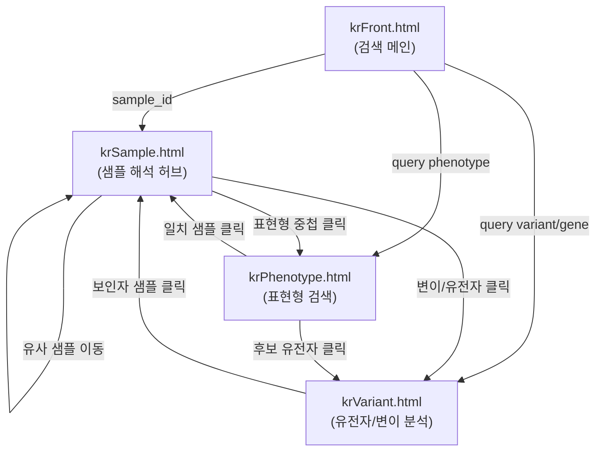
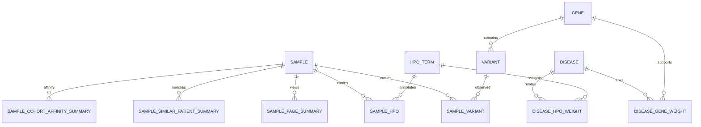

# Rare Disease Cohort Evidence Portal (dig-dug-portal) 상세 분석 보고서

본 보고서는 병원 희귀질환 코호트 내부 환자 증례 데이터(Metadata) 및 VCF 유전체 분석 데이터를 기반으로 작동하는 **내부 임상 증례 포털(Internal Evidence Portal)** 프로젝트의 아키텍처, 작동 매커니즘, 상세 구현 현황, 그리고 극복해야 할 문제점을 다차원적으로 분석하여 한국어로 정리한 보고서입니다.

---

## 1. 프로젝트 개요 및 핵심 비전

### 1.1 프로젝트 목표
본 프로젝트의 궁극적인 목표는 **희귀질환 코호트 연구자를 위한 내부 웹 브라우저(Internal Web Browser) 겸 임상 증례 포털**을 제공하는 것입니다. 
일반적인 게놈 브라우저나 암(Oncology) 정보 포털과 달리, 본 포털은 희귀질환 특유의 소규모 코호트 환경에 특화되어 있습니다. 연구자가 특정 검색어(샘플 ID, 표현형, 유전자/변이)로 조회 시 코호트 내 유사 증례, 후보 유전자/변이, 그리고 고려 가능한 희귀질환에 대한 다차원적 인사이트(Insight)를 즉시 제공하는 것을 지향합니다.

### 1.2 핵심 작동 개념: Context-Guided Interpretation
포털의 검색 엔진 및 해석 논리는 단순히 검색 대상을 나열하는 것에서 벗어나 아래의 핵심 수식을 바탕으로 설계되었습니다.

$$\text{Clinical Context} \times \text{Search Subject} \to \text{Interpreted Cohort Evidence}$$

*   **Search Subject (검색 대상):** 연구자가 직접 조사하려는 1차 입력입니다. (Sample ID, Phenotype profile, Variant/Gene 중 하나)
*   **Clinical Context (임상적 맥락):** 분석을 유도하는 2차 입력으로, 선택적인 배경 지식 또는 가설에 해당합니다. 이는 HPO(Human Phenotype Ontology) 기반 표현형 프로파일 세트로 변환되어 작동합니다.
*   **Interpreted Cohort Evidence (해석된 코호트 증거):** Clinical Context와 Search Subject를 결합하여 산출되는 해석 레이어입니다.

#### 검색 알고리즘의 2가지 주요 작동 방식
1.  **용어(Term/Subject) 기반 분석:** 입력 용어(예: 특정 HPO 표현형 또는 샘플 ID)에 가중치를 부여하여 코호트 전반에서 일치 및 유사 증례를 정렬하는 방식입니다.
2.  **용어(Subject) + Context 연동 분석:** 연구자가 사전에 지정한 Clinical Context(예: 심장 질환 관련 HPO 세트)를 바탕으로 현재 검색 대상의 결과를 재해석하는 방식입니다. 예를 들어 심장 질환 연구자라면, 검색한 변이/유전자나 환자 샘플이 심장 질환이라는 배경 맥락과 결합했을 때 어떤 연관 표현형, 변이 후보, 연관 질병을 보이는지 입체적인 필터링과 비교 데이터를 얻게 됩니다.
*   **핵심 규칙:** Active Context는 유전적 유사도(Genotype Similarity)가 아니라 항상 **HPO 표현형 기반 맥락(Phenotype-based Context)**으로 작동합니다. 변이/유전자 페이지에서도 Context는 변이 자체와 직접 비교되는 것이 아니라, 해당 변이를 가진 보인자(Carrier)들의 HPO 프로파일 또는 관련 질환/유전자의 표현형 프로파일과 대조 분석됩니다.

---

## 2. 포털 아키텍처 및 시스템 구성

현재 프로젝트는 Vue.js 프레임워크 기반의 멀티 페이지 애플리케이션(MPA) 및 정적 데이터 목업(Mockup) 체계를 갖추고 있습니다.

### 2.1 멀티 페이지 라우팅 엔트리
라우팅은 `vue.config.js`를 통해 관리되며, 총 4개의 주요 페이지가 서로 유기적으로 연결된 **"연결된 삼각형(Connected Triangle)"** 구조를 이룹니다.

*   **`krFront.html` (Front Page):** 코호트 탐색 및 임상 맥락(Context)을 설정하는 포털의 진입점입니다.
*   **`krSample.html` (Sample Page):** 단일 샘플 ID를 중심으로 표현형 프로파일, 변이 증거, 희귀질환 레퍼런스, 그룹 유사도 등을 통합하여 보여주는 **가장 핵심적인 해석 허브(Hub)**입니다.
*   **`krPhenotype.html` (Phenotype Page):** 입력된 표현형 프로파일을 기준으로 코호트 내 겹치는 샘플 분석, 동시 관찰 표현형 패턴, 잠재적 유전자/질환 후보군을 제시합니다.
*   **`krVariant.html` (Variant Page):** 쿼리된 변이/유전자의 보인자 분포, Locus 시각화 트랙, 보인자 HPO 프로파일 및 Context 대조 분석 결과를 제공합니다.

### 2.2 Clinical Context 공유 메커니즘
Clinical Context 상태는 백엔드 DB가 아니라 웹 브라우저의 `sessionStorage` 기반으로 설계되어 런타임 성능을 높였습니다.
*   **관련 모듈:** `src/views/KrClinicalFocus/focusStore.js`
*   **작동 방식:** `sessionStorage.getItem("krClinicalFocus.v1")`을 통해 실시간 맥락을 관리하며, 상태 변경 시 `CustomEvent("kr-clinical-focus-change")`를 발행하여 다른 3개 페이지가 별도의 새로고침 없이 즉시 변화를 감지할 수 있도록 연동되어 있습니다.

### 2.3 테스트 DB Fixture 바인딩 구조
현재 포털은 실제 데이터베이스 서비스를 직접 실시간으로 쿼리하지 않고, Mockup 수준에서 R 스크립트를 통해 생성된 정적 JS 파일(Fixture)을 덮어씌워 데이터를 렌더링하고 있습니다.

1.  **입력 DB:** R의 RDS 파일(`crdc_portal_test_db_tables.rds`) 형태로 테스트 데이터 보관.
2.  **변환 스크립트:** `scripts/export_portal_test_fixtures.R` 실행을 통해 RDS 테이블 내용을 해석하여 JSON 형태의 JS Fixture 생성.
3.  **생성되는 Fixture 파일:**
    *   `src/views/KrSample/portalSampleData.generated.js`
    *   `src/views/KrPhenotype/portalPhenotypeData.generated.js`
    *   `src/views/KrVariant/portalVariantData.generated.js`
4.  **Mock 데이터 Override:** 각 컴포넌트 폴더 내 `mockData.js`에서 생성된 Fixture 파일의 `applyPortal*Data(state)` 함수를 임포트하여 기본 정적 예시 데이터를 동적으로 덮어씌웁니다.

---

## 3. 데이터베이스 설계 및 스키마 분석 (DB Plan)

포털 데이터베이스의 핵심 목표는 **코호트 내부(CRDC) 데이터 탐색을 최우선(1순위)**으로 하되, 검증된 외부 레퍼런스 데이터베이스를 단계별로 연동하여 증거를 통합 제공하는 것입니다.

### 3.1 정보 및 레퍼런스 우선순위 (Evidence Hierarchy)
1.  **1순위 (Primary CRDC Internal Evidence):** 코호트 내부 샘플 메타데이터, HPO 빈도, 변이 재발성(Recurrence), 보인자 간 표현형 중첩도, 연구자 그룹(Investigator Group) 특이적 유사도.
2.  **1.5순위 (Core Rare Disease Reference):** Orphanet(희귀질환 정보의 핵심 Core), HPO(검색 기반 및 온톨로지 구조), DECIPHER, MONDO, OMIM(질환/유전자 레퍼런스).
3.  **2순위 (Secondary Annotation):** PanelApp(Curated clinical badge), Reactome 및 WikiPathways(기능적 경로 분석 정보), DDPG2 등. 
    *   *주의:* PanelApp 등 2순위 자료에 등재되지 않았더라도, 코호트 내부에서 재발성 및 명확한 표현형 중첩이 증명되면 `uncurated_recurrent_candidate`로 분류하여 신규 연구용 후보로 안전하게 보존합니다.

### 3.2 핵심 데이터베이스 스키마 및 테이블 설계
데이터베이스는 정규화된 마스터 테이블(Normalized Tables)과 1초 이내 빠른 조회를 지원하기 위해 미리 집계된 구체화된 요약 테이블(Materialized Summary Tables)의 2레이어로 구성됩니다.

#### 구체화 요약 테이블 (Materialized Summary Tables) 목록 및 역할
*   `sample_page_summary`: 샘플 정보 조회 메타데이터 전체 요약.
*   `sample_similar_patient_summary`: 샘플 간 HPO 표현형 유사도를 기반으로 코호트 내 가장 가까운 유사 환자 목록 제공.
*   `sample_cohort_affinity_summary`: 특정 환자가 속한 원래 연구 그룹(Home Cohort) 대비 다른 연구 그룹(Best Cohort)과의 표현형 유사성 점수 및 Z-score 산출. (원 연구 그룹 오분류 검출용)
*   `sample_genotype_recurrence_summary`: 동일 변이 보인자 수, 동일 유전자 보인자 수, 표현형 겹침 여부 등 코호트 내 유전적 재발성 제공.
*   `sample_disease_profile_match_summary`: 환자 표현형 프로파일과 외부 희귀질환-HPO 정보 간의 가중치 기반 정밀 일치도 정보 제공.
*   `sample_gene_variant_evidence_summary`: 샘플 레벨에서 최종 판독(Review)해야 할 핵심 유전자/변이 후보 체크리스트 데이터 제공.

---

## 4. 페이지별 주요 화면 구조 및 작동 세부사항

### 4.1 메인 진입 페이지 (`krFront.html`)
*   **좌측 (Search Card):** 샘플 ID(BCH-22-44945-01 등), 표현형 프로파일, 변이/유전자(chr2:231222761:AT:A 등) 세 가지 타입의 예제를 제공하며 검색 및 엔트리 포인트 연동을 유도합니다.
*   **우측 (Our Purpose Card):** 포털의 비전과 Evidence Layers 및 Clinical Context의 개념과 세션 설정을 가이드합니다.
*   **하단 (Workflow Cards):** 검색 타입별 가상의 단계적 가이드(Sample-first / Phenotype-first / Variant-first)와 `/images/context_summary_20260519.png` 워크플로우 대형 이미지 팝업을 제공합니다.

### 4.2 샘플 해석 페이지 (`krSample.html`)
*   **상단 Summary Band:** 성별(Sex), 연령(Age Band), 증상 수(HPO total), 희귀 코딩 유전자 수(Rare coding genes), 가장 유력한 후보 변이(Top candidate) 정보를 한눈에 요약 제공합니다.
*   **Overview 탭:** 샘플 상세 정보, Context 대조 비교 결과, GenDx 판독 상태 정보, 환자가 지닌 HPO 대분류 카테고리 구성 비율(Bar 차트)을 시각화합니다.
*   **Similar Samples 탭:** 표현형 일치도를 기반으로 가장 근접한 타 환자 정보를 표로 제공하며, 중첩된 HPO 단어 수를 클릭하면 구체적인 HPO 용어 목록 팝업을 보여줍니다.
*   **Similar by Genotype 탭:** 환자의 주요 변이를 타 샘플이 공유하는지 여부(Genotype Recurrence)를 탐색합니다.
*   **Disease Profile Matches 탭:** 외부 희귀질환 HPO 어노테이션 프로파일과의 일치 비율 및 세부 겹침 단어 목록을 제공합니다.
*   **Gene / Variant Evidence 탭:** 환자의 잠재 변이 증거를 Checklist 형태로 요약하여 PanelApp Curated 정보 및 내부 코호트 지원 여부 등을 매치시킵니다.

### 4.3 표현형 탐색 페이지 (`krPhenotype.html`)
*   **Query Phenotype Profile 카드:** 쿼리된 HPO 목록과 코호트 내 겹치는 샘플 수(20 / 350 등) 및 연령대 분포를 차트로 제시합니다.
*   **Phenotype-Derived Candidates 블록:** 외부 질환 및 유전자 데이터베이스와의 프로파일 매칭 결과(Disease profile candidates, Gene candidates) 및 해당 유전자에서 실제 발견된 코호트 변이 정보(CRDC variant overlay)를 탭으로 분리하여 제공합니다.
*   **CRDC Cohort Evidence 블록:**
    *   *Matched samples:* 입력 표현형 점수가 높은 환자 정렬 표 제공. 특정 행을 클릭하면 해당 환자의 세부 HPO 정보 패널이 우측에 실시간 로드됩니다.
    *   *Co-observed phenotypes:* 입력 표현형 이외에 일치 집단에서 반복 관찰되는 동시 발현 표현형 카테고리와 단어를 토글 리스트로 시각화합니다.
    *   *Investigator-level evidence:* 연구자 그룹별 표현형 빈도 분포 시각화 차트를 제공합니다.

### 4.4 유전자/변이 분석 페이지 (`krVariant.html`)
*   **Header:** 검색한 변이 명칭, Pathogenicity 스코어 정보, 보인자 기초 통계를 요약합니다.
*   **Locus Window:** 유전체 상의 위치 정렬, 코돈/염기서열 트랙, 그리고 하단의 보인자 빈도 분포(Carrier density plot)를 슬라이더 필터(나이대, 연구 그룹)와 연동하여 동적으로 시각화합니다.
*   **Carrier Phenotype Profile 블록:** 
    *   *보인자 환자 목록(Carrier samples):* 해당 변이를 지닌 환자들의 리스트와 이들의 메타데이터 정보.
    *   *보인자 표현형 프로파일(Carrier HPO profile):* 보인자 집단에서 관찰되는 HPO 카테고리 구성 비율.
    *   *Context 대조 분석(Context position in CRDC):* Active Context가 설정되어 있다면 보인자들의 HPO 구성이 해당 Context와 얼마나 맞닿아 있는지(Overlap) 점수와 백분위로 제공합니다.
*   **Context 역방향 등록 기능:** 보인자 환자 목록에서 체크박스를 선택하거나 보인자 HPO 카테고리를 선택한 후, 우측 상단의 `Confirm Context`를 누르면 이 내용들이 다시 **Global Clinical Context로 역방향 등록**되어 다른 페이지들을 재해석하는 단초를 제공합니다.

---

## 5. 구현 정도 및 한계점 평가 (Implementation Status & Evaluation)

### 5.1 주요 성과 (Strengths)
*   **완성도 높은 시각화 및 인터랙션:** Vanilla CSS 기반의 세련된 모던 카드 레이아웃, 컬러블라인드를 고려한 차트 색상, 일관성 있는 오렌지색 오픈/클로즈 삼각형 인터페이스가 우수하게 구현되었습니다.
*   **전역 상태 제어 메커니즘 구축:** sessionStorage 기반 Context 공유 및 실시간 역방향 주입(Context confirmed) 매커니즘이 안정적으로 구성되어 있습니다.
*   **명확한 해석 계층 정립:** Reframe 설계 검토(Preview HTML 포함)를 통해 내부 코호트 분석과 외부 Core/Secondary 레퍼런스를 분리하는 시각 구조 및 언어 체계의 설계를 완료하였습니다.

### 5.2 현재 해결해야 할 한계점 및 버그 (Limitations & Bugs)

1.  **하드코딩된 과거 데모 값의 잔재 (Fidelity & Mismatch Issues)**
    *   **유전자/변이 페이지 (`krVariant.html` 및 Reframe):** 실제 generated fixture는 `ARMC9`(chr2:231222761:AT:A, 259 carriers)인데, 템플릿 코드 곳곳에 과거 기획안에 쓰였던 `UBE3A` 유전자명, `Angelman syndrome` 질환명, `18 carriers` 등의 정적 텍스트가 강하게 하드코딩되어 있습니다. 이로 인해 DB Fixture가 제대로 연동되지 않은 것처럼 보이는 사용자 혼란을 유도합니다.
    *   **표현형 페이지 (`krPhenotype.html`):** 템플릿의 top card right summary 등에 여전히 `132 / 904` eligible samples 등의 static text가 하드코딩되어 있어, 실제 generated fixture의 `20 / 350` 수치와 시각적으로 충돌합니다.
    *   **샘플 페이지 (`krSample.html`):** metadata 헤더의 `Kabuki syndrome` 및 `KMT2D`와 같은 진단 정보 템플릿이 하드코딩되어 생성된 fixture의 `Not loaded` 상태 및 `ARMC9` 변이 정보와 맞지 않습니다.

2.  **런타임 검색/동적 조회 로직 부재 (Static Route Mismatch)**
    *   메인 페이지에서 특정 환자 ID(예: `BCH-22-44945-01`)를 검색하거나, 결과 페이지에서 타 환자 링크를 클릭하면 URL Parameter가 바뀌며 해당 URL로 이동은 성공합니다. 
    *   그러나 현재 구조상 런타임에 백엔드를 쿼리하는 대신 빌드된 단일 `portal*Data.generated.js` Fixture 객체 하나만을 바인딩하여 렌더링하고 있으므로, 어떤 ID를 검색하더라도 **화면 상의 세부 수치(변이 목록, HPO 총량 등)는 동일한 고정 데이터만 렌더링**되는 한계가 존재합니다.

3.  **실시간 연산 로직의 부재 (Not Calculated Fields)**
    *   프론트엔드 단독 구조의 한계로 인하여, PheRS 점수 계산, GRS 점수 계산, Annotation-burden corrected residual(잔차 보정) 계산 등을 실시간 수행하지 못하며, 화면이나 Fixture에는 단순히 `not calculated` 혹은 `NA` 상태로 표시되고 있습니다.

4.  **Clinical Context Overlap 비교 알고리즘의 한계**
    *   현재 Context 설정 프로파일 HPO와 비교 대상 HPO 간의 오버랩 연산이 온톨로지 상위/하위 전반(HPO Parent-Expansion 또는 Ancestor traversal)을 고려하지 않고 단순 텍스트 레이블 매칭 수준에서 처리되고 있어, 실질적인 HPO 유사 구조 추적 기능이 약합니다.

---

## 6. 향후 개선 로드맵 제안 (Roadmap)

1.  **Stale Static Wording 및 하드코딩 전면 제거 (최우선)**
    *   각 HTML/Vue 템플릿 파일 내부에 하드코딩되어 있는 `UBE3A`, `Angelman`, `Kabuki`, `132/904` 등의 잔재 텍스트를 제거하고, generated data 객체의 바인딩 변수로 교체하여 DB 정합성을 시각적으로 즉시 확보해야 합니다.
2.  **Reframe 정보 구조와 기본 포털 시각 레이아웃의 병합**
    *   reframe 후보 페이지들의 '상단 요약 밴드(Interpretation summary band)', '우선순위 계층 명시(CRDC 1순위 → Core 1.5순위 → Secondary 2순위)' 등의 해석 철학을, 기본 포털의 수려한 CSS 카드 디자인과 트랙 시각화 컴포넌트 위에 융합하여 UI 완성도를 극대화합니다.
3.  **다중 샘플/쿼리를 위한 데이터 구조 및 런타임 라우팅 확장**
    *   단일 fixture 바인딩 구조를 탈피하여, `mockData.js` 내에서 URL parameter(예: `sample_id=...`)를 읽어와 generated fixture 파일 내 여러 샘플 딕셔너리 중 일치하는 데이터를 동적으로 추출하는 런타임 스위치 구조를 단기적으로 구현합니다.
4.  **백엔드 API 및 계산 엔진 구축 (장기)**
    *   rds 데이터를 기반으로 하는 DuckDB/PostgreSQL 백엔드를 정식 연동하고, 실시간 HPO 온톨로지 전파 연산(OBO 파서 적용) 및 PheRS/GRS 알고리즘 엔진을 이식하여 최종 프로덕션 브라우저 개발을 완료합니다.
