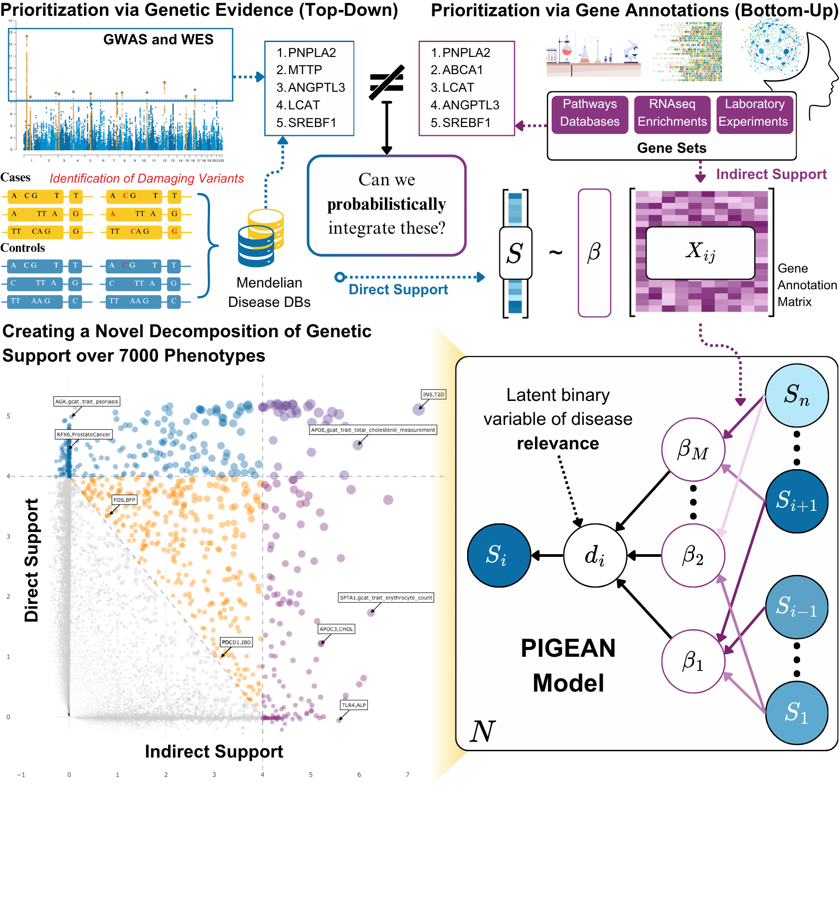

# Indirect genetic support

<figure class="pigean-abstract-figure">

<figcaption>
PIGEAN combines genetic association evidence and gene annotations in a probabilistic model. Explore direct and indirect support for individual genes in the <a href="#explorer">results Explorer</a>. 
<a class="pigean-figure-expand" href="./media/pigean-figure-1.png" target="_blank" rel="noopener noreferrer">View full-size figure (opens in a new tab)</a>
</figcaption>
</figure>

Drug targets with human genetic support are more than twice as likely to succeed in clinical trials, yet genetic associations directly implicate only a fraction of disease-relevant genes. A gene can also be disease-relevant through *indirect genetic support*: the extent to which it shares functional annotations (pathway membership, expression patterns, or other curated connections) with genes that are directly associated with a trait. Here we introduce PIGEAN, a Bayesian framework that uses genetic associations as an anchor to calibrate 144,627 functional annotations and quantify both direct and indirect genetic support for any gene-trait pair. Applied to 5,535 traits, PIGEAN produces 295,547 calibrated gene-trait relationships at posterior probability above 50%, expanding the genetically supported landscape by an order of magnitude.

We validate indirect genetic support via PIGEAN on three independent axes: indirect support predicts held-out genetic associations in leave-one-chromosome-out and temporal analyses ($p = 8.65e-09$); it prioritizes drug targets at clinical success rates (relative success = 2.52) exceeding the Open Targets Platform and comparable to Open Targets Genetics L2G scores (relative success = 1.90), while nominating 2,961 targets versus 1,203 from L2G alone; and it enriches for likely causal genes across 26,531 rare disease probands whose genes are absent from curated rare disease databases.

Across the phenome, the resulting resource classifies 5,971 gene-trait pairs as understood associations with convergent direct and indirect evidence, flags 46,409 as novel discoveries that reveal a gap between significant GWAS associations and curated biological knowledge, and nominates 19453 as indirect-only associations that are supported by functional evidence but lack a direct genetic signal.

