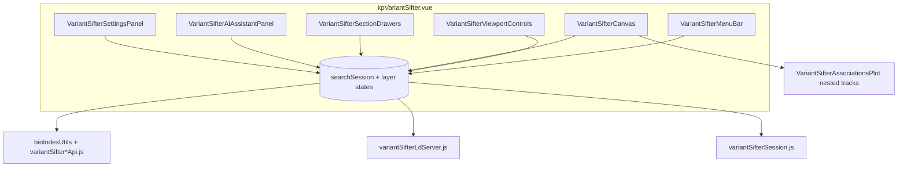
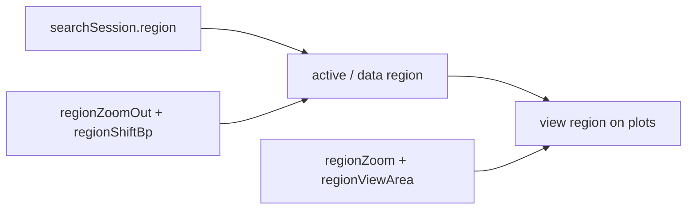
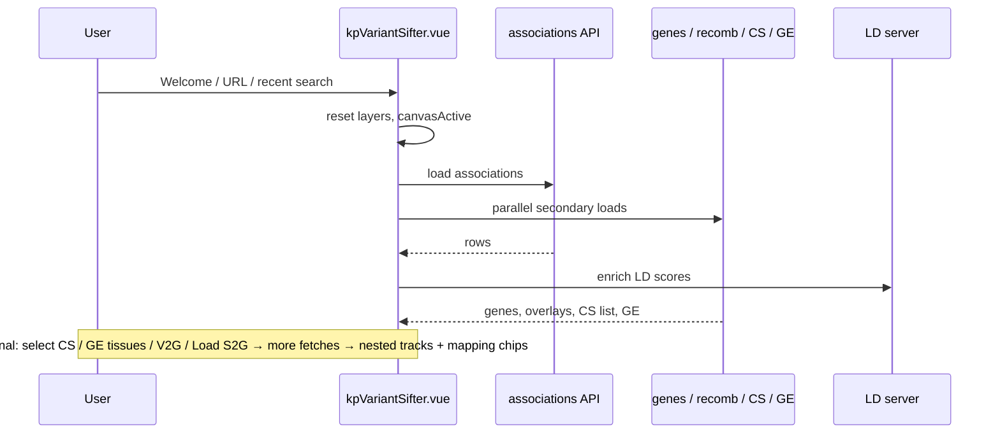

# KP Variant Sifter — architecture

Technical overview of **KP Variant Sifter** in dig-dug-portal. For UI conventions and copy/persistence rules, see [`DESIGN.md`](./DESIGN.md).

---

## Overview

KP Variant Sifter is a browser-based genomic locus workspace. Users search a phenotype + ancestry + region, explore associations (and LD) on a shared plot stack, open section drawers for credible sets / global enrichment / V2G / S2G / genes, map variants across evidence layers, and persist work via session JSON or an HTML report.

The root shell is **`kpVariantSifter.vue`** (registered as `kpVariantSifter` in `ResearchSectionComponents.vue`). It owns session and data-layer state and composes ~41 Vue components plus ~51 JavaScript modules under this directory.



---

## Directory layout

| Category | Files | Role |
|----------|-------|------|
| **Shell** | `../kpVariantSifter.vue` | Search orchestration, fetches, tokens, UI chrome state |
| **Chrome** | `VariantSifterMenuBar`, `ViewportControls`, `WorkspaceGuide`, `RegionLoadBubble`, `SettingsPanel` | Top bar, zoom/panels, guide, load progress, settings |
| **Canvas / tracks** | `Canvas`, `AssociationsPlot`, `AssociationRegionPlot`, `CredibleSetsTrack`/`Plot`, `AnnotationsWorkspaceTrack`, `V2gTrack`, `GenesTrack`, `TrackStrip`, `ZoomCenterMarker`, `LdRegionPlot`, `AssociationsLdPlot` | Genomic plot stack |
| **Drawers** | `SectionDrawers`, `*Drawer.vue` (six sections), `AssociationsFilters`, `AncestryBubbles` | Right-rail filters and selection |
| **Tables / mapping** | `DataTableModal`/`View`, `MappingBar`, `MappingRowDetails`, `*Table.vue`, `variantSifterMappingData.js`, `variantSifterVariantDataTable.js`, `variantSifterAssociationsTable*.js` | Data table + mapping |
| **Welcome / I/O** | `WelcomePanel`, `ExportSessionModal`, `variantSifterSession.js`, `variantSifterHtmlReport.js`, `variantSifterRecentSearches.js` | Onboarding and persistence |
| **Assistant** | `AiAssistantPanel`, `variantSifterAssistant*.js`, `variantSifterGeRelevanceLlm.js`, `variantSifterCs2ct*` | Keyword Actions + research steps |
| **Section data/API** | `*Associations*`, `*CredibleSets*`, `*Genes*`, `*GlobalEnrichment*`, `*V2g*`, `*S2g*`, `*LdServer*`, `*Projects*`, `*SearchUtils*` | Fetch, normalize, format |
| **Region / plot shared** | `variantSifterRegionZoom.js`, `variantSifterRegionPan.js`, `variantSifterPlotShared.js`, `variantSifterPlotMarkers.js`, `variantSifterPopupPosition.js`, `variantSifterGenesTrackDock.js`, `variantSifterRegionLoadProgress.js` | Viewport math and shared draw helpers |
| **Settings / registry** | `variantSifterSections.js`, `variantSifterToolSettings.js` | Sections, visible ids, API settings surface |
| **Shared styles** | `vksSharedStyles.css` | CFDE/VKS tokens + chrome |

External dependencies:

- **`@/utils/bioIndexUtils`** — BioIndex `query` / `match` / hosts
- **LD server** — UMich 1000G via `variantSifterLdServer.js` (lz beta constants)
- **`@/utils/revealKgApi`** — interactive LLM health + optional GE relevance classify (not `llmClient.js` directly)
- **portaldev.sph.umich.edu** — gene annotations, recombination overlay
- **`@/utils/variantUtils`**, **`plotUtils`**, **`dataConvert`** — ids, drawing, table formatting

---

## Component hierarchy

```
kpVariantSifter.vue
├── VariantSifterMenuBar
├── VariantSifterViewportControls          (when canvasActive)
├── VariantSifterWorkspaceGuide
├── session import <input>
├── vks-main
│   ├── VariantSifterCanvas
│   │   ├── VariantSifterWelcomePanel
│   │   ├── VariantSifterAssociationsPlot   ← sole top-level track host
│   │   │   ├── VariantSifterAssociationRegionPlot (+ ZoomCenterMarker)
│   │   │   ├── VariantSifterCredibleSetsTrack (+ CredibleSetsPlot)
│   │   │   ├── VariantSifterAnnotationsWorkspaceTrack
│   │   │   ├── VariantSifterV2gTrack          (V2G and S2G)
│   │   │   └── VariantSifterGenesTrack
│   │   ├── VariantSifterTrackStrip            (legacy/placeholder vs nested stack)
│   │   └── VariantSifterDataTableModal
│   │       ├── VariantSifterMappingBar
│   │       └── VariantSifterDataTableView
│   └── VariantSifterAiAssistantPanel
├── VariantSifterSectionDrawers
│   ├── Associations / CredibleSets / Genes / GE / V2G / S2G drawers
│   └── (Associations: filters, LD plot, ancestry bubbles, MappingBar)
├── VariantSifterRegionLoadBubble
├── VariantSifterExportSessionModal
└── VariantSifterSettingsPanel
```

**Event flow:** children emit intents (`@start-search`, `@update:mappingState`, `@add-credible-set`, …); the shell updates layer state and may refetch. Plots receive data + `sharedCanvasWidth` + `plotMarkers` as props. Prefer pure helpers in `variantSifter*.js` over growing the shell further when extracting logic.

---

## Session and layer state

`kpVariantSifter.vue` is the single source of truth. Important groups:

| Group | Fields / modules |
|-------|------------------|
| **Search** | `searchSession` — phenotype, ancestry, region `{chr,start,end}`, regionLabel, geneOrVariantQuery, regionExpandBp; `projectId` |
| **Viewport** | `regionZoom`, `regionZoomOut`, `regionViewArea`, `regionShiftBp`, `dataRegion`, view region computeds |
| **Associations** | `associationsState` — rows, filtersIndex, LD, ancestry series, loading/errors |
| **Genes** | `genesState` — track data + selectedTypes |
| **Overlays / markers** | `plotOverlaysState` (recomb, refVariant); `plotMarkersState` (starredVariants, positionMarkers) |
| **Credible sets** | `credibleSetsState` — available/selected ids, variantsBySet |
| **Global enrichment** | `globalEnrichmentState` — enrichment rows, annoData, tissue/biosample selection, llmRelevance, track p-threshold |
| **V2G / S2G** | `v2gState`, `s2gState` — tissueData, selections, selectedLinks (S2G reuses V2G-shaped state) |
| **Mapping** | `mappingState` `{ selectedCategoryIds, mappingMode }`; optional `workspaceMappingFilter` |
| **UI** | `canvasActive`, `welcomeOpen`, `openDrawerId`, `dataTableOpen`, `aiAssistantOpen`, `settingsOpen`, `visibleSectionIds`, `recentSearches`, `regionLoadProgress`, `assistantState` |
| **Cancellation** | Per-layer request tokens so stale responses do not overwrite newer searches |

Props in: `sectionConfigs`, `phenotypesInUse`, `utilsBox` (portal BioIndex host via `uiUtils.biDomain()`).

### Persistence

| Action | Module | Notes |
|--------|--------|-------|
| Export / import session | `variantSifterSession.js` | `VKS_SESSION_VERSION = 10`, `VKS_SESSION_APP = "kp-variant-sifter"` |
| Recent searches | `variantSifterRecentSearches.js` | localStorage, limit 5 |
| HTML report | `variantSifterHtmlReport.js` | Read-only snapshot |

See `DESIGN.md` for the persistence matrix and export readiness rules.

---

## Region model

Region math is split across `variantSifterRegionZoom.js` and `variantSifterRegionPan.js`:

| Concept | Meaning |
|---------|---------|
| **Search region** | `searchSession.region` — original query locus |
| **Active / data region** | Shifted + zoomed-out extent used for loading (`resolveActiveDataRegion` / `dataRegion`). Width capped (`VKS_MAX_ACTIVE_REGION_WIDTH_BP`, 500 kb) |
| **View region** | On-screen window after zoom-in + `regionViewArea` (`computeViewRegion`) |
| **regionZoom** | 0–99 magnify within active region |
| **regionZoomOut** | 0–100 expand beyond search |
| **regionShiftBp** | Pan of the active window (replaces legacy viewOffset) |
| **regionViewArea** | −100…100 center bias within the zoomed-in window |

Pan/drag on the association plot emits shift; zoom-slider commit may refetch when the active region grows (region-extend path in the shell).



---

## Search and data flow



Typical `loadInitialSearchData` order:

1. Associations for phenotype × region (and ancestry routing)
2. Parallel: genes track, recombination overlay, credible-sets list, global enrichment
3. LD enrichment on association rows
4. Optional sub-ancestry association series

S2G is **manual** Load/Clear in its drawer (not auto-fetched on search).

### BioIndex indexes and modules

| Module | Indexes / services |
|--------|--------------------|
| `variantSifterAssociationsApi.js` | `associations`, `ancestry-associations` (Giant project uses `associations`) |
| `variantSifterCredibleSetsApi.js` | `credible-sets`, `credible-variants` |
| `variantSifterGlobalEnrichmentApi.js` | `global-enrichment`, `regions`, `tissue-regions` |
| `variantSifterV2gApi.js` | `gene-links` |
| `variantSifterS2gApi.js` | `variant-links` |
| `variantSifterGenes.js` | BioIndex `genes` + portaldev gene annotations |
| `variantSifterLdServer.js` | UMich 1000G LD; falls back to next LD-capable SNP when lead fails |
| `variantSifterPlotShared.js` | portaldev recombination |
| `variantSifterCs2ctApi.js` | `c2ct-credible-set` |
| `variantSifterAssistantUnderstudied.js` | phenotype-wide / global associations |
| `variantSifterAssistantGeneticCorrelation.js` | genetic-correlation |
| `variantSifterSearchUtils.js` | gene match, varIdLookup, region parse/format |

### Project routing

`variantSifterProjects.js`:

- **Default** (`projectId === ""`) — portal BioIndex + full phenotype list + KP ancestries
- **GIANT** (`projectId === "giant"`) — host `https://giant.hugeampkpnbi.org` for indexes in `VKS_GIANT_BIOINDEX_INDEXES`; curated phenotypes/ancestries; other indexes fall back to the portal host
- **GWAS-CE** (`projectId === "gwas-ce"`) — associations from `https://gwas-ce.kpndataregistry.org/bioidx` via `session.gwasCeToken` (`associations-{token}`); welcome requires Token + Phenotype + Ancestry; GE/CS/genes and other indexes use the portal BioIndex with the selected phenotype; token omitted from page URL and redacted to `$token` on export; skips ancestry-association availability probes

Shell helper: `bioIndexHostFor(index)` → `resolveProjectBioIndexHost`.

Helpers: `isGwasCeProject`, `projectAssociationsOnly`, `projectUsesTokenSearch`, `normalizeGwasCeToken`, `resolveGwasCeToken`, `gwasCeAssociationsIndex`.

---

## Mapping model

Documented in `variantSifterMappingData.js` (do not collapse these layers):

1. **Raw workspace data** — never mutated by mapping UI
2. **Mappable option state** — chips from CS / GE / biosamples / V2G / S2G selections; `mappingState.selectedCategoryIds` + `mappingMode` (`or` \| `and`)
3. **Derived `workspaceMappingFilter`** — applied only when “Filter workspace to mapped data” is on; turning off restores full rendering from (1)+(2)

Group colors/labels and detail columns for the mapping bar and association table extensions live in the same module.

---

## Nested tracks vs section registry

`VARIANT_SIFTER_SECTIONS` drives drawer tabs and Settings visibility. **Canvas reality:**

- Only **Associations** mounts as the top-level plot host.
- Credible sets, GE annotations, V2G, S2G, and genes render **inside** `VariantSifterAssociationsPlot.vue`, gated by `visibleSectionIds` **and** data/selection (e.g. selected credible sets, annotation track data, V2G/S2G workspace flags).
- `sectionHasCanvasTrack` currently returns true for associations only; credible-sets is forced off for top-level strips even though `trackImplemented: true`.
- `VariantSifterTrackStrip` is a leftover placeholder relative to the nested stack.

When adding a track: nest it in the Associations plot stack (shared width + markers), add a drawer if needed, and update Settings visibility — do not assume `trackImplemented` alone mounts a strip.

---

## Actions assistant

Not a full REVEAL Canvas LLM planner. Catalog and matching live in:

| Module | Role |
|--------|------|
| `variantSifterAssistantActionCatalog.js` | User-facing Actions tab (Commands + Research) |
| `variantSifterAssistantActionSuggest.js` | Suggest / match helpers |
| `variantSifterAssistantConversation.js` | Thread entry helpers |
| `variantSifterAssistantGeRelevance.js` | CS2CT tissue relevance research step |
| `variantSifterGeRelevanceLlm.js` | Optional LLM classify via `revealKgApi` |
| `variantSifterCs2ctApi.js` / `variantSifterCs2ctClassify.js` | c2ct-credible-set fetch + classify |
| `variantSifterAssistantUnderstudied.js` | Bottom-line-only variants in locus |
| `variantSifterAssistantGeneticCorrelation.js` | LDSC genetic correlations → open phenotype in new tab |

**Runtime (shell):**

1. User submits Request → `onAssistantPlanRequest` → `matchVksAssistantRequest`
2. Simple **Commands** execute immediately
3. **Research** actions may build `createAssistantPlan` + step states; user runs Execute / Execute all

Known follow-on: replace keyword matching with Canvas-style plan → validate → execute when ready.

---

## Registration in the portal

`kpVariantSifter.vue` is registered in `ResearchSectionComponents.vue` as `kpVariantSifter`. Portal section JSON uses `"component": "kpVariantSifter"`.

Props passed from Research: `phenotypesInUse`, `utilsBox`, `sectionConfigs`.

---

## Open / incomplete areas

1. **Registry drift** — `trackImplemented` / `TrackStrip` / `sectionHasCanvasTrack` do not fully describe the nested-track architecture.
2. **Assistant** — keyword matching only; LLM planner not wired like REVEAL KG Canvas.
3. **GE relevance** — CS2CT is the primary catalog path; LLM classify path still present via `revealKgApi`.
4. **S2G** — manual load; not part of initial search parallel fetch.
5. **Session** — assistant thread and some chrome not exported; export requires genes + associations ready.
6. **Giant** — subset of indexes on Giant BioIndex; document new Giant indexes in `VKS_GIANT_BIOINDEX_INDEXES` when adding them.

---

## Related documents

| Document | Audience |
|----------|----------|
| [`DESIGN.md`](./DESIGN.md) | Contributors — UI rules, persistence, visualizer checklist |
| `.cursor/rules/kp-variant-sifter-visualizers.mdc` | Agents — new track/component rules |
| `VariantSifterWorkspaceGuide.vue` | End users — Getting Around |
| `variantSifterToolSettings.js` | Settings → APIs catalog surface |

---

## Changelog

| Date | Note |
|------|------|
| 2026-08-11 | Initial architecture doc for agent handoff (`dk-ai-based-VS`) |
| 2026-08-11 | GWAS-CE: token on session for associations; phenotype/ancestry restored for portal companion layers |
| 2026-08-11 | GWAS-CE skips ancestry-association probes; LD enrich falls back when lead is not in 1000G |
