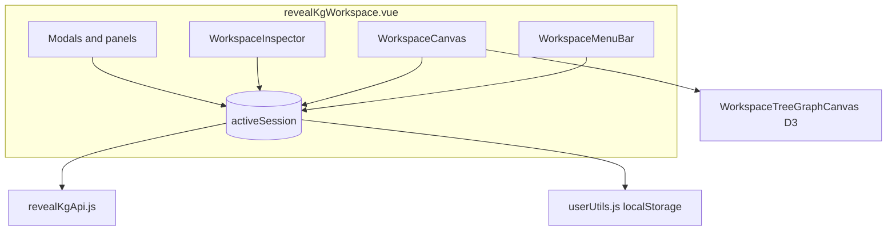
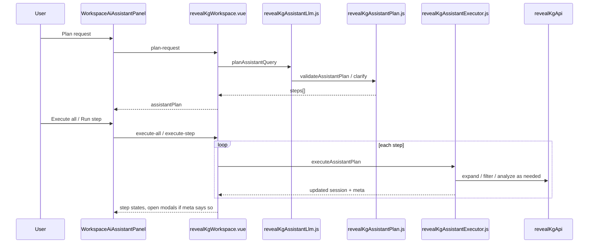

# REVEAL KG Canvas — architecture

Technical overview of **REVEAL KG Canvas** in dig-dug-portal. For UI conventions and copy rules, see [`DESIGN.md`](./DESIGN.md). For user-facing help, see `WorkspaceDocumentationModal.vue`.

---

## Overview

REVEAL KG Canvas is a browser-based knowledge-graph workspace. Users build a graph from REVEAL interactive APIs, explore it on a D3 tree canvas, inspect evidence, run analysis (explain, hypotheses, datasets), and persist work through My library, export/import, or HTML snapshots.

The root shell is **`revealKgWorkspace.vue`** (registered as `reveal-kg-workspace`). It owns session state and composes ~40 Vue components plus ~30 JavaScript utility modules under this directory.



---

## Directory layout

| Category | Files | Role |
|----------|-------|------|
| **Shell** | `../revealKgWorkspace.vue` | Session, menu routing, modal orchestration, assistant runtime |
| **Chrome** | `WorkspaceMenuBar`, `WorkspaceGraphReminder`, `WorkspaceGraphViewportControls` | Top bar, reminders, zoom |
| **Canvas** | `WorkspaceCanvas`, `WorkspaceTreeGraphCanvas`, `WorkspaceNodeActionMenu`, `WorkspaceEdgeActionMenu` | Graph rendering and pointer menus |
| **Change** | `WorkspaceExpandGraphPanel`, `WorkspaceExpandProgressOverlay`, `WorkspaceVisibilityFilterPanel`, `WorkspaceGraphDataTableModal` | Expand, filter, retrieved-nodes table |
| **Analyze** | `WorkspaceExplainGraphModal`, `WorkspaceBuildHypothesesModal`, `WorkspaceFindRelatedDatasetsModal`, `Workspace*Bubble.vue`, sig-chain components | Explain, hypotheses, datasets |
| **Inspector** | `WorkspaceInspector`, `Workspace*InspectorContent.vue`, evidence panels | Node/edge provenance |
| **Persist** | `WorkspaceWelcomeModal`, `WorkspaceInitialGraphModal`, `WorkspaceLibraryModal`, `WorkspaceSaveGraphModal`, `WorkspaceExportGraphModal` | Onboarding and I/O |
| **Assistant** | `WorkspaceAiAssistantPanel`, `WorkspaceAssistantActionProgressOverlay`, `revealKgAssistant*.js` | LLM planner + executor |
| **Graph utils** | `revealKgGraphBootstrap.js`, `revealKgGraphExpand.js`, `revealKgGraphFilter*.js`, `revealKgHierarchyGraphData.js`, … | Bootstrap, expand, filter, layout data |
| **Analysis utils** | `revealKgExplainUtils.js`, `revealKgSigChain*.js`, `revealKgCfdeDatasetUtils.js` | Explain, pathways, datasets |
| **Shared** | `wkbSharedStyles.css`, `revealKgReminders.js`, `revealKgEntityUtils.js` | Styles, reminders, entity pickers |

External dependencies:

- **`src/utils/revealKgApi.js`** — all `/api/interactive/*` calls
- **`src/utils/userUtils.js`** — My library CRUD, export/import payload shape
- **`src/utils/llmClient.js`** — LLM passthrough for planner and semantic features

---

## Component hierarchy

```
revealKgWorkspace.vue
├── WorkspaceMenuBar
├── stage
│   ├── WorkspaceCanvas
│   │   └── WorkspaceTreeGraphCanvas (D3)
│   ├── WorkspaceInspector
│   ├── WorkspaceGraphReminder
│   ├── node/edge action menus
│   ├── analysis bubbles (Explain / Hypotheses / Datasets)
│   ├── expand / filter panels
│   └── progress overlays
├── WorkspaceAiAssistantPanel
├── modals (welcome, initial graph, library, save, export, explain, hypotheses, datasets, docs, …)
└── confirm / table modals
```

**Event flow:** child components emit intents (`@run`, `@close`, `@menu-action`); the shell updates `activeSession` and opens the right modal. The canvas receives graph nodes/edges and view options as props; mutations flow back through session patches in the shell or pure functions in `revealKg*.js` modules.

---

## Session model

`activeSession` is the single source of truth for the current graph. Key fields:

| Field | Purpose |
|-------|---------|
| `graphNodes`, `graphEdges` | Visible working graph |
| `highlighted` | Selected node IDs (blue); drives `anchor_items` in API payloads via `keyNodeItemsFromSession` |
| `contextualEdges` | Dashed suggested links (not part of saved graph edges until expanded) |
| `retrievalLedger` | Scores/labels for graph data table rows |
| `visibilityFilterLayers` | Saved visibility filter layers |
| `controls` | Expand/filter draft state (intent, novelty, expression, limits) |
| `graphExplanations`, `sigChainRuns`, `datasetRuns` | Analysis run history |
| `nodeConnectionEvidenceCache`, `nodeExpressionProfileCache`, `edgeProvenanceById`, … | Inspector caches (export/snapshot only; not My library) |
| `expansionHistory` | Past expansion runs (export/import only) |

**Normalization:** `withNormalizedKeyNodes` keeps `highlighted` in sync with nodes still on the graph. After expand/select assistant steps, `ensureSessionFilterState` reapplies filter visibility.

### Persistence tiers

| Action | What is stored |
|--------|----------------|
| **My library** | Layout, edges, selected nodes, filters, analysis text — no inspector caches |
| **Export / Import** | Full workflow including inspector caches and expansion history |
| **Download snapshot** | Self-contained HTML (read-only) |

See `DESIGN.md` for the full matrix and rules when adding new cache fields.

---

## Graph operations

### Initial build

1. User picks entities in `WorkspaceInitialGraphModal` (catalog + optional semantic search).
2. `revealKgGraphBootstrap.js` calls anchor-links and optional neighbor fetch.
3. Session created with `graphNodes`, `graphEdges`, `highlighted` (starting picks), `retrievalLedger`.

### Expand

- UI: `WorkspaceExpandGraphPanel` → `expandGraphOnSession` (`revealKgGraphExpand.js`).
- Seeds: selected nodes or node/edge menu scope.
- Progress: `WorkspaceExpandProgressOverlay` + batch classification messages.
- History appended via `revealKgExpansionHistoryUtils.js`.

### Visibility filters

- Build: `buildVisibilityFilterOnSession` (`revealKgGraphFilterApply.js`) — LLM or semantic relevance, novelty, or expression.
- Toggle layers: `revealKgVisibilityFilterUtils.js`.
- Display graph: `getDisplayGraph` (`revealKgGraphDisplayUtils.js`) applies enabled layers.

### Contextual edges

- Fetched when the visible node set changes (`getInteractiveContextualEdges`).
- Shown on hover or when view options allow; not persisted as active edges.

---

## Analyze flows

| Feature | Entry points | Core module | API |
|---------|--------------|-------------|-----|
| Explain graph | Analyze menu, assistant | `revealKgExplainUtils.js` | `interpretInteractiveSession` |
| Build hypotheses | Analyze menu, assistant | `revealKgSigChainPrioritizeUtils.js` | `prioritizeInteractiveSigChains`, `getInteractiveSubgraphEdges` |
| Find datasets | Analyze menu, assistant | `revealKgCfdeDatasetUtils.js` | `findInteractiveCfdeDatasets` |

Successful runs surface as **bubbles** on the canvas; clicking reopens the modal for that run.

---

## Canvas assistant

The assistant is a **plan → execute** pipeline separate from graph bootstrap. It does not replace manual UI; it orchestrates the same capabilities through validated steps.



### Module responsibilities

| Module | Role |
|--------|------|
| `revealKgAssistantTools.js` | `ASSISTANT_ACTIONS` — planner-facing action catalog |
| `revealKgAssistantActionCatalog.js` | UI examples for Actions tab |
| `revealKgAssistantPrompt.js` | System + user prompt text |
| `revealKgAssistantContext.js` | Compact session JSON (`sample_nodes`, selection counts, filter summary, …) |
| `revealKgAssistantLlm.js` | `createLLMClient` wrapper; `planAssistantQuery` |
| `revealKgAssistantPlanRepair.js` | Fix missing `node_labels` from query; convert validation errors to clarify |
| `revealKgAssistantPlan.js` | Parse JSON; validate steps (`action`, `target`, `options`); `computeAssistantPlanPostEffects` |
| `revealKgAssistantTarget.js` | Target scope schema |
| `revealKgAssistantTargetResolve.js` | Map targets → node IDs, expand seeds, inspect subjects, gene nodes |
| `revealKgAssistantExecutor.js` | `runAssistantAction` switch — mutates session or triggers UI callbacks |
| `revealKgAssistantNodeSuggest.js` | Autocomplete against current graph nodes |
| `revealKgAssistantErrorUtils.js` | User-safe error strings |

### Step shape (v2)

```json
{
  "id": "step-1",
  "action": "expand_graph",
  "label": "Expand from selected genes",
  "target": { "scope": "selected_nodes", "node_types": ["gene"] },
  "options": { "count": 10, "filter_type": "none" }
}
```

### Post-execution effects

`computeAssistantPlanPostEffects` merges per-action flags:

- **normalizeSession** — re-normalize selected nodes + filter state
- **forceContextualRefetch** — after expand adds nodes
- **clearHiddenSelection** — drop selected IDs that are no longer visible
- **remindAfterMutation** — node-count reminders after expansion

Expand uses the existing expand progress overlay; filter/explain/hypotheses/datasets use `WorkspaceAssistantActionProgressOverlay`. Graph pointer menus are suppressed while `assistantExecuting` is true.

### Runtime callbacks

The executor receives a `runtime` object from the shell: `apiClient`, `anchorItems`, `setGraphViewOptions`, `inspectNode` / `inspectEdge`, `openExportGraph`, `openSaveGraph`, … UI-only actions (`export_graph`, `inspect`, view toggles) invoke these instead of mutating session fields directly.

---

## Inspector

`WorkspaceInspector.vue` loads evidence by node type:

- Connections, expression, factor loadings, sig-chain packets, edge provenance
- All fetches write to session cache fields; orange graph highlights indicate cached evidence
- Pagination uses `WorkspaceGraphTablePagination.vue` everywhere

Add new evidence sources by: cache handler on shell → prop into Inspector → include in export payload only.

---

## API layer

All network I/O goes through **`revealKgApi.js`** (`/api/interactive/*` on same origin; dig-dug-server proxies to cfde-reveal in dev).

Health check (`getInteractiveHealth`) sets `llmAvailable` on the shell, gating semantic search, LLM filters, explain, hypotheses, and assistant steps that require interactive LLM.

Do **not** point `VUE_APP_REVEAL_KG_API_BASE_URL` at EC2 in local dev (CORS). See `DESIGN.md` and repo-root `KgWorkspaceApis.rtf` for endpoint catalog.

---

## Graph visualization

| Surface | Library |
|---------|---------|
| Main canvas | **D3** — layered tree (`revealKgHierarchyGraphData.js`, `revealKgGraphColors.js`) |
| Hypothesis pathway mini-graphs | **vis-network** |

Legend semantics: selected (blue), starting (gray diamond), active edges (solid), contextual (dashed). View options control jumping/contextual visibility without deleting data.

---

## Registration in the portal

`revealKgWorkspace.vue` is registered in `ResearchSectionComponents.vue` as `reveal-kg-workspace`. Portal section JSON uses `"component": "revealKgWorkspace"`.

---

## Related documents

| Document | Audience |
|----------|----------|
| [`DESIGN.md`](./DESIGN.md) | Contributors — UI rules, persistence rules, checklist |
| `WorkspaceDocumentationModal.vue` | End users — in-app guide |
| `KgWorkspaceApis.rtf` (repo root) | Backend endpoint reference |
| `src/utils/revealKgApi.js` | API client implementation |

---

## Changelog

| Date | Note |
|------|------|
| 2026-06-10 | Initial architecture doc (post assistant v2, Help menu, legacy cleanup) |
