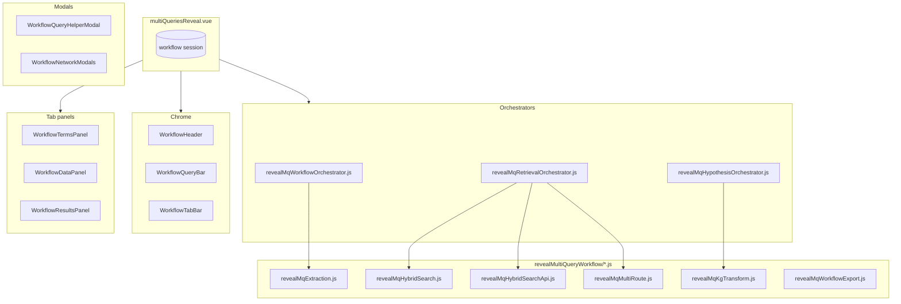

# Multi Query REVEAL — architecture

Technical overview of **CFDE REVEAL Multi Query** in dig-dug-portal. For UI conventions see [`DESIGN.md`](./DESIGN.md).

## Overview

Multi Query REVEAL is a **linear three-tab workflow**: Search terms → Data → Results. Users enter a research question, review LLM-extracted terms and retrieval directions, inspect hybrid-search evidence, then generate mechanistic hypotheses.

The root shell is **`multiQueriesReveal.vue`** (registered as `factor-base-reveal`). It owns workflow session state and composes components under `revealMultiQueryWorkflow/`. Orchestration lives in dedicated JS modules; the shell delegates via thin method wrappers.

## Directory layout

| Category | Files | Role |
|----------|-------|------|
| **Shell** | `../multiQueriesReveal.vue` | Session state, thin orchestrator delegates, tab routing |
| **Chrome** | `WorkflowHeader.vue`, `WorkflowQueryBar.vue`, `WorkflowTabBar.vue`, `WorkflowOpsMenu.vue` | Intro, query input, export/import, tab bar |
| **Modals** | `WorkflowQueryHelperModal.vue`, `WorkflowNetworkModals.vue`, `WorkflowQueryGuidelinesModal.vue`, `WorkflowSearchTermsExtractionModal.vue` | Guided query builder; network popups; query guidelines; extraction help |
| **Panels** | `WorkflowTermsPanel.vue`, `WorkflowDataPanel.vue`, `WorkflowResultsPanel.vue`, `WorkflowStepGate.vue` | Tab content; reusable Continue gate |
| **Orchestrators** | `revealMqWorkflowOrchestrator.js`, `revealMqRetrievalOrchestrator.js`, `revealMqHypothesisOrchestrator.js` | Extraction, hybrid retrieval, mechanism LLM phases |
| **Utils** | `revealMqExtraction.js`, `revealMqHybridSearch.js`, `revealMqHybridSearchApi.js`, `revealMqMultiRoute.js`, `revealMqKgTransform.js`, `revealMqStepGates.js`, `revealMqStepTime.js`, `revealMqRouteEdit.js`, `revealMqWorkflowExport.js`, `revealMqWorkflowSession.js` | Pure logic, HTTP, session export |
| **Styles** | `mqSharedStyles.css` | Shared tab, gate, alt-query styles |
| **Shared viz** | `../FactorBaseRevealHeatmap2.vue`, `../FactorBaseRevealNetwork2.vue` | Heatmap + network (outside folder) |
| **Tests** | `__tests__/*.test.js` | Unit tests |

## Session model

The shell's `data()` mirrors `createEmptyWorkflowSession()` in `revealMqWorkflowSession.js`.

**Panel wiring:** Tab panels use explicit **props + events** (like Terms). State is passed via `v-bind="dataPanelProps"` / `v-bind="resultsPanelProps"`; read-only formatters and row accessors are bundled in a **`helpers`** prop object from shell computed properties (`dataPanelHelpers`, `resultsPanelHelpers`). Modals still use `:shell="mqShell"` until migrated.

| Group | Fields |
|-------|--------|
| **Query** | `userQuery`, `searchMode`, `hypothesisGenerationMode` |
| **Extraction** | `searchCriteria`, `multiQueryRoutes`, `*EditRows`, `extractionAmbiguityCheck` |
| **Retrieval** | `factorData`, `lastHybridSearchResponse`, `pairSelectionOverrides` |
| **Workflow** | `steps`, `showTab`, `workflowRunId`, gate flags |
| **Results** | `mechanisms`, `mechanismDiagnosticAssessment` |

**Export / Import:** `revealMqWorkflowExport.js` snapshots full session including Results (`kind: reveal-mq-workflow-export`, schema v2).

## Workflow steps

| Step id | Tab | Gate |
|---------|-----|------|
| `1` | Search terms | Review extracted terms → continue to retrieval |
| `2` | Data | Review phenotypes / gene sets → continue to hypotheses |
| `4` | Results | Mechanism LLM (no gate) |

## Orchestration flow

1. **Extraction** — `beginExtractionFlow` / `startWorkflowFromExtractedTerms` in `revealMqWorkflowOrchestrator.js`
2. **Retrieval** — `onResearch` → single-route `runHybridRetrievalWorkflow` or multi-route `runMultiQueryRetrievalWorkflow` in `revealMqRetrievalOrchestrator.js`
3. **Hypotheses** — `requestMechanismHypotheses` in `revealMqHypothesisOrchestrator.js` after step-2 gate approval

## Migration status

| Phase | Status |
|-------|--------|
| Utils + session scaffold | Done |
| Chrome, tab panels, modals | Done |
| Extraction / retrieval / hypothesis orchestrators | Done |
| Shell `:shell` prop (replacing provide/inject) | Done |
| Multi-route helpers + hybrid HTTP API modules | Done |
| Fine-grained Data/Results panel props | Done — props/events + `helpers` bundle |
| `hybridSearchReveal.vue` fork consolidation | Out of scope — separate portal section component |

## External dependencies

- `src/utils/llmClient.js` — extraction + mechanism LLM
- `src/utils/cfdeUtils.js` — phenotype / factor labels
- `src/utils/factorRevealGeneColors.js` — network gene colors
- `factorRevealDataNetwork.js` (Canvas folder) — shared network builder
