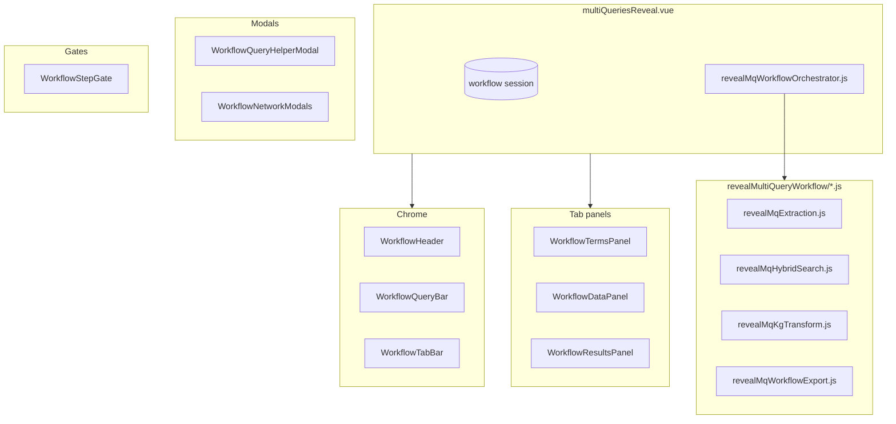

# Multi Query REVEAL — architecture

Technical overview of **CFDE REVEAL Multi Query** in dig-dug-portal. For UI conventions see [`DESIGN.md`](./DESIGN.md).

## Overview

Multi Query REVEAL is a **linear three-tab workflow**: Search terms → Data → Results. Users enter a research question, review LLM-extracted terms and retrieval directions, inspect hybrid-search evidence, then generate mechanistic hypotheses.

The root shell is **`multiQueriesReveal.vue`** (registered as `factor-base-reveal`). It owns workflow state and composes components under `revealMultiQueryWorkflow/`.

## Directory layout (current)

| Category | Files | Role |
|----------|-------|------|
| **Shell** | `../multiQueriesReveal.vue` | Session, workflow orchestration, tab routing |
| **Chrome** | `WorkflowHeader.vue`, `WorkflowQueryBar.vue`, `WorkflowTabBar.vue` | Intro, query input, export/import, tab bar |
| **Modals** | `WorkflowQueryHelperModal.vue`, `WorkflowNetworkModals.vue` | Guided query builder; network popups |
| **Panels** | `WorkflowTermsPanel.vue`, `WorkflowDataPanel.vue`, `WorkflowResultsPanel.vue`, `WorkflowStepGate.vue` | Tab content; reusable Continue gate |
| **Utils** | `revealMqExtraction.js`, `revealMqHybridSearch.js`, `revealMqKgTransform.js`, `revealMqStepGates.js`, `revealMqStepTime.js`, `revealMqRouteEdit.js`, `revealMqWorkflowExport.js`, `revealMqWorkflowSession.js`, `revealMqWorkflowOrchestrator.js` | Pure logic + extraction orchestration |
| **Styles** | `mqSharedStyles.css` | Shared tab, gate, alt-query styles |
| **Shared viz** | `../FactorBaseRevealHeatmap2.vue`, `../FactorBaseRevealNetwork2.vue` | Heatmap + network (outside folder) |
| **Tests** | `__tests__/*.test.js` | Unit tests |

## Session model

The shell's `data()` mirrors `createEmptyWorkflowSession()` in `revealMqWorkflowSession.js`. Tab panels receive state via **`provide('mqWorkflow')`** during the gradual refactor (panels use `inject` + `w` alias); Terms panel uses explicit props/events.

| Group | Fields |
|-------|--------|
| **Query** | `userQuery`, `searchMode`, `hypothesisGenerationMode` |
| **Extraction** | `searchCriteria`, `multiQueryRoutes`, `*EditRows`, `extractionAmbiguityCheck` |
| **Retrieval** | `factorData`, `lastHybridSearchResponse`, `pairSelectionOverrides` |
| **Workflow** | `steps`, `showTab`, `workflowRunId`, gate flags |
| **Results** | `mechanisms`, `mechanismDiagnosticAssessment` |

**Export / Import:** `revealMqWorkflowExport.js` snapshots session through the Data step (`kind: reveal-mq-workflow-export`).

## Workflow steps

| Step id | Tab | Gate |
|---------|-----|------|
| `1` | Search terms | Review extracted terms → continue to retrieval |
| `2` | Data | Review phenotypes / gene sets → continue to hypotheses |
| `4` | Results | Mechanism LLM (no gate) |

## Migration phases

1. **Done:** Utils extraction, session scaffold, chrome + tab panels, modals, extraction orchestrator
2. **Next:** Move hybrid-search + hypothesis orchestration into `revealMqWorkflowOrchestrator.js`; replace panel `inject` with props/events
3. **Last:** Consolidate `hybridSearchReveal.vue` fork

## External dependencies

- `src/utils/llmClient.js` — extraction + mechanism LLM
- `src/utils/cfdeUtils.js` — phenotype / factor labels
- `src/utils/factorRevealGeneColors.js` — network gene colors
- `factorRevealDataNetwork.js` (Canvas folder) — shared network builder
