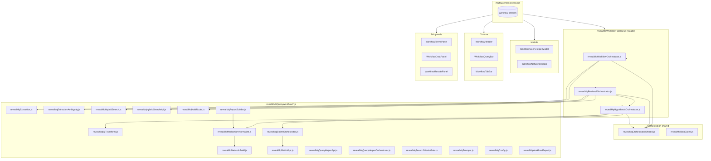

# Multi Query REVEAL — architecture

Technical overview of **CFDE REVEAL Multi Query** in dig-dug-portal. For UI conventions see [`DESIGN.md`](./DESIGN.md).

## Overview

Multi Query REVEAL is a **linear three-tab workflow**: Search terms → Data → Results. Users enter a research question, review LLM-extracted terms and retrieval directions, inspect hybrid-search evidence, then generate mechanistic hypotheses.

The root shell is **`multiQueriesReveal.vue`** (registered as `factor-base-reveal`). It owns workflow session state and composes components under `revealMultiQueryWorkflow/`. The shell imports **one orchestration entry point** — `revealMqWorkflowPipeline.js` — rather than the three phase files directly; the shell delegates via thin method wrappers, and business logic that used to live inline in the shell now lives in dedicated `revealMq*.js` modules (see "Utils" below).


```mermaid
flowchart TB
    subgraph shell ["multiQueriesReveal.vue"]
        Session[(workflow session)]
    end

    subgraph pipeline ["revealMqWorkflowPipeline.js (façade)"]
        ExtractOrch[revealMqWorkflowOrchestrator.js]
        RetrievalOrch[revealMqRetrievalOrchestrator.js]
        HypothesisOrch[revealMqHypothesisOrchestrator.js]
    end

    subgraph shared ["Orchestration-shared"]
        OrchShared[revealMqOrchestratorShared.js]
        StepGates[revealMqStepGates.js]
    end

    subgraph modals ["Modals"]
        QueryHelper[WorkflowQueryHelperModal]
        NetworkModals[WorkflowNetworkModals]
    end

    subgraph chrome ["Chrome"]
        Header[WorkflowHeader]
        QueryBar[WorkflowQueryBar]
        TabBar[WorkflowTabBar]
    end

    subgraph tabs ["Tab panels"]
        Terms[WorkflowTermsPanel]
        Data[WorkflowDataPanel]
        Results[WorkflowResultsPanel]
    end

    subgraph utils ["revealMultiQueryWorkflow/*.js"]
        Extract[revealMqExtraction.js]
        Ambiguity[revealMqExtractionAmbiguity.js]
        Hybrid[revealMqHybridSearch.js]
        HybridApi[revealMqHybridSearchApi.js]
        MultiRoute[revealMqMultiRoute.js]
        KG[revealMqKgTransform.js]
        MechNorm[revealMqMechanismNormalize.js]
        NetBuild[revealMqNetworkBuild.js]
        ReportBuilder[revealMqReportBuilder.js]
        BiolinkApi[revealMqBiolinkApi.js]
        BiolinkOrch[revealMqBiolinkOrchestrator.js]
        QHApi[revealMqQueryHelperApi.js]
        QHOrch[revealMqQueryHelperOrchestrator.js]
        CriteriaGate[revealMqSearchCriteriaGate.js]
        Prompts[revealMqPrompts.js]
        Config[revealMqConfig.js]
        Export[revealMqWorkflowExport.js]
    end

    shell --> chrome
    shell --> tabs
    shell --> modals
    shell --> pipeline
    pipeline --> ExtractOrch
    pipeline --> RetrievalOrch
    pipeline --> HypothesisOrch
    ExtractOrch --> OrchShared
    ExtractOrch --> Ambiguity
    RetrievalOrch --> OrchShared
    RetrievalOrch --> HypothesisOrch
    HypothesisOrch --> OrchShared
    HypothesisOrch --> BiolinkOrch
    ExtractOrch --> Extract
    RetrievalOrch --> Hybrid
    RetrievalOrch --> HybridApi
    RetrievalOrch --> MultiRoute
    HypothesisOrch --> KG
    HypothesisOrch --> MechNorm
    MechNorm --> NetBuild
    ReportBuilder --> MechNorm
    BiolinkOrch --> BiolinkApi
```

## Directory layout

| Category | Files | Role |
|----------|-------|------|
| **Shell** | `../multiQueriesReveal.vue` | Session state, thin orchestrator delegates, tab routing |
| **Chrome** | `WorkflowHeader.vue`, `WorkflowQueryBar.vue`, `WorkflowTabBar.vue`, `WorkflowOpsMenu.vue` | Intro, query input, export/import, tab bar |
| **Modals** | `WorkflowQueryHelperModal.vue`, `WorkflowNetworkModals.vue`, `WorkflowQueryGuidelinesModal.vue`, `WorkflowSearchTermsExtractionModal.vue` | Guided query builder; network popups; query guidelines; extraction help |
| **Panels** | `WorkflowTermsPanel.vue`, `WorkflowDataPanel.vue`, `WorkflowResultsPanel.vue`, `WorkflowStepGate.vue` | Tab content; reusable Continue gate |
| **Orchestration façade** | `revealMqWorkflowPipeline.js` | Single entry point the shell imports; re-exports the three phase modules under one surface and wires the extraction→retrieval hand-off explicitly |
| **Orchestrators** | `revealMqWorkflowOrchestrator.js`, `revealMqRetrievalOrchestrator.js`, `revealMqHypothesisOrchestrator.js`, `revealMqBiolinkOrchestrator.js` | Extraction, hybrid retrieval, mechanism LLM, and post-hoc Biolink/TRAPI mapping phases |
| **Orchestration-shared** | `revealMqOrchestratorShared.js`, `revealMqStepGates.js` | `runLlmWithRetry`/`classifyAndReportError`/session-reset/KG-triple-cache helpers shared by all phases; step-id constants + selectors + the `setStep`/`applyStepUpdate` state machine |
| **Utils — extraction/session** | `revealMqExtraction.js`, `revealMqExtractionAmbiguity.js`, `revealMqMultiRoute.js`, `revealMqSearchCriteriaGate.js`, `revealMqRouteEdit.js` | Term normalization, anti-anchor detection, multi-route reshaping + constraint specs, step-1 gate edit reconciliation |
| **Utils — retrieval** | `revealMqHybridSearch.js`, `revealMqHybridSearchApi.js` | Hybrid-search request/response shaping, HTTP |
| **Utils — mechanism/report** | `revealMqKgTransform.js`, `revealMqMechanismNormalize.js`, `revealMqNetworkBuild.js`, `revealMqReportBuilder.js` | KG flatten/CSV, gene-score attachment + candidate inventory, graph builders (factor connectivity, flattened-KG networks, hypothesis-in-KG flow), HTML report/handoff assembly |
| **Utils — biolink** | `revealMqBiolinkApi.js` | NameRes/NodeNorm/TRAPI relay HTTP calls (paired with `revealMqBiolinkOrchestrator.js` above) |
| **Utils — query helper** | `revealMqQueryHelperApi.js`, `revealMqQueryHelperOrchestrator.js` | Gene autocomplete + factor-row HTTP, guided-builder query composition |
| **Utils — config/prompts** | `revealMqConfig.js`, `revealMqPrompts.js`, `revealMqStepTime.js`, `revealMqWorkflowSession.js`, `revealMqWorkflowExport.js` | Env-var runtime config, LLM system prompts, step-timer formatting, session shape, export/import |
| **Utils — genes-first entry point** | `revealMqGeneEntryApi.js`, `revealMqGeneEntryCrossReference.js`, `revealMqGeneEntryFactorData.js`, `revealMqGeneEntryOrchestrator.js` | `?genes=` URL entry point: Bayes-gene translator HTTP, top-N/cross-reference logic, factorData bridging, top-level orchestration. See dedicated section below. |
| **Styles** | `mqSharedStyles.css` | Shared tab, gate, alt-query styles |
| **Shared viz** | `../FactorBaseRevealHeatmap2.vue`, `../FactorBaseRevealNetwork2.vue` | Heatmap + network (outside folder; also used by `hybridSearchReveal.vue` — do not change behavior without checking that sibling tool) |
| **Tests** | `__tests__/*.test.js` | Unit tests |

## Session model

The shell's `data()` mirrors `createEmptyWorkflowSession()` in `revealMqWorkflowSession.js`. Env-var-driven runtime config (hybrid-search/biolink URLs, query-helper factor template, client-embedding flag) is resolved once via `resolveRevealMqRuntimeConfig()` in `revealMqConfig.js` and spread into `data()`. LLM system prompts are plain string constants in `revealMqPrompts.js`, not reactive state (except the two mode-dependent fields feeding `mechanismHypothesisSystemPromptEffective`).

**Panel wiring:** Tab panels and modals use explicit **props + events**. State is passed via `v-bind="dataPanelProps"` / `v-bind="resultsPanelProps"` / `v-bind="queryHelperModalProps"` / `v-bind="networkModalsProps"`; read-only formatters and row accessors are bundled in a **`helpers`** prop object from shell computed properties. Two-way-bound modal fields go through `v-on="...Listeners"` (each `update:<field>` event assigns back onto the shell), the same pattern Vue's `.sync` modifier expands to.

| Group | Fields |
|-------|--------|
| **Query** | `userQuery`, `searchMode`, `hypothesisGenerationMode` |
| **Extraction** | `searchCriteria`, `multiQueryRoutes`, `*EditRows`, `extractionAmbiguityCheck` |
| **Retrieval** | `factorData`, `lastHybridSearchResponse`, `pairSelectionOverrides` |
| **Workflow** | `steps`, `showTab`, `workflowRunId`, gate flags |
| **Results** | `mechanisms`, `mechanismDiagnosticAssessment` |

**Export / Import:** `revealMqWorkflowExport.js` snapshots full session including Results (`kind: reveal-mq-workflow-export`, schema v2).

## Workflow steps

| Step id | Tab | Gate |
|---------|-----|------|
| `1` | Search terms | Review extracted terms → continue to retrieval |
| `2` | Data | Review phenotypes / gene sets → continue to hypotheses |
| `4` | Results | Mechanism LLM (no gate) |

Step-id literals are centralized in `WORKFLOW_STEP_IDS` (`revealMqStepGates.js`) — both the orchestrators (writers of `steps[].id`) and the shell's tab/badge-driving computed properties (readers) import from there instead of hardcoding `"1"`/`"2"`/`"4"`.

## Orchestration flow

1. **Extraction** — `beginExtractionFlow` / `startWorkflowFromExtractedTerms` (`revealMqWorkflowOrchestrator.js`, via the `revealMqWorkflowPipeline.js` façade). On approval, extraction hands off to retrieval through an explicit `onApproved` callback the façade wires (`(terms, opts) => retrieval.onResearch(vm, terms, opts)`) rather than calling back into `vm.onResearch()`.
2. **Retrieval** — `onResearch` → single-route `runHybridRetrievalWorkflow` or multi-route `runMultiQueryRetrievalWorkflow` (`revealMqRetrievalOrchestrator.js`). This phase directly imports and calls `requestMechanismHypotheses` from the hypothesis orchestrator — the one intentional cross-phase module coupling.
3. **Hypotheses** — `requestMechanismHypotheses` (`revealMqHypothesisOrchestrator.js`) after step-2 gate approval. Success triggers `autoMapAllMechanismsToBiolink` (`revealMqBiolinkOrchestrator.js`), which maps each mechanism's spine network to Biolink CURIEs (NameRes + NodeNorm) and then validates edges against Translator via TRAPI in the background, generation-guarded per mechanism index.

All three orchestrator files share `runLlmWithRetry` and `classifyAndReportError` (`revealMqOrchestratorShared.js`) instead of each hand-rolling its own retry loop and error-classification branches.

## Genes-first entry point (`?genes=`)

A **fourth, alternate entry point** into the same shell: instead of a free-text query that the LLM extracts terms from, the user supplies a raw gene list directly via a `genes=` URL parameter, bypassing the entire Search-terms/extraction tab. This entry point still lands on the existing **Data** tab and reuses the existing heatmap/network/factor-table UI unchanged — no new UI components were built for it. **Visualization/UX polish for this path is explicitly deferred** (per direct user instruction) — treat the current Data-tab rendering of gene-derived data as functionally correct but not yet UX-reviewed.

### Wiring

`multiQueriesReveal.vue`'s `mounted()` branches on `keyParams.genes` (from `@/utils/keyParams`) ahead of the existing `keyParams.query` check:

```js
async mounted() {
    if (keyParams.genes) {
        await runGeneEntryWorkflow(this, keyParams.genes);
    } else if (keyParams.query) {
        this.userQuery = keyParams.query;
    }
    // ...unchanged placeholder-rotation/focus logic
},
```

`this.geneEntry` (added to the shell's `data()`, namespaced separately from `revealMqWorkflowSession.js`'s fields since its shape is still provisional and isn't yet part of the export/import contract) holds all raw responses and derived cross-reference data for debugging/future use — see shape below. **The actual UI hand-off is `vm.factorData`**, same field the normal text-query pipeline populates.

### New files (`revealMqGeneEntry*.js`)

| File | Layer | Responsibility |
|------|-------|-----------------|
| `revealMqGeneEntryApi.js` | HTTP (`vm`-based) | `fetchGenePigeanFactors`, `fetchGenePhenotypes`, `fetchGeneScoresFlat` — call the Broad Translator's `bayes_gene/{pigean,phenotypes,gene_scores}` endpoints. `fetchPigeanFactorsForTraits(vm, traitIds)` — one GET per trait against the existing per-phenotype `pigean-factor` bioindex endpoint (same one the Query Helper modal uses), fully parallel, **never throws** — an empty/`count:0` result is a normal outcome (expected ID-vocabulary mismatch, see Gotchas), not an error. |
| `revealMqGeneEntryCrossReference.js` | Pure logic | `selectTopTraits`, `selectTopGeneSets` (merges `gene_set_scores` maps from both `gene_scores` and `pigean` responses), `buildGeneDerivedFactorSummary`, `crossReferenceRecurringTraitFactors` (groups per-trait factor rows by `top_gene_sets` string overlap — this is the only stable join key across independent API calls; factor ids/labels are NOT comparable across calls), `crossReferenceGeneSetToFactors`. Used to populate `vm.geneEntry.crossReference` — **this cross-reference data is not currently rendered anywhere**; it exists as a richer substrate for future Data-tab UX work. |
| `revealMqGeneEntryFactorData.js` | Bridge to existing pipeline | Two builders that both produce the canonical `factorData[phenotype] = {genes, factors, allFactors}` shape (see full code above/in-file docstring): `buildFactorDataFromGeneEntry` (single-bucket fallback, built from the whole-gene-list `bayes_gene/pigean` response alone) and `mergePigeanFactorRowsIntoFactorData` (the **primary** path — see Data flow below). `geneSets: {}` is left empty on every factor throughout, since exact gene↔gene-set membership isn't available from any of these APIs; the existing KG/network builders (`revealMqKgTransform.js`, `revealMqNetworkBuild.js`) already degrade gracefully (dashed/fallback edges) when membership is unknown, the same way they do today for semantic-fallback hybrid-search factors. |
| `revealMqGeneEntryOrchestrator.js` | Orchestration (`vm`-context) | `runGeneEntryWorkflow(vm, rawGenesParam)` — the single entry point called from `mounted()`. `parseGenesParam` normalizes the raw param via `vm.normalizeHelperSelectedGenes(...)` after splitting on `/[\n;]+/` + commas. |

### Data flow

`runGeneEntryWorkflow` does two largely independent things:

1. **Cross-reference substrate** (`vm.geneEntry.*`, not yet rendered in UI): `Promise.allSettled` over the 3 top-level translator calls (`bayes_gene/pigean`, `bayes_gene/phenotypes`, `bayes_gene/gene_scores`) so one endpoint failing never blocks the others → top 15 traits (`selectTopTraits`) → per-trait factor fetch (`fetchPigeanFactorsForTraits`, best-effort) → top 50 gene sets (`selectTopGeneSets`) → both cross-reference functions.
2. **`vm.factorData` build** (what actually drives the UI), via `buildFactorDataFromHybridSearch(vm, genes)`:
   - Calls `vm.callHybridRevealSearch({phenotypeTerms: [], mechanismTerms: [], researchContext: ..., genesOfInterest: genes})` — **no phenotype/mechanism terms needed**; genes-only + a research-context string is sufficient (see relaxed guard below). This gives real phenotype names and real per-gene `combined`/`gwasSupport`/`geneSetSupport` scores via the existing `normalizeHybridFactorsToFactorData`.
   - For each phenotype hybrid-search discovered, fetches that phenotype's real gene-set-cluster breakdown via `fetchPigeanFactorsForTraits` and merges it in with `mergePigeanFactorRowsIntoFactorData`, **replacing** hybrid-search's own coarse single-factor-per-phenotype entry with the real multi-cluster rows when available, falling back to hybrid-search's original entry per-phenotype when the per-phenotype fetch comes back empty.
   - If hybrid-search itself fails entirely, falls back to `buildFactorDataFromGeneEntry` (single "Your gene list" bucket, built from the whole-gene-list `bayes_gene/pigean` response alone).
   - Either way, once `factorData` is non-empty: assigns `vm.factorData`, rebuilds `vm.lastKgTriples` via `vm.transformMergedDataToKG`, sets `vm.genesAndFactorValuesLoaded`/`vm.searchCriteriaExtractionGateDone`, and **registers a step via `vm.setStep(...)`** (critical — see Gotchas), then sets `vm.showTab = "data"`.

### `vm.geneEntry` state shape

```js
geneEntry: {
    status: "idle",  // idle | loading | partial | error | ready
    inputGenes: [],
    errors: { pigean: null, phenotypes: null, geneScores: null, hybridSearch: null, perTrait: {} },
    pigeanResponse: null, phenotypesResponse: null, geneScoresFlatResponse: null, hybridSearchResponse: null,
    topTraits: [], topGeneSets: [], perTraitFactors: {},
    geneDerivedFactorSummary: [],
    crossReference: { recurringTraitFactors: [], geneSetToFactors: [] },
}
```

### Gotchas discovered this session (read before touching this code)

- **The entire tab bar + all tab panels are gated behind `v-if="steps && steps.length"`** (`multiQueriesReveal.vue` ~line 136). This is a single shared gate for the whole shell chrome, not per-entry-point. The gene-first path originally didn't call `vm.setStep(...)` and, despite `factorData`/`showTab`/all gate flags being set correctly, **nothing rendered at all** — the shell silently stayed on the landing/intro chrome. Fixed by registering a `WORKFLOW_STEP_IDS.DATA` step in the orchestrator's tail (mirroring what the normal extraction/retrieval flow always does). Any future entry point into this shell must call `vm.setStep(...)` or the UI will appear completely broken with no console errors.
- **`callHybridRevealSearch`'s client-side guard was relaxed** (`revealMqHybridSearchApi.js`): it used to throw unless `phenotype_terms` was non-empty. Live testing proved the server only requires *any one* of `phenotype_terms` / `mechanism_terms` / `research_context` text, or a `query_embedding` — it does **not** specifically require `phenotype_terms`. The guard now checks for that broader condition. Verified safe: the only other caller (`revealMqRetrievalOrchestrator.js`, normal flow) always populates `phenotype_terms` anyway.
- **Phenotype/trait ID vocabularies only partially overlap** across sources: `bayes_gene/phenotypes` returns a mix of Orphanet-style and `gcat_trait_*` ids; hybrid-search returns its own phenotype naming; the per-phenotype `pigean-factor` bioindex GET only recognizes some subset of any of these. Empty results from that endpoint for a given phenotype are **expected and normal**, not a bug — always treat them as "no enrichment available for this one," never surface as an error.
- Cross-call factor ids (`Factor0`, `Factor1`, ...) and labels are **not comparable** across separate API calls/traits — only `top_gene_sets` (semicolon-joined gene set name strings) is a stable, shared join key.
- Direct `curl`/server-side requests to `search.hugeamp.org` hit Cloudflare bot-challenge (403); this only matters for manual testing/debugging, not runtime behavior — the shell's own `fetch()` calls from a loaded browser tab pass through fine.
- A backend service for expanding exact gene↔gene-set membership pairs is not currently usable from any of these endpoints (`gene_set_ids: []` throughout) — don't assume it's just "not wired up yet"; it was investigated and no working source was found this session.

## Migration status

| Phase | Status |
|-------|--------|
| Utils + session scaffold | Done |
| Chrome, tab panels, modals | Done |
| Extraction / retrieval / hypothesis orchestrators | Done |
| Shell `:shell` prop (replacing provide/inject) | Done — modals migrated to explicit props/events; `mqShell` removed |
| Multi-route helpers + hybrid HTTP API modules | Done |
| Fine-grained Data/Results panel props | Done — props/events + `helpers` bundle |
| Unified orchestration façade (`revealMqWorkflowPipeline.js`) + shared retry/error helpers | Done |
| Shell-inline logic extraction (mechanism normalize, network build, report builder, biolink, query helper, prompts, config) | Done |
| `hybridSearchReveal.vue` fork consolidation | Out of scope — separate portal section component |
| Genes-first entry point (`?genes=`) — fetch + cross-reference engine, hybrid-search+pigean-factor `factorData` bridging | Done — core data pipeline built and verified live end-to-end |
| Genes-first entry point — Data-tab visualization/UX tailored to gene-derived data | **Not started** — explicitly deferred by user; current heatmap/network/factor-table rendering is the generic one, unreviewed for this data source |
| Genes-first entry point — `vm.geneEntry` cross-reference data (`topTraits`, `topGeneSets`, `crossReference.*`) surfaced in UI | **Not started** — computed and available on `vm.geneEntry` but not rendered anywhere yet |

## External dependencies

- `src/utils/llmClient.js` — extraction + mechanism LLM
- `src/utils/cfdeUtils.js` — phenotype / factor labels
- `src/utils/factorRevealGeneColors.js` — network gene colors
- `src/utils/uiUtils.js` — `biDomain()` for query-helper gene autocomplete
- `factorRevealDataNetwork.js` (Canvas folder) — shared network builder
