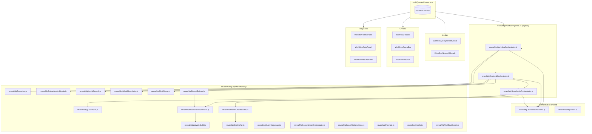

# Multi Query REVEAL — architecture

Technical overview of **CFDE REVEAL Multi Query** in dig-dug-portal. For UI conventions see [`DESIGN.md`](./DESIGN.md).

## Overview

Multi Query REVEAL is a **linear three-tab workflow**: Search terms → Data → Results. Users enter a research question, review LLM-extracted terms and retrieval directions, inspect hybrid-search evidence, then generate mechanistic hypotheses.

The root shell is **`multiQueriesReveal.vue`** (registered as `factor-base-reveal`). It owns workflow session state and composes components under `revealMultiQueryWorkflow/`. The shell imports **one orchestration entry point** — `revealMqWorkflowPipeline.js` — rather than the three phase files directly; the shell delegates via thin method wrappers, and business logic that used to live inline in the shell now lives in dedicated `revealMq*.js` modules (see "Utils" below).


```mermaid
flowchart TB
    subgraph shell ["multiQueriesReveal.vue"]
        Session[(workflow session)]
    end

    subgraph pipeline ["revealMqWorkflowPipeline.js (façade)"]
        ExtractOrch[revealMqWorkflowOrchestrator.js]
        RetrievalOrch[revealMqRetrievalOrchestrator.js]
        HypothesisOrch[revealMqHypothesisOrchestrator.js]
    end

    subgraph shared ["Orchestration-shared"]
        OrchShared[revealMqOrchestratorShared.js]
        StepGates[revealMqStepGates.js]
    end

    subgraph modals ["Modals"]
        QueryHelper[WorkflowQueryHelperModal]
        NetworkModals[WorkflowNetworkModals]
    end

    subgraph chrome ["Chrome"]
        Header[WorkflowHeader]
        QueryBar[WorkflowQueryBar]
        TabBar[WorkflowTabBar]
    end

    subgraph tabs ["Tab panels"]
        Terms[WorkflowTermsPanel]
        Data[WorkflowDataPanel]
        Results[WorkflowResultsPanel]
    end

    subgraph utils ["revealMultiQueryWorkflow/*.js"]
        Extract[revealMqExtraction.js]
        Ambiguity[revealMqExtractionAmbiguity.js]
        Hybrid[revealMqHybridSearch.js]
        HybridApi[revealMqHybridSearchApi.js]
        MultiRoute[revealMqMultiRoute.js]
        KG[revealMqKgTransform.js]
        MechNorm[revealMqMechanismNormalize.js]
        NetBuild[revealMqNetworkBuild.js]
        ReportBuilder[revealMqReportBuilder.js]
        BiolinkApi[revealMqBiolinkApi.js]
        BiolinkOrch[revealMqBiolinkOrchestrator.js]
        QHApi[revealMqQueryHelperApi.js]
        QHOrch[revealMqQueryHelperOrchestrator.js]
        CriteriaGate[revealMqSearchCriteriaGate.js]
        Prompts[revealMqPrompts.js]
        Config[revealMqConfig.js]
        Export[revealMqWorkflowExport.js]
    end

    shell --> chrome
    shell --> tabs
    shell --> modals
    shell --> pipeline
    pipeline --> ExtractOrch
    pipeline --> RetrievalOrch
    pipeline --> HypothesisOrch
    ExtractOrch --> OrchShared
    ExtractOrch --> Ambiguity
    RetrievalOrch --> OrchShared
    RetrievalOrch --> HypothesisOrch
    HypothesisOrch --> OrchShared
    HypothesisOrch --> BiolinkOrch
    ExtractOrch --> Extract
    RetrievalOrch --> Hybrid
    RetrievalOrch --> HybridApi
    RetrievalOrch --> MultiRoute
    HypothesisOrch --> KG
    HypothesisOrch --> MechNorm
    MechNorm --> NetBuild
    ReportBuilder --> MechNorm
    BiolinkOrch --> BiolinkApi
```

## Directory layout

| Category | Files | Role |
|----------|-------|------|
| **Shell** | `../multiQueriesReveal.vue` | Session state, thin orchestrator delegates, tab routing |
| **Chrome** | `WorkflowHeader.vue`, `WorkflowQueryBar.vue`, `WorkflowTabBar.vue`, `WorkflowOpsMenu.vue` | Intro, query input, export/import, tab bar |
| **Modals** | `WorkflowQueryHelperModal.vue`, `WorkflowNetworkModals.vue`, `WorkflowQueryGuidelinesModal.vue`, `WorkflowSearchTermsExtractionModal.vue` | Guided query builder; network popups; query guidelines; extraction help |
| **Panels** | `WorkflowTermsPanel.vue`, `WorkflowDataPanel.vue`, `WorkflowResultsPanel.vue`, `WorkflowStepGate.vue` | Tab content; reusable Continue gate |
| **Orchestration façade** | `revealMqWorkflowPipeline.js` | Single entry point the shell imports; re-exports the three phase modules under one surface and wires the extraction→retrieval hand-off explicitly |
| **Orchestrators** | `revealMqWorkflowOrchestrator.js`, `revealMqRetrievalOrchestrator.js`, `revealMqHypothesisOrchestrator.js`, `revealMqBiolinkOrchestrator.js` | Extraction, hybrid retrieval, mechanism LLM, and post-hoc Biolink/TRAPI mapping phases |
| **Orchestration-shared** | `revealMqOrchestratorShared.js`, `revealMqStepGates.js` | `runLlmWithRetry`/`classifyAndReportError`/session-reset/KG-triple-cache helpers shared by all phases; step-id constants + selectors + the `setStep`/`applyStepUpdate` state machine |
| **Utils — extraction/session** | `revealMqExtraction.js`, `revealMqExtractionAmbiguity.js`, `revealMqMultiRoute.js`, `revealMqSearchCriteriaGate.js`, `revealMqRouteEdit.js` | Term normalization, anti-anchor detection, multi-route reshaping + constraint specs, step-1 gate edit reconciliation |
| **Utils — retrieval** | `revealMqHybridSearch.js`, `revealMqHybridSearchApi.js` | Hybrid-search request/response shaping, HTTP |
| **Utils — mechanism/report** | `revealMqKgTransform.js`, `revealMqMechanismNormalize.js`, `revealMqNetworkBuild.js`, `revealMqReportBuilder.js` | KG flatten/CSV, gene-score attachment, graph builders (factor connectivity, flattened-KG networks, hypothesis-in-KG flow), HTML report/handoff assembly |
| **Utils — biolink** | `revealMqBiolinkApi.js` | NameRes/NodeNorm/TRAPI relay HTTP calls (paired with `revealMqBiolinkOrchestrator.js` above) |
| **Utils — query helper** | `revealMqQueryHelperApi.js`, `revealMqQueryHelperOrchestrator.js` | Gene autocomplete + factor-row HTTP, guided-builder query composition |
| **Utils — config/prompts** | `revealMqConfig.js`, `revealMqPrompts.js`, `revealMqStepTime.js`, `revealMqWorkflowSession.js`, `revealMqWorkflowExport.js` | Env-var runtime config, LLM system prompts, step-timer formatting, session shape, export/import |
| **Utils — gene-set entry point** | `revealMqGeneSetEntryApi.js`, `revealMqGeneSetEntryCrossReference.js`, `revealMqGeneSetEntryFactorData.js`, `revealMqGeneSetEntryOrchestrator.js`, `revealMqGeneSetEntryFallback.js` | `?genes=` URL entry point: top traits from Bayes-gene phenotypes, per-phenotype gene/gene-set/membership fetches, factorData builder, orchestration, and text-query fallback when APIs fail / return no usable data. See dedicated section below. |
| **Styles** | `mqSharedStyles.css` | Shared tab, gate, alt-query styles |
| **Shared viz** | `../FactorBaseRevealHeatmap2.vue`, `../FactorBaseRevealNetwork2.vue` | Heatmap + network (outside folder; also used by `hybridSearchReveal.vue` — do not change their behavior without checking that sibling tool). Gene-set entry populates the same `factorData` shape these consume. |
| **Tests** | `__tests__/*.test.js` | Unit tests |

## Session model

The shell's `data()` mirrors `createEmptyWorkflowSession()` in `revealMqWorkflowSession.js`. Env-var-driven runtime config (hybrid-search/biolink URLs, query-helper factor template, client-embedding flag) is resolved once via `resolveRevealMqRuntimeConfig()` in `revealMqConfig.js` and spread into `data()`. LLM system prompts are plain string constants in `revealMqPrompts.js`, not reactive state (except the two mode-dependent fields feeding `mechanismHypothesisSystemPromptEffective`).

**Panel wiring:** Tab panels and modals use explicit **props + events**. State is passed via `v-bind="dataPanelProps"` / `v-bind="resultsPanelProps"` / `v-bind="queryHelperModalProps"` / `v-bind="networkModalsProps"`; read-only formatters and row accessors are bundled in a **`helpers`** prop object from shell computed properties. Two-way-bound modal fields go through `v-on="...Listeners"` (each `update:<field>` event assigns back onto the shell), the same pattern Vue's `.sync` modifier expands to.

| Group | Fields |
|-------|--------|
| **Query** | `userQuery`, `searchMode`, `hypothesisGenerationMode` |
| **Extraction** | `searchCriteria`, `multiQueryRoutes`, `*EditRows`, `extractionAmbiguityCheck` |
| **Retrieval** | `factorData`, `lastHybridSearchResponse`, `pairSelectionOverrides` |
| **Workflow** | `steps`, `showTab`, `workflowRunId`, gate flags |
| **Results** | `mechanisms`, `mechanismDiagnosticAssessment` |

**Search criteria select** (`WorkflowQueryBar`): Gene / Disease / Gene set / Dataset / Free text. Only **Gene set** and **Free text** are enabled (others dimmed/disabled). Gene set ↔ `searchPath: "genes"` / `?genes=`; Free text ↔ `searchPath: "query"` / `?query=`.

**Gene-set entry point:** `?genes=APOE,LDLR` sets the select to Gene set, fills the query input, and runs `bayes_gene/pigean` → Data **without** clicking Reveal. Manual Gene set + Reveal writes `?genes=` then runs the same path. Free text + Reveal writes `?query=` and starts extraction.

**Export / Import:** `revealMqWorkflowExport.js` snapshots full session including Results (`kind: reveal-mq-workflow-export`, schema v6). Includes `searchPath` (`genes` | `query`) and slim `geneSetEntry` (`inputGenes`, `researchIntention`, `status`). On import, restores gene-set entry vs text-query mode and syncs the URL (`?genes=` / `?query=`).

## Workflow steps

| Step id | Tab | Gate |
|---------|-----|------|
| `1` | Search terms | Review extracted terms → continue to retrieval |
| `2` | Data | Review phenotypes / gene sets → continue to hypotheses |
| `4` | Results | Mechanism LLM (no gate) |

Step-id literals are centralized in `WORKFLOW_STEP_IDS` (`revealMqStepGates.js`) — both the orchestrators (writers of `steps[].id`) and the shell's tab/badge-driving computed properties (readers) import from there instead of hardcoding `"1"`/`"2"`/`"4"`.

## Orchestration flow

1. **Extraction** — `beginExtractionFlow` / `startWorkflowFromExtractedTerms` (`revealMqWorkflowOrchestrator.js`, via the `revealMqWorkflowPipeline.js` façade). On approval, extraction hands off to retrieval through an explicit `onApproved` callback the façade wires (`(terms, opts) => retrieval.onResearch(vm, terms, opts)`) rather than calling back into `vm.onResearch()`.
2. **Retrieval** — `onResearch` → single-route `runHybridRetrievalWorkflow` or multi-route `runMultiQueryRetrievalWorkflow` (`revealMqRetrievalOrchestrator.js`). This phase directly imports and calls `requestMechanismHypotheses` from the hypothesis orchestrator — the one intentional cross-phase module coupling.
3. **Hypotheses** — `requestMechanismHypotheses` (`revealMqHypothesisOrchestrator.js`) after step-2 gate approval. Success triggers `autoMapAllMechanismsToBiolink` (`revealMqBiolinkOrchestrator.js`), which maps each mechanism's spine network to Biolink CURIEs (NameRes + NodeNorm) and then validates edges against Translator via TRAPI in the background, generation-guarded per mechanism index.

All three orchestrator files share `runLlmWithRetry` and `classifyAndReportError` (`revealMqOrchestratorShared.js`) instead of each hand-rolling its own retry loop and error-classification branches.

## Gene-set entry point (`?genes=`)

A **fourth, alternate entry point** into the same shell: instead of a free-text query that the LLM extracts terms from, the user supplies a raw gene list via `genes=`, bypassing Search-terms/extraction. It lands on the **Data** tab and populates the same `vm.factorData` shape the text-query path uses, so heatmap / network / factor table / KG run without a separate gene-set entry viz fork.

### Wiring

`multiQueriesReveal.vue`'s `mounted()` branches on `keyParams.genes` ahead of `keyParams.query`:

```js
async mounted() {
    if (keyParams.genes) {
        await runGeneSetEntryWorkflow(this, keyParams.genes);
    } else if (keyParams.query) {
        this.userQuery = keyParams.query;
    }
    // ...placeholder-rotation/focus logic
},
```

`this.geneSetEntry` holds status / input genes / top traits for debugging. **UI hand-off is `vm.factorData`.**

### Files (`revealMqGeneSetEntry*.js`)

| File | Layer | Responsibility |
|------|-------|-----------------|
| `revealMqGeneSetEntryApi.js` | HTTP | `fetchGenePhenotypes` (Bayes-gene translator). `fetchGenePigeanScoresForPhenotype` / `fetchGeneSetPigeanScoresForPhenotype` / `fetchJoinedGeneSetMembers` (cfde bioindex). Gene-phenotype scores map `combined` → Combined, `log_bf` → GWAS support, `prior` → Gene set support. Gene-set rows include `beta` (effect size). Batch helpers for phenotypes and membership pairs. Empty results never throw. |
| `revealMqGeneSetEntryCrossReference.js` | Pure logic | `selectTopTraits` — ranked phenotypes by p_value (optionally capped). |
| `revealMqGeneSetEntryFactorData.js` | Bridge | `buildFactorDataFromPhenotypePigean` — merges gene rows, gene-set rows, and joined membership into canonical `factorData[phenotype] = {genes, factors, allFactors}` with real `geneSets[gs].genes` membership. Keeps gene sets with **`beta > 0.01`** only; drops traits with none. Bounds gene columns to input genes (fallback top-N) and gene-set columns to top-N factor-assigned sets. |
| `revealMqGeneSetEntryOrchestrator.js` | Orchestration | `runGeneSetEntryWorkflow(vm, rawGenesParam)`. |

### Data flow

1. `bayes_gene/phenotypes` → full ranked trait list.
2. Walk traits in p_value order (batched GETs) until **10 traits** return non-empty `pigean-gene-phenotype` rows (skip empty/id-mismatch traits). If fewer than 10 have data after scanning all candidates, **proceed with whatever was found**. Also fetch `pigean-gene-set-phenotype` for those. Console logs unique gene names from those calls (and overlap with the search list).
3. Keep **top 5 factors** per usable trait; for gene sets on those factors (≤30 by `rs_score`), keep only rows with **`beta > 0.01`** (non-significant / missing beta dropped). If a trait has **no** such gene sets, **drop the trait**. Membership (`pigean-joined-gene-set`) is fetched only for the remaining significant gene sets (batched, **10 concurrent**). Rows with null/empty `factor` are assigned the **phenotype id as factor** (one phenotype×genes/gene-sets row when the trait has no real clusters).
4. `buildFactorDataFromPhenotypePigean` → filter to search genes → prune factors without search-gene crossings → **attach context genes** that appear in ≥2 survived gene sets (`includedFromRequest: false`), filling Combined / GWAS / Gene-set support from the already-fetched `pigean-gene-phenotype` rows when present. Then `transformMergedDataToKG`, `setStep(DATA)`, `showTab = "data"`.
5. Data-tab **Continue** gate (same `waitForStepApproval` as text-query). Gene-set entry shows an optional **Research intention** field under the Continue strip; on Continue, that text is used as research context for `requestMechanismHypotheses`.

Heatmap axes (existing `FactorBaseRevealHeatmap2`): **rows = factors** (Y-axis shows **factor/cluster labels** via `row-label-mode="factor"`; phenotype remains in the hover tooltip), **columns = gene sets then genes** (search genes bold; context genes normal). Table **Number of genes** shows `search:context`. KG/network use the same membership-filled `geneSets` maps as the text-query path.

### `vm.geneSetEntry` state shape

```js
geneSetEntry: {
    status: "idle",  // idle | loading | partial | error | ready
    inputGenes: [],
    errors: { phenotypes: null, perPhenotype: {} },
    phenotypesResponse: null,
    topTraits: [],
    progress: { message: "", detail: "" },
    researchIntention: "",  // gene-set entry only; fed into hypothesis research context
}
```

A centered BootstrapVue modal shows on gene-set entry **error / fallback** (not while loading). Live fetch progress for both text-query and gene-set entry is shown under the **Data** tab (`WorkflowDataPanel`: `revealDataSteps` timeline + `loadStatus`). Gene-set entry opens the Data tab early and mirrors `geneSetEntry.progress` into `setLoadStatus` / Data substeps.

### Gotchas

- **Tab bar + panels gated behind `v-if="steps && steps.length"`** — gene-set entry must call `vm.setStep(...)` or nothing renders.
- **Phenotype ID vocabularies only partially overlap** — Bayes-gene traits (esp. Orphanet-style) may return empty cfde bioindex results; treat empty as normal, skip that phenotype.
- Factor ids (`Factor0`, …) are **per-phenotype**, not comparable across traits.
- Membership fetches are bounded to gene sets on the **top 5 factors** per phenotype (≤30 gene sets) and run with **concurrency 10** (same for per-phenotype score fetches) to avoid 503 bursts from the bioindex.
- Direct `curl` to `search.hugeamp.org` can hit Cloudflare 403; browser `fetch()` from the portal is fine.

### Fallback to text-query path

When gene-set entry cannot proceed (API unresponsive / hard HTTP errors, or zero usable data after scanning), the progress modal offers **Switch to text-query search**:

1. Notify where it failed (`geneSetEntry.progress` + `failureReason`: `api_error` | `insufficient_data`).
2. On approve: clear gene-set entry state, set `userQuery` to  
   `Investigate shared biological mechanisms and pathways among GENE1, GENE2, ….`  
   (no phenotype/gene-set ask in the question), replace URL `genes=` with `query=`, call `queryParse()` → search-term extraction.
3. On the text-query Data tab, genes listed in extracted **genes of interest** (search-term genes) are bolded vs context genes (`applySearchTermGenesOfInterestFlags` after hybrid normalize).
4. Text-query Data Continue gate offers LLM **Data** scope radios (`FREE_TEXT_LLM_FEED_SCOPE` in `revealMqFreeTextLlmFeed.js`): Selected; Selected + genes of interest; Full data (association legend filters still apply). Gene-set entry keeps its own scope options (`GENE_SET_ENTRY_LLM_FEED_SCOPE`).
5. Free-text hypothesis generation uses a **single slim JSON feed** (clusters + `gene_indices`, slim `diagnostic_meta`, route headers without `top_hits`) — not CSV + phenotype summary + route evidence bundles. Local flattened KG is still built for evidence-network mapping from `cited_gene_set_names` / genes / `associated_pairs`.

Helpers: `revealMqGeneSetEntryFallback.js`.

**Simulated failure (dev/QA):** append `geneSetEntryFail=api` (or `=1`) / `geneSetEntryFail=empty` alongside `genes=`. The orchestrator skips real fetches, shows the failure modal after a short fake progress, and the Switch CTA clears `genes` + `geneSetEntryFail` and starts the text-query path.

## Migration status

| Phase | Status |
|-------|--------|
| Utils + session scaffold | Done |
| Chrome, tab panels, modals | Done |
| Extraction / retrieval / hypothesis orchestrators | Done |
| Shell `:shell` prop (replacing provide/inject) | Done — modals migrated to explicit props/events; `mqShell` removed |
| Multi-route helpers + hybrid HTTP API modules | Done |
| Fine-grained Data/Results panel props | Done — props/events + `helpers` bundle |
| Unified orchestration façade (`revealMqWorkflowPipeline.js`) + shared retry/error helpers | Done |
| Shell-inline logic extraction (mechanism normalize, network build, report builder, biolink, query helper, prompts, config) | Done |
| `hybridSearchReveal.vue` fork consolidation | Out of scope — separate portal section component |
| Gene-set entry point — phenotype→gene/gene-set/membership → unified `factorData` | Done — same Data-tab visualizers as text-query path |
| Gene-set entry point — Data Continue + research intention → hypotheses | Done |

## External dependencies

- `src/utils/llmClient.js` — extraction + mechanism LLM
- `src/utils/cfdeUtils.js` — phenotype / factor labels
- `src/utils/factorRevealGeneColors.js` — network gene colors
- `src/utils/uiUtils.js` — `biDomain()` for query-helper gene autocomplete
- `factorRevealDataNetwork.js` (Canvas folder) — shared network builder
